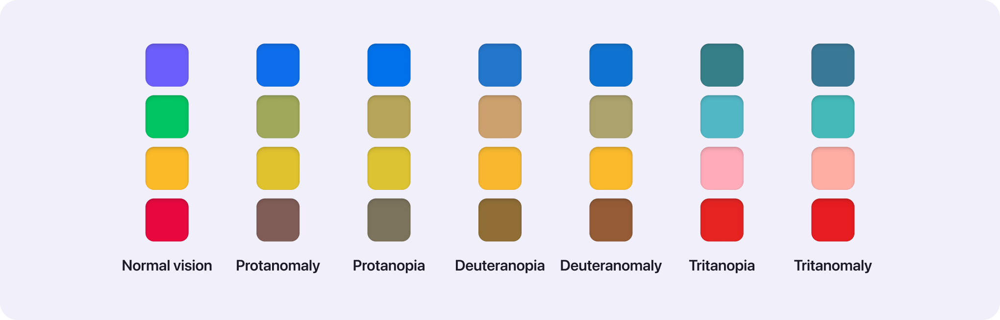

# color choice can impact the accessibility of designs

- color choice can impact the accessibility of designs. It's important to check the contrast between the colors you choose. As a designer, you should follow Web Content Accessibility Guidelines, or WCAG, to make sure your designs are accessible. [1]

> For example the image on the left uses black text on a white background, which has a high contrast ratio, but the image on the right uses varying shades of green, blue, and yellow on a camo green background, making the text very difficult to read and therefore inaccessible. [1]

- One more thing to keep in mind when choosing colors for your design: Test your color choices on various devices and in different environments. Colors can look different on your desktop computer than they do on your mobile phone. Colors can also look different depending on whether you're using the device in daylight or in the dark. [1]

> One example of this is a viral internet photo from 2015 of a dress that some Internet users described as white and gold and others described as black and blue. Many people were confused about how the same dress could be interpreted as completely different colors, but the explanation was simple. The color of the dress changed depending on the color of the light the user was in. The dress looked black and blue under yellow light and white and gold under blue light. This is just one example of why testing your color choices in different environments is crucial. [1]

## Color Blindness

Color blindness results in difficulty distinguishing between certain colors. There are three common categories of color blindness: red-green, blue-yellow, and total color blindness.

*To understand how color blindness can affect how users see color, visit the Colblindor [Color Blindness Simulator](https://www.color-blindness.com/coblis-color-blindness-simulator/), where you can upload images and check them through various colorblind filters.*

There are a few ways to keep color accessibility in mind as you design: [2]

- Color contrast
- Color blindness

Not everyone perceives color the same way. According to WHO estimates, 2.2 billion people have some kind of vision impairment. So it's really important to consider if your colors have enough contrast and if they are distinguishable.

This is why Atmos comes with a built-in contrast checker and color vision simulator so you can ensure accessibility at every step of your color palette journey.

### Color contrast

It's good to think about how your colors will be used in the interface now so you don't have to come back later. For example, will you need to put text on tinted backgrounds, how will your primary button look like, and so on? Continuously check the contrast ratios between the shades you plan to use together and double-check later in your designs. [2]

WCAG recommended thresholds (for passing AA requirements) are:

- 4.5:1 - standard text (body)
- 3:1 - larger text (>120% larger than body text)
- 3:1 - active UI components and graphical objects such as icons and graphs
- No contrast requirement - Images, inactive UI components, purely decorative elements

### Color blindness types

Also known as color vision deficiency (CVD) affects about 1 in 12 men and 1 in 200 women in the world. There are 3 different types of color blindness: [2]

- Protanopia/Protanomaly - individuals don't perceive or see only a few shades of red.
- Deuteranopia/Deuteranomaly - individuals don't perceive or see only a few shades of green.
- Tritanopia/Tritanomaly - individuals don't perceive or see only a few shades of blue.

99% of people who are color blind are suffering from red-green color blindness

To ensure color combinations are distinguishable check your colors using color-blind simulators. Don't rely only on color to convey information, use words or iconography as support. Learn more about these techniques in WCAG guideline 1.4.1 Use of color.

### **Use icons in designs, in addition to color**

> For example, check out the image below: if you’re designing a form and want to indicate that a field is missing text or formatted incorrectly, do not solely rely on turning incorrect text to the color red. You should also use a red exclamation point icon. The exclamation point icon will draw users' attention to the form field with the color and the icon, so your designs will be clearer to more users.

### **Use patterns and texture to create contrast**

Contrast is the difference between two or more elements in a design.

- Contrast is often created through black and white imagery,
- or the large size of header text versus the smaller size of body text.

> Imagine you're creating a bar graph about user research using a client’s brand colors. To create contrast without relying on color alone, you can add subtle stripes to one column and dots to another, as shown in the image below. With contrasting patterns, in addition to color, the bars in the graph will be clearly differentiated for all users.

### **Avoid color combinations that could be hard to distinguish from one another**

Here are some color combinations that are often difficult for users who are color blind to differentiate between:

- Green & red
- Green & brown
- Blue & purple
- Green & blue
- Light green & yellow
- Blue & gray
- Green & gray
- Green & black

*Keep in mind: If you use green in your designs, that doesn’t mean you need to avoid red, brown, blue, and gray altogether. But because these colors can be hard to distinguish, it’s better to not put those colors directly next to each other, especially for critical information. In addition, you should create other forms of contrast, like adding written labels to differentiate important facts. Check out the image below to understand these best practices in action!*

### Using Red and Green Without a 3rd color / Adequate Contrast

Other than the connotation of Christmas, red and green being the main colors affects accessibility for colorblind users. The most common is red-green color blindness, requiring another color for contrast or make decisions that will help in providing contrast. [3]

It should be noted that there are other types of color blindness. They are less common than red-green color blindness. The red-green is a starting point and can be used as a foundation to accommodate users with lesser common color blindness.

## Low contrast sensitivity

**People who have low contrast sensitivity experience objects as dim or unclear, which makes those objects more difficult for a person to identify.**

> Many people experience low contrast sensitivity on a daily basis.
>
> - For example, people who have a high visual acuity experience low contrast sensitivity when it’s dark and a digital screen is too bright, or when it’s bright and a digital screen is too dark.
> - In addition, as people’s eyes get older, their contrast sensitivity naturally weakens.

**One way that you can design with low contrast sensitivity in mind is to use the luminosity contrast ratio, which is a measurement of the contrast between the background and the text color used on top of that background.**

- As a standard, the WCAG recommends that the luminosity contrast ratio of images and text meets a contrast ratio of at least 4.5 : 1.

Check out these four examples of contrast ratios in action:

- Low contrast has a ratio of 2 : 1. As you can tell, the background color and text are difficult to read.
- Minimum contrast has a ratio of 4.5 : 1. These background and text combinations are easier to read, even though they use light colors.
- High contrast has a ratio of 16 :1. These designs are easy to read and use bolder colors for text that stand out on the backgrounds.  
- Maximum contrast has a ratio of 21 : 1. For the most contrast in your designs, like these, use black and white only.

One of the easiest ways to check the contrast and harmony of your color is by converting the design/color palette into a black and white image. You can change the color properties or even the color scheme to achieve the best contrast based on the results. [3]

## Light sensitivity

Some users are just as sensitive to bright light and bright colors as they are to low contrast.

**Light sensitivity is the inability to tolerate light**.

Users who have light sensitivity might experience your designs with a dim screen. Or they might use the operating system of their device to choose between light mode, dark mode, and high contrast mode, as shown in the image below. It's best to allow users to make these setting choices, so try designing your own light and dark modes of your own projects.

## Accessibility in Colors

- The video [Colors with Good Contrast](https://www.w3.org/WAI/perspective-videos/contrast/) from W3 showcases how luminosity contrast ratio affects users on a daily basis, from navigating street signs to conversing with a loved one.

- To check the contrast ratio for your designs, WebAIM provides a [Contrast Checker tool](https://webaim.org/resources/contrastchecker/) where you input the hex codes of colors from your designs. If your contrast ratio doesn’t meet the standards outlined above, you can use the tool's hue slider to adjust the colors and find new ones that meet the WCAG guidelines for accessible designs.

- If you want to learn more about designing with accessible colors, check out this video from the W3C, the creators of the WCAG guidelines, that demonstrates how to review designs for web accessibility: [Easy Checks: A First Review of Website Accessibility](https://www.w3.org/WAI/test-evaluate/preliminary/#video).

- Stuck on how you can apply WCAG to your design’s color palette? Here’s a [Color palette generator](http://colorsafe.co/) by Color Safe that shows WCAG in action.

- Download the plugin Stark to run contrast checks on your designs directly in Figma, saving you time and improving your workflow. Check out their page on Figma Community: [Stark - Figma](https://www.figma.com/community/plugin/732603254453395948/Stark)

## _References

[1]: <https://www.coursera.org/learn/high-fidelity-designs-prototype/supplement/Ca3gb/accessibility-considerations-for-color>
[2]: <https://atmos.style/blog/create-best-ui-color-palette>
[3]: <https://medium.com/rutgers-creative-x/understanding-color-for-ui-design-ec53719e880e>
