# (Branding) Color Palletes

**What is a color palette?**

A color palette is simply a set of primary colors (or main colors) and secondary colors that work well together, combined to form a brand.

*In Figma, your color palette can be set up as either color styles or as color variables. Don't worry, we'll get into how to create color styles soon!* [5]

Defining the right color palette for a design project is one of the most important steps in the design process, but it can be quite difficult to get right.

- [Base Colors](#base-colors)
- [Color Scales](#scaleshades)

## Base Colors

Brand color palettes are carefully selected sets of colors used consistently across all brand materials to create a consistent look and feel. These colors reflect the brand’s personality and values, helping to evoke the right emotions and associations with the audience.

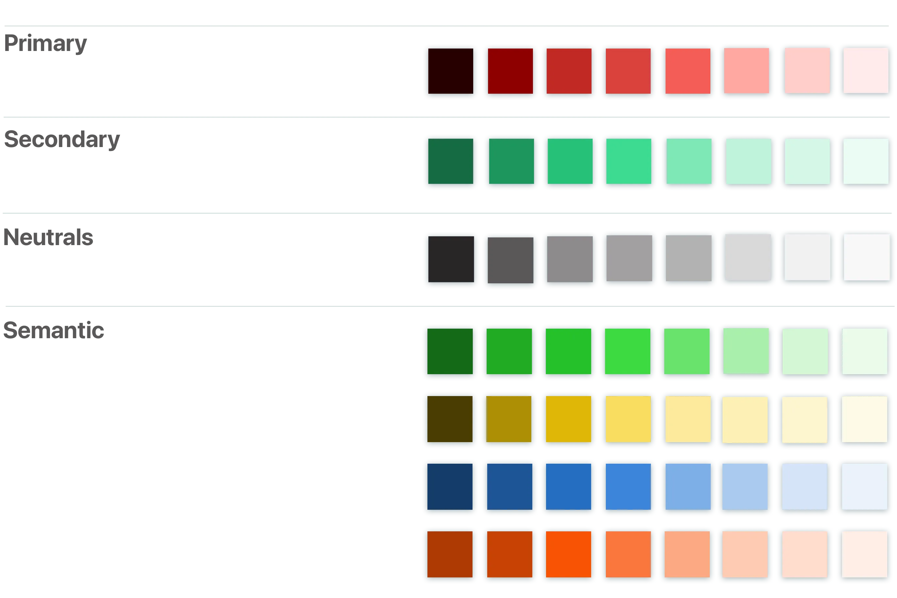

A good color palette should contain neutral colors (usually grays), primary colors (also known as brand colors), and accent colors (also known as secondary colors). It's also good to include feedback colors (green for success and red for failure), especially if forms are an essential part of the functionality. [5]

Here’s what typically makes up a brand color palette: [6],[13],[14],[15]

- **Primary Colors**: The main colors that represent the brand and are used the most.
- **Secondary Colors**: Additional colors that complement the primary ones, adding variety and flexibility.
- **Accent Colors**: Colors used sparingly to highlight specific elements and create emphasis.
- **Neutral Colors**: Usually for backgrounds or text, these colors balance and support the primary and secondary colors.

to define base colors, consider:

- Color psychology evokes certain emotions, stimulates senses, and encourages user action. It’s important to reference color psychology to create combinations that connect with users and provoke the mood you’re trying to convey. [9]
- Before you launch your design, gather feedback on your color palette to ensure it resonates with end users and aligns with your overall goal. This allows you to make any necessary adjustments to your color palette to create a pleasing user experience. [9]

### Primary color

*Primary aka Main color.*

- The primary color becomes the one that is most prominent. [1],[6]
- define the overall feel, look and can elicit emotion [1],[4],[5],[16]
- used across all interactive elements such as buttons, links, inputs, call to action buttons, emphasizing navigation elements, etc. [5],[6]
- Your primary color in UI design isn’t typically the color you see most. In interface designs, the most used colors are actually your neutral colors [6]
  > This is the color that makes you think red when you hear Netflix or Target, when their interfaces are actually primarily made up of neutral colors.

- numbers of primary color:
  - can start with one and typically one color [4],[5],[6],[7]
  - maybe two if you’re feeling adventerous. [4],[5]
  - maximum with 3 for consistency and recognition. [8]

- reference color psychology and symbolism to create combinations that connect with users and provoke the mood you’re trying to convey.[9]

- Your brand’s primary color will be the star of the show. Use it liberally in all of your brand collateral (digital and print). [13]
- Try to select photos that also include this color to use on social media for an on-brand feed. [13]

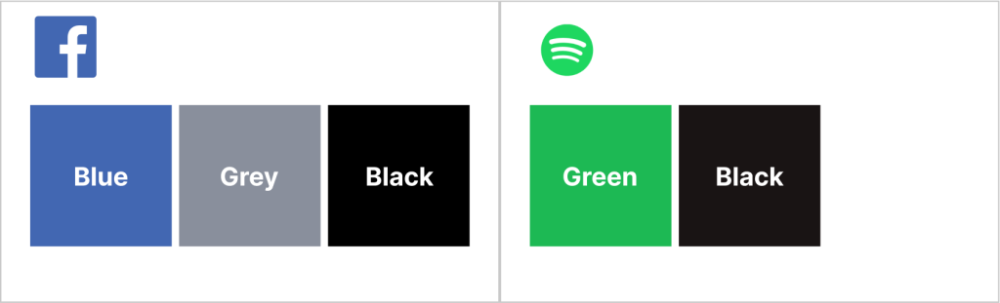

**Do not confuse with [Color theory - Primary Color](../../color_theory/color_theory/#primary-color)**

**Do not confuse with [rule 60-30-10 - Primary Color](../rules/rule_60-30-10/rule_60-30-10/#dominantprimary-color-60)**

### Secondary

Secondary colors blend in and complement your primary brand color without taking center stage (like a best friend). The easiest way to choose a secondary color is to take your primary color a shade or two lighter or darker. [13]

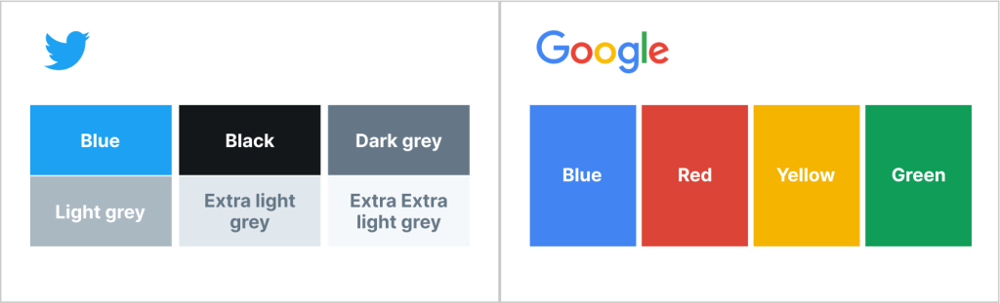

### Neutral color

- neutral colors are shades of white, gray, black, and sometimes beige or other muted tones. [5],[7]
- They provide a backdrop for other colors, creating balance, contrast, and a clean aesthetic. [7]
- It's one of your main colors simply because almost everything in UI design — text, lines, form fields, backgrounds, dividers, etc... will use neutral colors. [6]
- **Avoid absolute white or black**: When you deal with backgrounds or large areas, avoid using total white or black. [4],[6],[8],[9]
    > True black tends to look pretty unnatural, so start with a really dark grey and work your way up to white in steady increments. [4],[9]
    > Pure black is overpowering, strains the eyes and reduces the reading stamina of users. [9]
    > avoid using pure black on white as the contrast can be tiring to the eyes [6]

- A light neutral works great as a background color, and balances out the bolder colors when white is too boring or needs a break. [13]
- Darker neutrals give your palette more versatility and usually work well as a font color if they’re significantly darker [13]

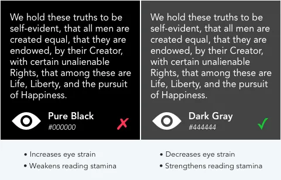

**Examples:**

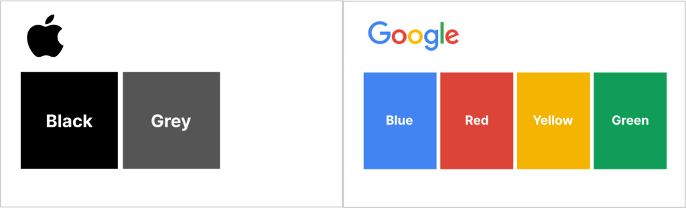

Refer to [Neutral Color](../../color_theory/color_psychology/color_psychology/#color-temperature)

### Accent color

- Your accent color is the pop that brings your brand to life! Use it to highlight calls to action (e.g., “Contact Us” buttons), important information, or creative brand elements. Accent colors are the most pronounced of your brand colors. [13]
- These act as "secondary colors" or "supporting colors" to your primary color palette. [5]
- These are useful for grabbing attention [5]
- highlight other important parts [6]
- create hierarchy and establish a unified design.
- They're also useful for components such as labels and badges. [5]

- numbers of accent color:
  - Depending on your brand and messaging, you can go for more than two accent colors [6]
    > for example, a colorful brand style aimed at children or fun themes. Most of the time though, one or two is the ideal number.

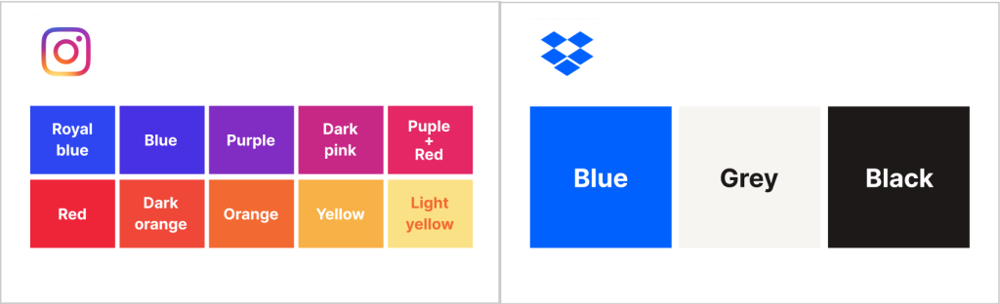

**Do not confuse with [Color theory - Secondary Color](../../color_theory/color_theory/#secondary-color)**

**Do not confuse with [rule 60-30-10 - Secondary Color](../rules/rule_60-30-10/rule_60-30-10/#complementarysecondary-color-30)**

#### Semantic color

Feedback colors emphasize different semantic states. They're used to provide visual feedback and/or warnings to users as they use your interface.

- **Error colors**: Error colors are used across error states and in "destructive" actions. They communicate a destructive/negative action, such as removing a user from your team.
- **Warning colors**: Warning colors can communicate that an action is potentially destructive or "on-hold". These colors are commonly used in confirmations to grab the users' attention.
- **Success colors**: Success colors communicate a positive action, a positive trend, or a successful confirmation. If you're using green as your primary color, it can be helpful to introduce a different hue for your success green.

## Scale/Shades

- Recommend 8-12 shades for each color [3],[4],[5]

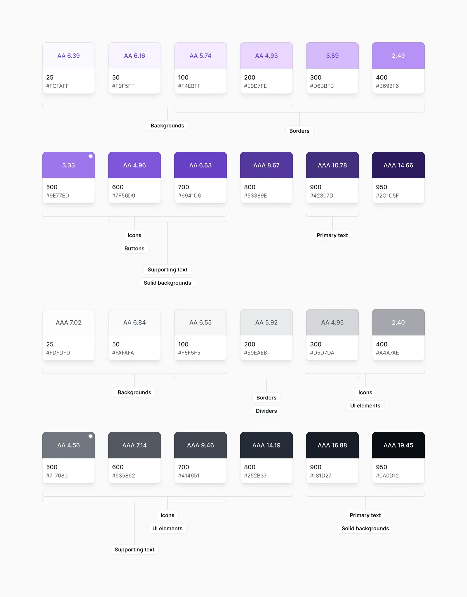

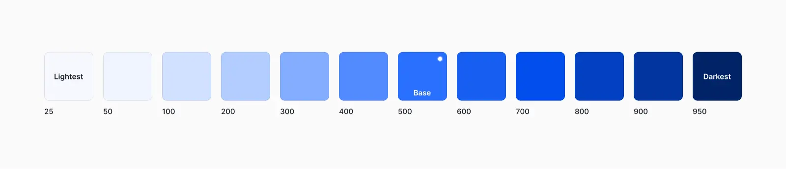

- scale from 0 to 1000, or 50 to 950 [4],[5]

Steps to define shades:

- [Step-1: Place primary color into the color scale](#step-1-place-primary-color-into-the-color-scale)
- [Step-2: Find the edges](#step-2-find-the-edges)
- [Step-3: Fill in the gaps](#step-3-fill-in-the-gaps)
- [Step 4: Repeat for your neutral and accent/secondary colors](#step-4-repeat-for-your-neutral-and-accentsecondary-colors)

### Step-1: Place primary color into the color scale

**Your primary color and will sit at brand-500 on the scale**. [4],[5]

- This is the first step because we will use this base color (brand-500) to define the hex codes for all of the lighter and darker shades of your brand color in your color palette (brand-25 to brand-950): [4],[5]

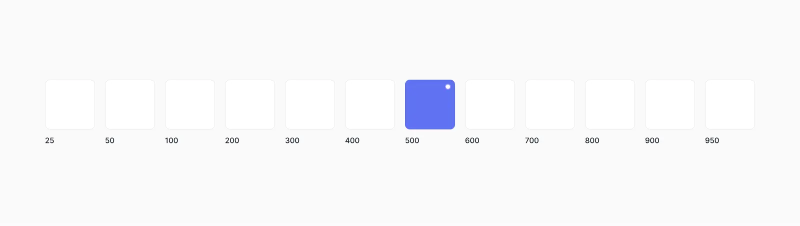

**Tips**:

- There's no real scientific way to do this, but for primary and accent colors, a good rule of thumb is to pick a shade that would work well as a button background. [4]
- It's important to note that there are no real rules here like "start at 50% lightness" or anything — every color behaves a bit differently, so you'll have to rely on your eyes for this one. [4]

#### if you already have hex codes or colors that you want to work with

Perhaps you've been given a style guide or a limited color palette to work with that already has a brand color.

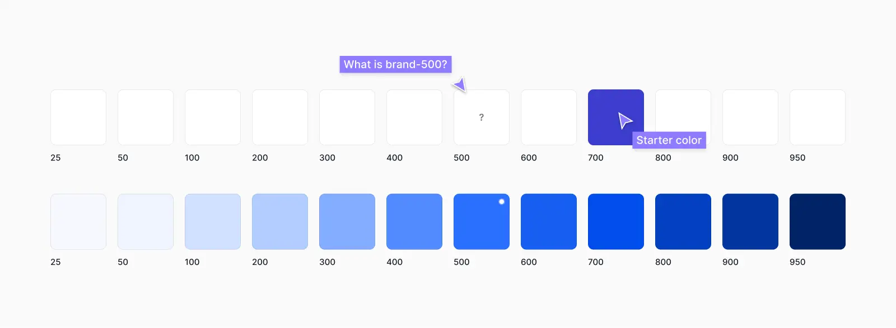

- If this color is too light or too dark to be the base color (brand-500), you can use this color to create your base color. Place the color on this scale as accurately as you can by comparing it to a similar color in the color palette

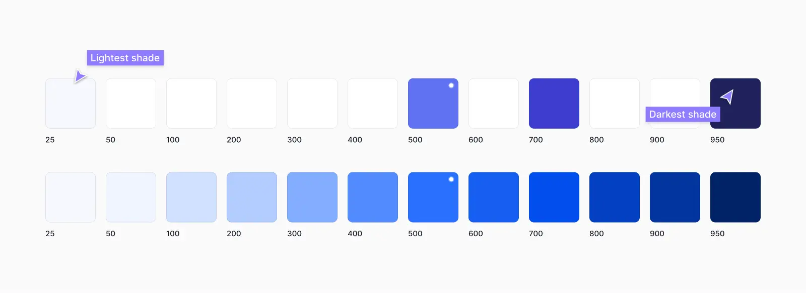

#### Adjust lightness and saturation in HSL to find brand-500

You can then copy this color and tweak it to find the base color at brand-500. Do this by adjusting the color model values in Figma, specifically lightness and saturation in the HSL values instead of hex codes. The aim here is to adjust these values in your starting color until it matches optically with other colors at the 500 shade: [4],[5]

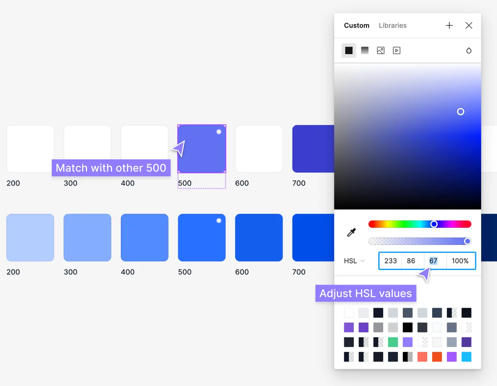

- **Adjust lightness**: Start with the lightness values first [5]
  - This is not an exact calculation/formula, unfortunately! The matching depends largely on the hue and every color behaves differently.
    > For example, a blue-500 color with -10 lightness to create a blue-400 does not necessarily mean it'll match optically with a purple-500 color with -10 lightness to create a purple-400.
  - One is likely to look "brighter" than the other and needs to be tweaked by a human. You'll have to use your eyes until it "looks" right alongside contrasting colors and other colors in the color palette.

- **Adjust saturation**: then tweak the saturation values after. [5]
  - Too much saturation tends to make colors look "brighter" than other colors in your palette, while too little can make them look too muted and dull.
  - Saturation has less impact at the lighter and darker ends of your color scale where you may need more saturation for color to come through.

### Step-2: Find the edges

Adjust the lightness and saturation in the HSL values to define your lightest (brand-25) and darkest (brand-950) colors: [4],[5]

- This is the same [method](#adjust-lightness-and-saturation-in-hsl-to-find-brand-500) as above, but it should be much easier to match optically with other colors in the color palette.
  > Generally, lighter shades from 25-100 are used for backgrounds, and darker shades from 900-950 and used for high-contrast text.

- Once again, this isn't an exact science. You'll likely need to adjust the saturation as well and just tweak them until you're happy with them and fit the context where they will be used. [4],[5]
- The darkest shade of a color is usually reserved for text, while the lightest shade might be used to tint the background of an element. [4]

> A simple alert component is a good example that combines both of these use cases, so it can be a great place to pick these colors.

### Step-3: Fill in the gaps

The next step is to fill in everything in between! Use the same HSL values [method](#adjust-lightness-and-saturation-in-hsl-to-find-brand-500) as above to pick shades in between. [4],[5]

- It's usually easier to start with brand-200 and brand-700 first and then move on to the others. You want these shades to feel like the perfect compromise between the shades on either side. [4],[5]

- This creates four more holes in the scale (800, 600, 400, and 200), which you can fill using the same approach. [4]

This might take some time. The goal here is to create a smooth balance across the scale, while ensuring the color scale matches optically with other colors in your color palette. They should "look" like they're the same lightness and brightness: [4],[5]

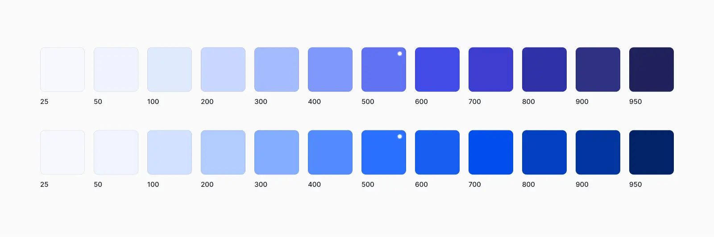

### Step 4: Repeat for your neutral and accent/secondary colors

Once you're happy with your brand color scale, you can move on to your neutral (gray) colors, as well as your secondary colors and feedback colors. The process is the same, but this time you should also pay close attention to the saturation of the other colors in your color palette. [4],[5]

Remember, more saturation tends to make colors look "brighter", while less makes them look muted. If your brand color is bright and playful with high saturation, you may have to adjust your other colors accordingly so they "look right" and work well together: [5]

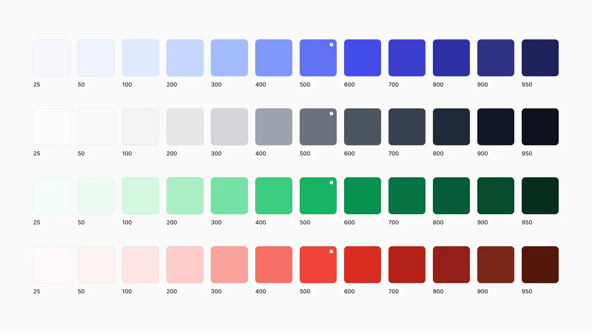

## Color Palette Generators

[coolors](<https://coolors.co/>)
[colormind](<http://colormind.io/>)
[colorhunt](<https://colorhunt.co/>)
[colordesigner](<https://colordesigner.io/>)
[toptal](<https://www.toptal.com/>)
[canva](<https://www.canva.com/colors/color-palette-generator/>)
[adobe](<https://color.adobe.com/create/color-wheel>)
[uicolors](<https://uicolors.app/create>)
[tailwindshades](<https://www.tailwindshades.com/>)
[tints](<https://www.tints.dev/brand/9E77ED>)
[tailcolor](<https://tailcolor.com/>)
[atmos](<https://atmos.style/color-wheel>)

**Color shade generator:**

[colorkit](<https://colorkit.co/color-shades-generator/>)

**Semantic color generator:**

[colors.eva.design](<https://colors.eva.design/>)

**Tools:**

[supa-palette](<https://www.supa-palette.com/>)

## Examples

- [Color palette examples](https://www.figma.com/resource-library/types-of-color-palettes/#color-palette-examples)
- [Choosing Colors for Your Brand](https://mushaboom.studio/articles/choosing-colors-for-your-brand)

## __References

[1]: <https://www.cloudesign.com/blogs/color-palette-in-ui-ux-design/>
[2]: <https://ux4sight.com/blog/ux-training-how-to-optimize-the-use-of-accent-colors>
[3]: <https://atmos.style/blog/create-best-ui-color-palette>

**Shades:**

[4]: <https://www.refactoringui.com/previews/building-your-color-palette>
[5]: <https://www.untitledui.com/blog/figma-color-palettes>
[6]: <https://medium.com/@shannon.cabeen/how-to-actually-implement-your-ui-color-palette-a5a7e266dc6f>
[7]: <https://careerfoundry.com/en/blog/ui-design/introduction-to-color-theory-and-color-palettes/>
[8]: <https://www.interaction-design.org/literature/article/ui-color-palette>
[9]: <https://www.figma.com/resource-library/types-of-color-palettes/>

[10]: <https://www.mockplus.com/blog/post/ui-color-schemes>
[11]: <https://venngage.com/blog/brand-colors/>
[12]: <https://blog.hubspot.com/marketing/brand-colors>
[13]: <https://selahcreativeco.com/blog/how-to-choose-your-brand-color-palette>
[14]: <https://www.markbrandboutique.com/blog/what-are-brand-colors-and-how-to-use-your-brand-colors>
[15]: <https://supercharge.design/articles/what-is-the-3-color-rule-in-ui-design>
[16]: <https://sibilaribeiro.com/create-your-website-color-palette/>

## __Appendix

## Color assignments and combination

những shades đậm thường được chọn làm font chữ
những shades nhạt thường được chọn làm nền

cách phối mầu với neutral color, nằm ngoài schemes????
