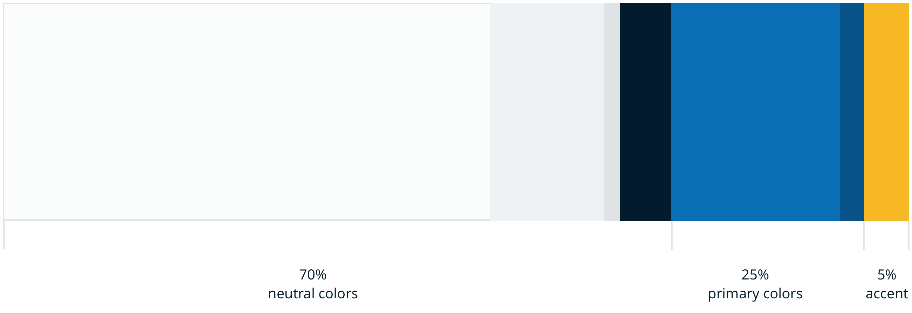
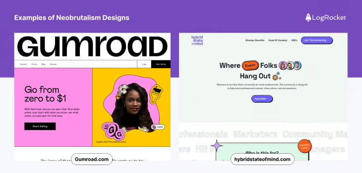
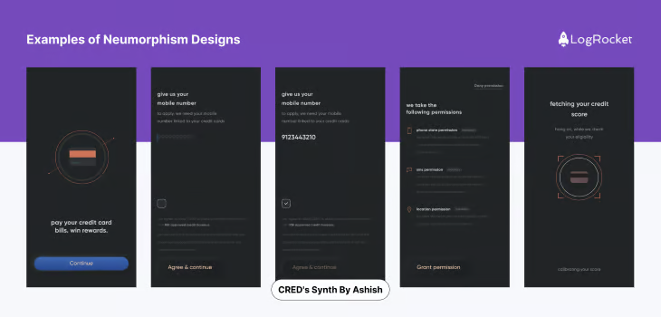

# Rule 60-30-10

## Definition

### Dominant/Primary color (60%)

**Roles:**

- makes up 60 percent of the color palette in your design (1)(2)(3)(4)(5)(6)(7)(8)(9)(10)(11)(12)
- It helps set the overall tone and mood you want to convey, creates a sense of unity, and creates a solid foundation for your cohesive and visually structured design (2)(4)(8)(11)(12)

**Color Properties:**

- This is the most prominent color within your interface (2)(5)(9)(12)
- might be neutral color (typically white, black, or variations of either of them), gives room for the secondary and accent colors to stand out (3)(7)(10)
- might use bolder color when you have move confident (10)

**Usage:**

- serves as the primary backdrop or background, headers, expansive sections, color blocking and large text areas (4)(6)(8)(12)

### Complement/Supporting/Secondary color (30%)

**Roles:**

- makes up 30 percent of the palette (1)(2)(3)(4)(5)(6)(7)(8)(9)(10)(11)(12)
- provides depth and visually interest/pleasing (2)(4)(5)
- allowing the design to feel cohesive and unified.(8)

**Color Properties:**

- This shade complements the primary color (2)(3)(4)
- This shade complements the accent color (3)
- enough contrast with dominant color, It could be a darker or lighter shade of your dominant colour or a colour that is opposite on the colour wheel. (4)(9)

**Usage:**

- use for headlines, sidebars, highlighting or text callouts (6)(7)
- larger UI elements or secondary backgrounds (15)
- defines major sections or components (15)
- navigation bars or side panels. (16)

### Guiding/Contrast/Accent color (10%)

**Roles:**

- makes up 10 percent of the palette to add emphasis (1)(2)(3)(4)(5)(6)(7)(8)(9)(10)(11)(12)
- These colors add pops of interest and help UI elements stand out (2)(3)(4)(5)(6)
- give attention, adding interest and guide user through the interface, facilitating seamless navigation (2)(3)(4)(5)(6)(9)(10)(11)(12)(13)

**Color Properties:**

- Be creative and daring (4)
- typically your boldest color (6)(9)

**Usage:**

- Use it for areas you want to draw the eye to such as call-to-action areas, buttons, icons, important text, hyperlinks, or any interactive components (6)(7)(8)(9)(10)

## Match brand colors to this rules

- all color palettes from brand are arbitrary using in Dominant, Complement and Guiding color

- can use multi-shade colors (6): If you need to add a fourth or fifth color, split either the primary or secondary colors and add a lighter or darker shade of that color to the mix. Just remember to still keep that color split within its designated percentage. (6)
  > For example, if you split your primary color to add a lighter hue, the 60% would change to something like 40% original color plus 20% lighter hue. Resist splitting your accent color as this will dilute the punch you need this color to convey.

  

- New creative combination by swapping Dominant, Complement, Guiding color. (6)

From popular to rare cases:

- 

### Case-1

- Dominant color is brand neutral color
- Complement color is shaded brand neutral color (light vs dark)
- Guiding color is brand primary color or brand accent color: The final 10 percent is dedicated to brand-specific accents or highlights. This small portion includes unique brand colors or quirky design elements that are distinctive to each identity (12)

### Case-2

### Case-3

### Case-4

## Benefits

Implementing the 60-30-10 Colour Rule isn’t just about aesthetics; it has a direct impact on the user experience. By using the right colours in the right proportions, you can:

- **Improving User Experience**:
  - A clear hierarchy and visual structure make it easier for users to navigate and find information on your website, reducing frustration and enhancing their overall experience. (1)(2)(3)(4)(5)
    > The 60–30–10 rule intuitively acknowledges the natural hierarchy, with the dominant color capturing initial attention, the secondary color guiding users, and accent colors pinpointing interactive elements. This intentional distribution enhances usability and user satisfaction.
  - It helps you strategically highlight important elements such as calls to action or key information. (1)(2)(3)(5)

- **Enhancing Visual Appeal**:
  - Create a visually pleasing and memorable design. (1)(2)(5)
  - Making it more attractive to users and leaving a lasting impression. (1)(2)

- **Reinforcing Brand Identity**: Consistent color usage strengthens your brand image and helps users recognize your website and company, increasing trust and loyalty. (1)(2)

- **Accessibility: Designing for All**:
  - Enhance readability and accessibility for all visitors. (1)(4)
    > Ensuring sufficient contrast between text and background colors is imperative for users with visual impairments.

- **Increasing User Engagement**: A visually pleasing website encourages users to explore further and engage with your content, driving more conversions and revenue. (1)(2)
  > Following on from the user experience above, the website leads you gently into the search fields, inviting you to engage with it.

- **Simplifying Design Decisions**:
  - The 60/30/10 rule provides a clear framework for making design choices, streamlining the process, and reducing the likelihood of design inconsistencies. (2)(3)(4)
  - **Branding: A Consistent Visual Identity**: The color palette chosen should align seamlessly with the brand’s identity. Consistency across digital and offline touchpoints enhances brand recognition, with the dominant color becoming synonymous with the brand itself. (4)
  - When designing, it’s easy to get carried away with multiple colors. The 60–30–10 rule helps you stay on track by giving you a clear structure to follow, preventing the design from feeling chaotic or overly complex.

- **The Practical Journey: Prototyping, Testing, and Adapting**: Implementing the 60–30–10 rule in real-world design involves iterative processes. Prototyping allows for a tangible exploration of color distribution, while user testing and feedback become invaluable tools for assessing how well the color scheme aligns with user expectations and preferences. (4)
  > As a UX designer, I’ve honed my skills in navigating design iterations, welcoming user feedback as a compass guiding the evolution of the color palette. This iterative approach ensures that the final design not only adheres to the 60–30–10 rule but also resonates with users on a practical level.

- **Flexibility in Design: Adapting to Project Dynamics**: While the 60–30–10 rule provides a solid foundation, it’s not a rigid formula. Each project comes with unique requirements, brand characteristics, and design objectives. Flexibility is a designer’s ally, allowing for adaptation of the color distribution to suit the project’s specific needs while preserving the underlying principles of balance and harmony. (4)
  > Reflecting on my experiences in Kolkata’s dynamic design community, I’ve witnessed how flexibility in design thinking fosters innovation and meets the diverse needs of clients and users alike.

- **Flexibility for dark mode and high contrast settings**: Dark mode and high contrast settings are popular for reducing eye strain or improving visibility. Using the 60-30-10 rule, the proportions will remain even when colours are inverted or adjusted to suit different display preferences. This flexible framework ensures that your design remains accessible and visually appealing across various settings. (15)

## Tips

- You should also consider black and white as colors that have their own significance. (2)
- **Experiment with different color combinations**: The 60–30–10 rule is a guideline, not a strict rule. Don’t be afraid to experiment with different color combinations and adjust the proportions to suit your design goals. (1)
- **Use shades and tints**: To add depth and complexity to your color scheme, use shades and tints of your dominant and secondary colors. This will create a cohesive and harmonious design. (1)
- **Use color palettes**: Use online tools such as Coolors or Adobe Color to create color palettes based on the 60–30–10 rule. This will save you time and help you choose colors that work well together. (1)(2)
- **Test your design**: Once you’ve chosen your colors, test your design on different devices and in different lighting conditions. This will ensure that your design is legible and accessible to all users. (1)
- When your website is image-heavy, it does make it harder to apply this rule effectively. In that case, sticking to a more neutral color palette will help the accent color stand out more. (3)

## Styles

### Neobrutalism

Neobrutalism design style is characterized by raw, rough aesthetics, and is often accompanied by bold typographies and harsh contrasting color combinations. [1]

In this style, it’s common to see cards, buttons, and other components outlined with heavy black borders which act as the accent color (10 percent).

The main backdrop of the design is the dominant color (60 percent) and the components have the secondary color (30 percent) that is always in high contrast with the dominant color, which provides the design with a sense of rawness.

### Neumorphism

Neumorphism is known for its soft, realistic, and minimalistic appearance and it can be enhanced with the application of the 60-30-10 rule: [1]

The dominant color (60 percent) in neumorphism forms the background and sets the mood for the design. Typically, it’s a soft and neutral hue. Then the secondary color (30 percent) complements the dominant color providing a subtle contrast that enhances the depth and realism of the design. This is mainly applied to elements like cards, panels, or other significant UI components.

Lastly, the accent color (10 percent) plays a small yet crucial role in drawing the attention of the user towards the small interactive elements or key actions such as buttons or icons; it is used in various ways like subtle shadows and highlights.

## _References

[1]: <https://blog.logrocket.com/ux-design/60-30-10-rule/>
