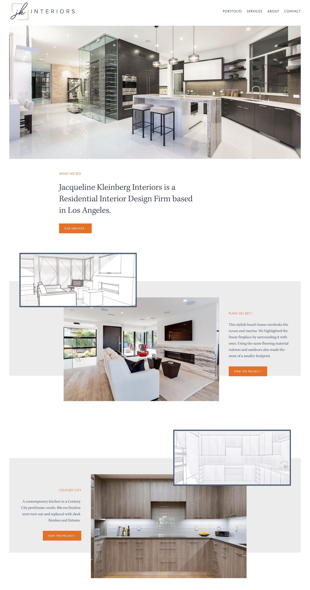
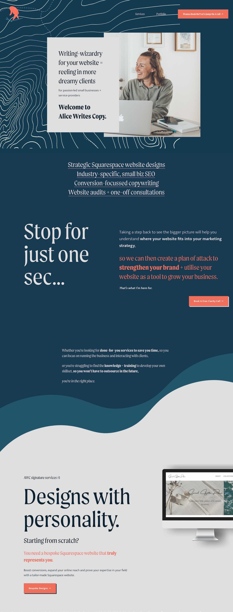
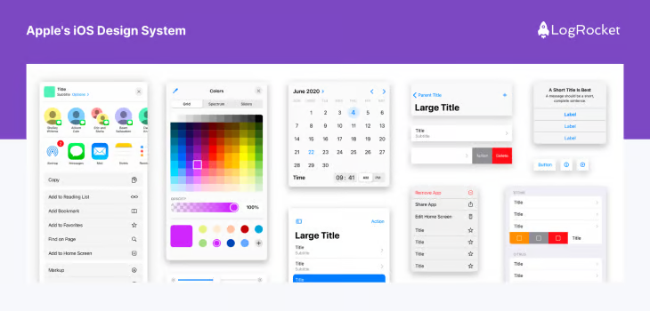
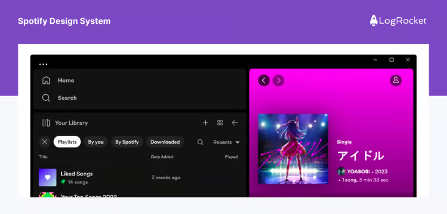
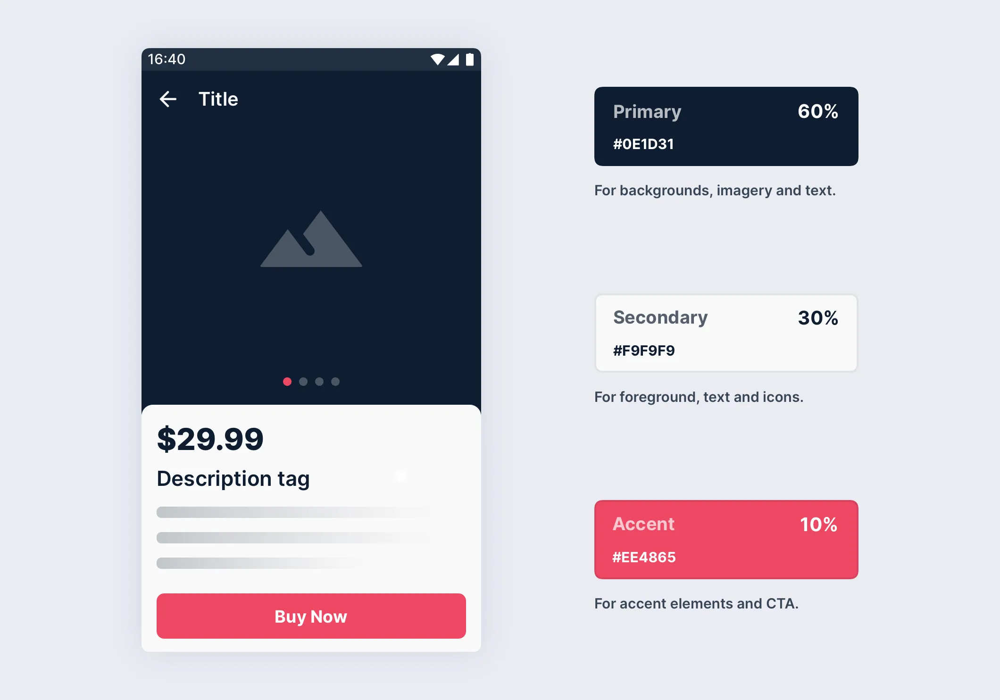
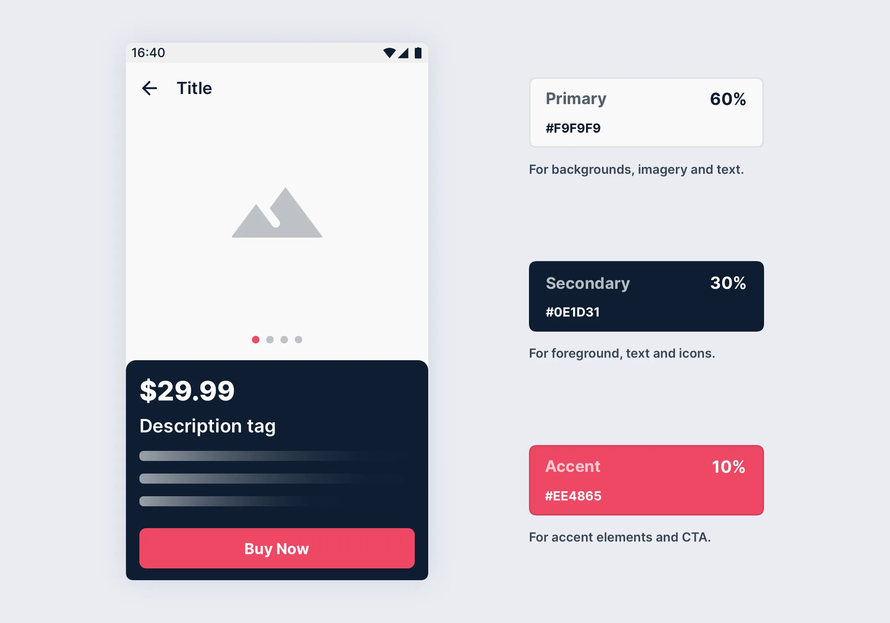

# Examples

## Examples of the 60–30–10 Rule in Action

[1]

1. Website Design
In a website layout, you might use the dominant color (60%) for the background and main sections, the secondary color (30%) for navigation bars and side panels, and the accent color (10%) for buttons, links, and calls to action.

2. Social Media Post
For a social media graphic, the 60–30–10 rule can guide your color choices for the background, text, and decorative elements. For instance, if you’re designing a post for a brand, the dominant color could be the brand’s primary shade, the secondary color could emphasize key information, and the accent color could make calls to action pop.

3. Logo Design
Even in logo creation, this rule proves beneficial. The dominant color can represent the brand’s identity, the secondary color can offer contrast, and the accent color adds a memorable detail.

Designing is like creating your own masterpiece, and the 60–30–10 rule is the secret sauce that makes everything click! Whether you’re painting a website, crafting a logo, or just making your social media pop, this rule ensures your colors play nice together while making the design stand out. So, go ahead, let your creativity shine — just remember, balance is key!

## example-1

[2]

Example colour schemes if the dominant colour is red
Red, white, and black: This classic colour combination is simple and elegant. This colour scheme works well for designs that want to convey a bold and striking message.

Red, yellow, and orange: This colour combination is warm and vibrant. This colour scheme works well for designs that want to convey a sense of energy and excitement.

Red, green, and blue: This colour combination is cool and calming. This colour scheme works well for designs that want to convey a sense of stability and trust.

Example colour schemes if the dominant colour is green
Green, blue, and grey: This colour combination is calming and natural. This colour scheme works well for designs that want to convey a sense of relaxation and balance.

Green, purple, and pink: This colour combination is playful and feminine. This colour scheme works well for designs that want to convey a sense of creativity and fun.

Green, yellow, and orange: This colour combination is bright and energetic. This colour scheme works well for designs that want to convey a sense of enthusiasm and excitement.

Example colour schemes if the dominant colour is blue
Blue, white, and grey: This colour combination is clean and calming. This colour scheme works well for designs that want to convey a sense of professionalism and trustworthiness.

Blue, orange, and yellow: This colour combination is bold and vibrant. This colour scheme works well for designs that want to convey a sense of energy and excitement.

Blue, green, and purple: This colour combination is harmonious and relaxing. This colour scheme works well for designs that want to convey a sense of calmness and tranquillity.

Example colour schemes if the dominant colour is black
Black, white, and grey: This colour combination is classic and timeless. This colour scheme works well for designs that want to convey a sense of sophistication and elegance.

Black, gold, and silver: This colour combination is luxurious and glamorous. This colour scheme works well for designs that want to convey a sense of prestige and high-end quality.

Black, red, and orange: This colour combination is bold and striking. This colour scheme works well for designs that want to convey a sense of excitement and energy.

## Website Design Example #1

[3]

*Disclaimer: When you have images in a website, it does make it a little bit more challenging to be using just 3 colors.

But generally, I would say this first website nailed it! They did an incredible job of not having the images take away from the harmoniousness of the design!

You can still very much tell what the main three colors are, the 60% being the white, the 30% being gray, and the 10% is our very standout orange color.

(Which you’ll notice they’ve reserved for all their CTAs!)

Ok, so there’s an example using a neutral color as the primary, but what about when it comes to using bold colors for your site?

## Website Design Example #2

[3]

So this next example actually comes from a very talented website designer and past student of my Square Secrets™️ & Square Secrets Business™️ courses!

Alice of Alice Writes Copy! (She offers copywriting in edition to her design services!)

So let’s look at how she’s incorporated her brand colors into her website design using the 60-30-10 rule!

What’s her 60% color? That bold blue! Awesome, right?

Then her 30% color is the sort of whitish-grey she uses for most of her text to contrast the blue.

Then the 10% is that brilliant sort of corral-y orange color in her logo, buttons, and any text she really wants to make pop!

## Apple’s iOS

[6]

Apple’s iOS interface also follows the 60-30-10 rule. The dominant color is white (60 percent), the secondary color is light gray (30 percent), and the accent colors are vibrant hues like blue and green (10 percent).

## Spotify

Spotify’s interface showcases a darker theme. The dominant color is black (60 percent), the secondary color is a darker shade of gray (30 percent), and the accent color is vibrant green (10 percent).

In each of these examples, the 60-30-10 rule helps create a visually balanced and intuitive interface.

The dominant color provides a clean canvas, the secondary color adds depth, and the accent color draws attention to key elements. This strategic use of color enhances usability and user experience.

## example-2

[4]

To better visualize, let us have a quick example with “60–30–10” in action:

You can also apply colors in a different order, and it will still work. Wow!

## example-3

[5]

For example, the sleep app Hatch uses a dark blue background as its primary color to evoke feelings of relaxation. It uses a slightly lighter shade of blue as its secondary color to add visual interest and make buttons stand out. Finally, it uses gray, light blue, and soft orange accent shades to highlight essential buttons and elements. This color palette complements the primary blue tones without disrupting the app’s peaceful ambiance.

## _References

[1]: <https://anshravisuals.medium.com/understanding-the-60-30-10-rule-in-design-a-guide-to-balanced-aesthetics-6988430b24c7>
[2]: <https://www.davidhodder.com/the-60-30-10-colour-rule-a-guide-to-creating-harmonious-designs/>
[3]: <https://www.paigebrunton.com/blog/60-30-10-color-rule-for-web-designers>
[4]: <https://blog.prototypr.io/tips-for-creating-a-better-color-palette-c69d9c20ae37>
[5]: <https://www.figma.com/resource-library/types-of-color-palettes/#step-3-use-the-60-30-10-rule>
[6]: <https://blog.logrocket.com/ux-design/60-30-10-rule/#color-harmony-in-brand-identities-and-design-aesthetics>
