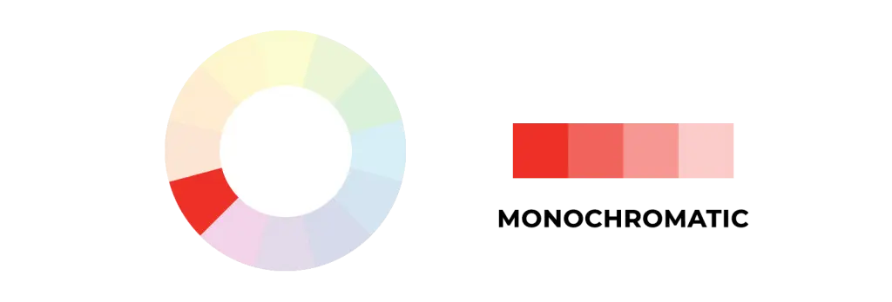
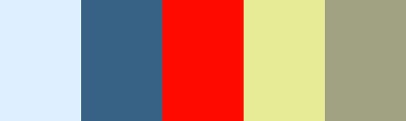

# Color Harmony/Scheme

**A color scheme is a set of colors that work well together visually**. [3]

**In color theory, a color scheme is a combination of 2 or more colors used in aesthetic or practical design. Aesthetic color schemes are used to create style and appeal**. [4]

*Color Schemes aka Color Harmony*. [5]

## Monochromatic

The monochromatic scheme involves taking one hue and creating other design elements from shades and tints.

**This formula uses a single hue further allowing you to explore different saturation and value to create variations of that color**.[1],[2]

**Effects:**

- This formula is guaranteed to match, creating a visually cohesive look. [1]
- It’s also considered the easiest on the eyes. [1]
- It doesn’t draw attention to itself and can help associate brands with a specific, memorable color. [1]
- A monochromatic color palette can be seen as undeniably chic and conservative. [1]
- It may also fall prey to boredom, depending on the use. [1]
- Monochromatic schemes are easy to create, but can also be boring when done poorly. [2]

**Usages:**

- These are the simplest color schemes to create, as they’re all taken from the same hue, making it harder to create a jarring or ugly scheme (though both are still possible). [2]
- You can bend the rules a little bit – and still keep the monochromatic scheme – by using a complementary, or accent color. The complementary hue can be found directly across from your chosen color and, used sparingly, do the trick. [1]
- Monochromatic schemes are easy to create, but can also be boring when done poorly. Adding in a strong neutral like white or black can help keep things interesting. [2]

**Examples:**

Here are three examples of monochrome color schemes. For the most part with these schemes, the first color (if we look at this from left to right) would likely be used for headlines. The second color would be used for body text or possibly the background. The third color would likely be used for the background (or body text if color #2 was used as the background). And the last two colors would be used as accents or within graphics. [2]

## Analogous

Analogous colors involve using three colors next to each other on the color wheel, such as blue, blue-violet, and violet.

The analogous combination uses colors that are next to each other on the color wheel like blues and greens or reds and oranges.[1]

Analogous schemes are created by using three colors that are next to each other on the 12-spoke color wheel. [2]

**Effects:**

- They match extremely well and create schemes that are pleasing to the eye.[1]
  > You will often find this very versatile combination in nature – picture red, orange and yellow leaves in the Autumn or the sky during sunset.
- An analogous scheme is great for very serene, peaceful designs where you want your audience to feel comfortable and relaxed.[1]
- It doesn’t mean that you can’t use the same color scheme to create other feelings like exuberance and energy, especially if using warm hues.[1]

**Usages:**

- Analogous color schemes are the next easiest to create. [2]
- Traditionally, analogous color schemes all have the same chroma level, but by using tones, shades, and tints we can add interest to these schemes and adapt them to our needs for designing websites. [2]

**Examples:**

- This is a traditional analogous color scheme, and while it's visually appealing, there isn't enough contrast between the colors for an effective website design. [2]

- Here's a color scheme with the same hues as the one above, but with the chroma adjusted to give more variety. It's now much more suitable for use in a website. [2]

- Another example of a traditional analogous scheme. [2]

- And the above theme modified for use in a website design. [2]

## Complementary

Designers use 'opposite color' pairs like blue and yellow to maximize contrast here.

Complementary schemes are created by combining colors from opposite sides of the color wheel, like red & green or blue & orange. [1][2]

**Effects:**

- This combination, when they have the same value (tint/shade), is extremely vibrant and dynamic, and this is why they are constantly used in sports.
- Its high-contrast and high-intensity create *"visually jarring"* or *“vibrating boundaries”* when color vibration happens along the edges separating hues of the same value.

**Usages:**

- This scheme can be difficult to apply in a harmonious way if used in its purest form. The solution here is to introduce tint, shade, or desaturated tones to one of the colors or add a neutral color to the mix. It’ll add some variety and eliminate the *vibrating boundaries* while keeping the contrast. [1],[2]
- (*vibrating boundaries*) This is best avoided (either by leaving negative space or by adding another, transitional color between them). [2]

**Examples:**

- A wide range of tints, shades, and tones makes this a very versatile color scheme. [2]

- Another complementary color scheme with a wide range of chromas. Notice how placing the brighter red and green colors next to each other, a sort of “vibrating” quality is achieved on their edges. Be aware of this in your designs and make sure it’s done intentionally, if it all. [2]

- Don't forget that beige and brown are just tints and shades of orange. [2]

## Split-Complementary or Compound Harmony

Split complementary schemes add more complexity than regular complementary schemes. In this scheme, instead of using colors that are opposites, you use colors on either side of the hue opposite your base hue. [1],[2]

**Effects:**

- It still gives you contrast, like in the complementary scheme, but adds more colors to work with and more interesting results.[1]
- This scheme uses colors from either side of your complementary color pair to soften the contrast. [3]

**Usages:**

**Examples:**

- A scheme where yellow-green is the base hue. It's important to have enough difference in chroma and value between the colors you select for this type of scheme. [2]

- Another palette with a wide range of chromas. [2]

## Triadic

The Triadic scheme uses three equally distant colors on the color wheel. It maintains harmony and high contrast. [3]

**The triadic scheme uses three colors that are evenly spaced, forming a perfect triangle on the color wheel**. [1],[2]

**Effects:**

- This is one of the more diverse color schemes. They can be difficult to do well, but add a lot of visual interest to a design when they are. [2]
- These combinations tend to be striking and stimulating, especially if you use primary or secondary colors. [1]

**Usages:**

- Play around with tints & shades to create a scheme with less contrast. [1]
- Use one as the main color and the other two as accents. [1]
- The hardest part of this formula is getting the three colors to match the descriptions of your brand personality. I suggest you get to the questions list and color symbolism chart first before you decide to use this scheme. [1]

**Examples:**

- Using a very pale or dark version of one color in the triad, along with two shades/tones/tints of the other two colors makes the single color almost work as a neutral within the scheme. [2]

- Alternately, using one very bright hue with paired muted hues makes the single bright hue stand out more. [2]

## Tetradic or Double-Complementary

This involves using four colors that form two sets of complementary pairs with one color dominating.

**This scheme forms a rectangle on the wheel, using two complementary color pairs**.

**Effects:**

- It’s a very eye-catching combination, but may be harder to apply in your designs, since more colors are more difficult to balance.

**Usages:**

- Tetradic color schemes are probably the most difficult schemes to pull off effectively. [2]
- This combination works better if you choose one color to be the main hue, while the others can serve as accent colors, with adjusted saturation and value of some or all colors.
- *PRO TIP*: If you’re not confident with your color-choosing abilities, I suggest you stay away from this color harmony formula.

**Examples:**

- A rather unimpressive tetradic color scheme. The best way to use a scheme like this is to use one color as the primary color in a design and the others just as accents. [2]

- Tetradic color schemes can work well for creating color schemes with similar chromas and values. Just add a neutral (such as dark gray or black) for text and accents. [2]

- It works just as well for darker color schemes. [2]

## Square

A variant of tetradic, this scheme finds four colors evenly spaced on the color wheel.

## Diad

**a scheme with 2 colors separated by one color on the color wheel**.

- Pros: cohesive
- Cons: lacks extreme contrast

*Tips: avoid combining warm and cool colors, don’t have too many colors*.
*The color properties and color schemes can be combined in picking the best possible color scheme for your designs*.

## Custom

Custom color schemes are the hardest to create. Instead of following the predefined color schemes discussed above, a custom scheme isn’t based on any formal rules. Keep in mind things like chroma, value, and saturation when creating these kinds of color schemes. [2]

**Examples:**

- The colors here all have similar chroma and saturation levels. [2]

- Again, using colors with similar chroma and saturation is effective and creates a sense of cohesion across a color scheme. [2]

- Using one color with a high chroma among other colors with lower chromas is another effective method (the higher chroma color would/can act as an accent). [2]

## __References

[1]: <https://sibilaribeiro.com/create-your-website-color-palette/>
[2]: <https://www.smashingmagazine.com/2010/02/color-theory-for-designer-part-3-creating-your-own-color-palettes/>
[3]: <https://www.interaction-design.org/literature/topics/color-theory>
[4]: <https://en.wikipedia.org/wiki/Color_scheme>
[5]: <https://www.linearity.io/blog/color-palette/>
