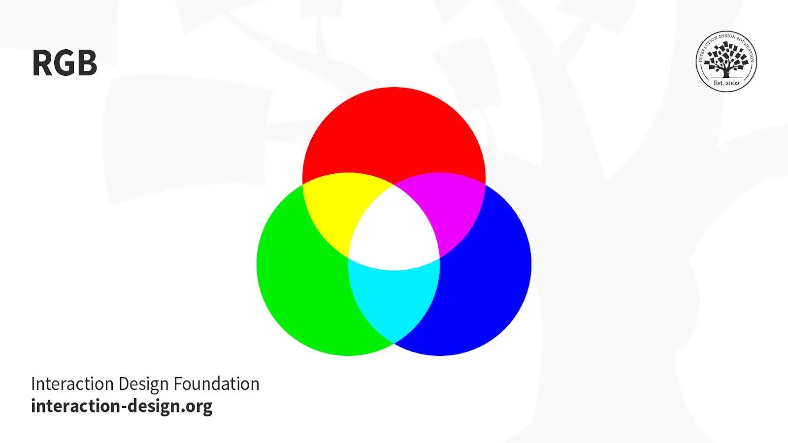
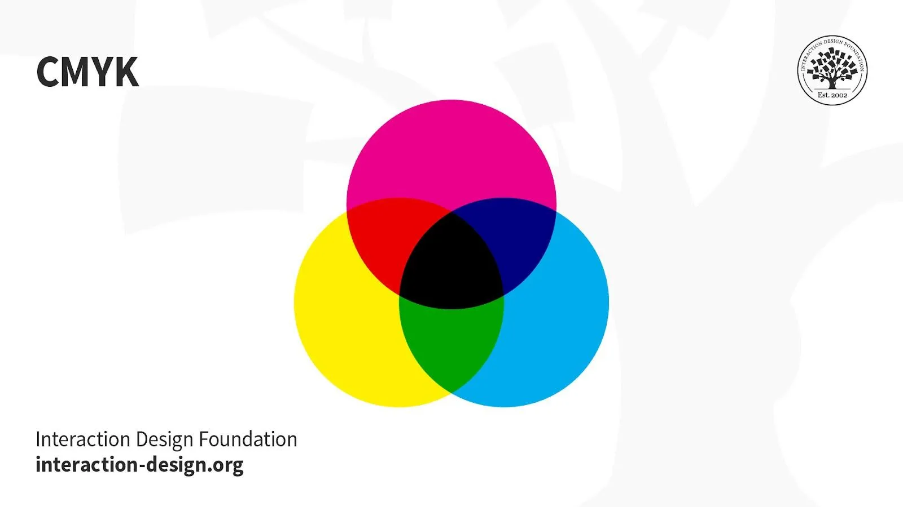
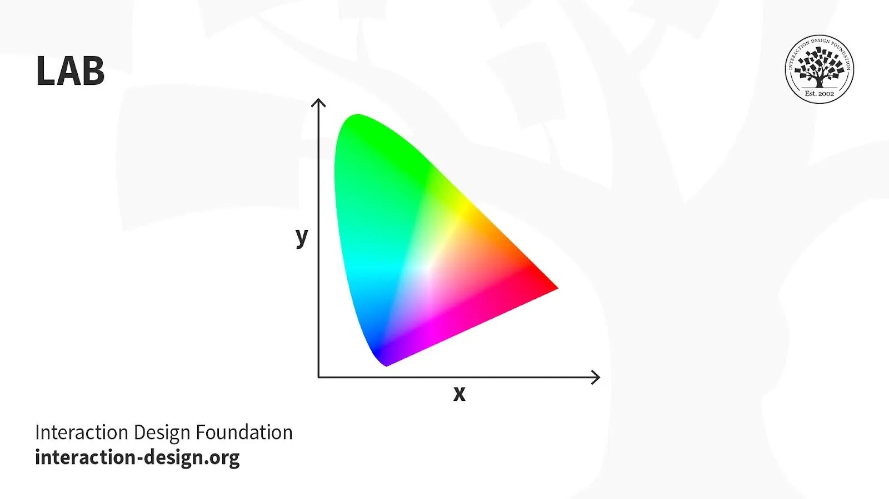
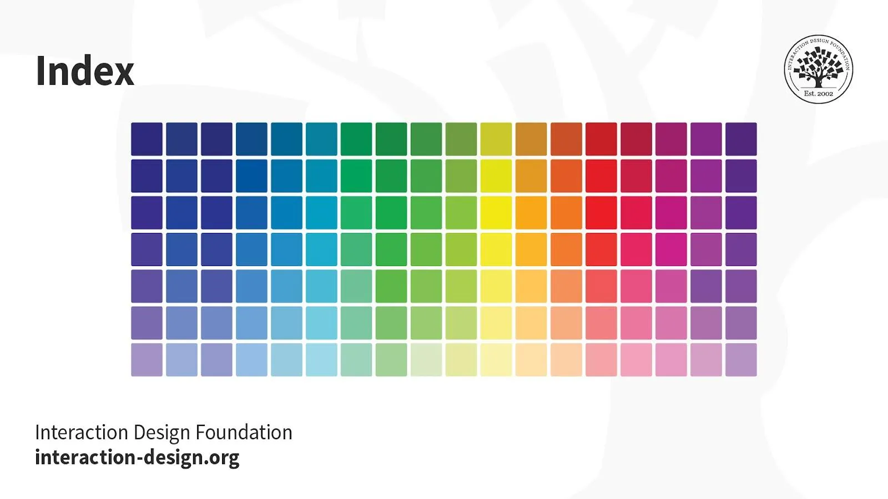
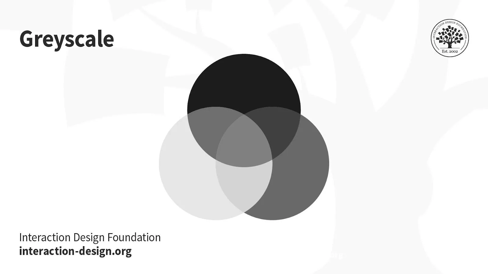

# Color Models

**A color system is a collection of colors chosen from a particular visual range**. [1],[2]

- It's like a color toolbox where you can mix a few selected colors to create shades and hues.

You can create a color theme based on your chosen material design color system.

> RGB, CMYK, and Lab are all examples of such color systems. When it comes to applying color to an interface, RGB is what we use.

In screen design, we use the color model, with red, green, and blue as primary colors. [3]

## RGB

RGB: This color mode uses the additive process. It comprises Red, Green and Blue hues that combine to create extensive color variations.

RGB exists exclusively in digital formats (e.g., mobile screens). Although RGB is present across most electronic devices, the color elements vary across systems and models. So, an image can display differently on-screen from brand to brand.

Uses:

- Web & App Design.
- Digital Design.
- Social Media.
- Online Advertisements.

## CMYK

This subtractive color mode comprises Cyan, Magenta, Yellow and Key (Black), which combine to produce a range of hues. This four-color process works for most printers.

Printed images are a series of layered four-color dots (measured in dots per inch) that create different hues and gradations. Although CMYK is a standard color model, the exact range of colors represented can vary depending on the press and printing conditions.

Uses:

- Stationery (e.g., business cards).
- Advertising (e.g., posters, flyers, brochures).
- Product Packaging.

*Tip — Use CMYK mode when preparing an image to be printed with process colors, as image conversion from RGB to CMYK creates a color separation. If you start with an RGB image, it’s best to edit first in RGB and then convert to CMYK afterward*.

## Lab

Also called CIELab, LAB is based on how humans perceive color. It comprises one channel for lightness (L, ranging from the values 0–100) and two for color (A—the Green-Red Axis channel—and B, the Blue-Yellow Axis channel, ranging from +127 to -128).

LAB color is device-independent, making it easy to achieve precisely the same color across different types of media so your (e.g.) digital logo appears identically on a mug, banner, etc. However, LAB’s large file sizes can delay load times.

Uses:

- Branded Products (e.g., T-shirts, banners).
- Color Reference.
- Photography.
- Improving images with a natural and vibrant look.

## Index

This mode produces 8‑bit image files with up to 256 colors. Like RGB, this color mode is exclusively for digital formats, on-screen. When you convert an image to index color, a color table gets built to store and index the image’s colors.

If a color in the original image doesn’t appear in the table, the software chooses the closest one or uses a dither effect to simulate the color.

Uses:

- Websites.
- Digital Presentations.
- Mobile Applications.

While its color palette is limited, index color can reduce file size yet maintain the desired visual quality for digital presentations, websites and mobile applications. So, this mode is ideal for image optimization. For extensive editing, it’s best to convert temporarily to RGB mode.

## Greyscale

This black-and-white-looking mode comprises various shades of grey within an image.

You can use it in print and digital formats. In digital, each image pixel has a value ranging from 0 (black) to 255 (white). In print, the values range from 0% (white) to 100% (black), representing the amount of black ink used.

Uses:

- Digital formats to express a specific tone in your designs.
- Print formats to lower costs and minimize ink usage.

## Bitmap

(a.k.a. line art): This mode comprises black and white pixels, with no colors or shades of grey.

In digital formats, black and white values represent an image’s pixels, while black ink dots and the white of the paper represent the overall image in print formats.

Uses:

- Print and digital formats to create a line drawing or hand-drawn sketch or make vintage effects.
- While jagged-edged on-screen, bitmap images usually print smoothly with high resolution.

## __References

[1]: <https://www.interaction-design.org/literature/article/ui-color-palette>
[2]: <https://careerfoundry.com/en/blog/ui-design/introduction-to-color-theory-and-color-palettes/>
[3]: <https://www.interaction-design.org/literature/topics/color-modes>
