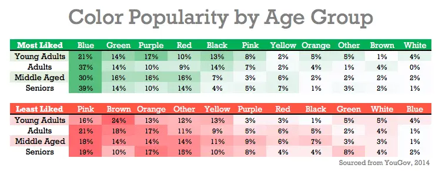

# Color Psychology

With clarity on your target audience, it’s time to look at the psychology behind your potential brand colors. Color psychology is a branch of psychology surrounding the influence of colors on human mood and behavior. According to color psychology, the human mind subconsciously reacts and interprets colors in a way that influences our actions. [3]

## How to Choose Colors for Your Users

[7],[8]

> Imagine walking into a serene dark blue room, then into a vibrant red one. The shift in your mood and perception is noticeable, isn't it? Now, transfer this concept into the digital world. That's the power and psychology of color in UI design.

- When designing, you can conjure a multitude of meanings through your color choices. Brand logos and colors need to resonate with the target audiences. So, industry and global market location are among the factors designers consider for leveraging color symbolism according to widely accepted associations, notably these:

- Remember, context is key. And, while most “facts” about color psychology lack scientific basis, a deeper look at the palette can reveal some essential insights:

- **Lastly, the colors you choose need to match your users and their sensibilities, not your personal preferences**.

If you want to create a color palette that attracts your target audience and accurately tells your brand story, it’s essential to have a basic understanding of color psychology. To get you up to speed, let’s take a look at some of the most common color associations below: [3]

### Red

Red = Love, Passion, Strength, Power, Danger, Excitement, Energy

Red – Scarlet and crimson are among the variations that make red sexy and dangerous to Western eyes. Red may be bloody and arresting in the form of revolutionary rage and wounded bank balances, but red’s far less dramatic to Eastern eyes.

> Red is the color of blood, so it’s often associated with energy, war, danger, and power but also passion, desire, and love. Some common associations with red include action, adventure, aggression, and excitement. [3]

### Orange

Orange = Warmth, Creativity, Adventure, Freshness, Happiness, Attraction, Success

Orange – Linked with creativity and happiness, orange declares national and religious identity and defines athletic applications. Like red, it can grab attention (e.g., prisoner jumpsuits). Consider it for youthful, energetic brands as opposed to luxury, traditional or serious ones.

> Orange is energetic and warm. Some common associations with orange include creativity, enthusiasm, lightheartedness, and affordability. [3]

### Yellow

Yellow = Optimism, Cheer, Happiness, Warmth, Caution, Energy, Intellect

Yellow – The color of the Sun highlights with eye-catching warmth. Yellow can represent happiness, warmth, alarm, sickness, cowardice; take your pick. Some shades can look cheap, though, so it’s a noteworthy example of the need to research users’/customers’ reactions.

> Yellow evokes positivity, youth, joy, playfulness, sunshine, and warmth. [3]

### Green

Green = Nature, Growth, Wealth, Luck, Envy, Freshness, Quality

Green – It’s the color of Mother Nature and her life-sustaining bounty, with connotations of recycling and healthy finances. Green also means “proceed”; but there’s also inexperience and envy. The shade matters. Brighter, lighter greens indicate growth, vitality and renewal; darker, richer greens represent prestige, wealth and abundance.

> Green is the color of nature. It symbolizes growth, freshness, serenity, money, health, and healing. [3]

### Blue

Blue = Trust, Calm, Sadness, Peace, Loyalty, Depth, Authenticity

Blue – People find blue trustworthy, assuring, calming and masculine. It’s a tranquil sea and peaceful wonder at the sky; but then it can “mood-swing” to depression. You can bank on blue for designing financial and corporate dependability, although the right shade is vital.

> Blue is perceived as authoritative, dependable, and trustworthy. Common associations with blue include calmness, serenity, confidence, dignity, and security. [3]

### Pink

> Pink evokes feelings of innocence and delicateness, gratitude, romance, softness, and appreciation. [3]

### Purple

Purple = Royalty, Nobility, Wisdom, Luxury, Imagination, Mystery, Spirituality

> Purple – Long associated with royalty, purple connotes luxury and indulgence. But its majesty doesn’t always translate to design; for example, only women favor it as a top-tier color. Purple is uncommon in branding. [3]

### White

White = Purity, Simplicity, Innocence, Peace, Cleanliness, Emptiness, Goodness

> White – Cleanliness, goodness, innocence and simplicity are all associated with white. It’s as pure as a fresh snowfall, yet it signifies mourning in the East and means surrender internationally. Although innately positive, white lacks a dynamic personality, so it’s best left for brands that are indeed pure, simple and transparent. [3]

### Black

Black = Sophistication, Formality, Sorrow, Boldness, Elegance, Death, Mystery

Black – Black means serious business, with overtones of severity and mystery, of death and grief. However, its inherent darkness doesn’t always convey negativity. It’s also a positive bank balance and smart, attractive clothing. It’s best to consider contrasting it with a bright color: gold for luxury or white for a bold, simple statement. Also, its texture and glossiness can influence your brand’s message.

> Black represents power, elegance, and authority. Common associations with black also include class, distinction, formality, mystery, secrecy, and seriousness. [3]

## Color Temperature

Your colors must reflect your design’s goal and the brand’s personality. You should also apply color theory to optimize a positive psychological impact on users. So, you should carefully determine how the color temperature (i.e., your use of warm, neutral and cool colors) reflects your message. [4]

> For example, you can make a neutral color such as grey warm or cool depending on factors such as your organization’s character and the industry. [5]

### Cool Colors

Cool colors often imply calm and tranquil emotions. They may also give the impression of coldness and impersonality. [5]

*TIP: Combine cool colors with warm or neutral color for balance*.

- Blue is sober and discreet and gives confidence to the customer in relation to the design.
- Green is fresh and represents health.
- Purple is the color mostly used in spas, beauty, and wellness as it can mean spirituality.
- Silver is often associated with brands in technology. It represents the color of innovation and modernity.

### Warm Colors

Warm colors trigger strong emotions like energy and vigor. [5]

*TIP: Be careful in using only warm colors in your design. This can trigger unwanted emotions like aggression. So like cool colors, it is best to combine other color shades with warm colors*.

- Red is widely used in promotional campaigns like a product sale. The color red is one of the strongest warm colors as it can easily stand out from the rest of the color group. Red is also used to catch the user’s attention. However, be cautious in using this color as red can trigger aggression as an emotion.
- Pink is used in brands promoting women, children and also sweet foods. This color may also mean innovation and differentiation that can be used for campaigns that arouse the interest of the consumers in knowing the product.
- Yellow is also used to attract attention (aside from red). This color is also used in creating CTAs to get attention and focus from the users.
- Orange is mostly used for brands that promote youth, energy, and creativity.
- Gold usually means wealth and power.

### Neutral Colors

Neutral colors are commonly used as backgrounds in design since they soften the other colors. The colors under neutrals are a perfect combination to cool and warm shades. [5]

- Brown is associated with elegance and sophistication so you will notice that most luxury brands have this color in their logos. Brown color can also mean nature and rustic, thus, a good color choice for organic products.
- Beige promotes the feeling of comfort and coziness. This color is widely used as interior color for walls, curtains, rugs, and etc.
- Gray implies professionalism and responsibility. It can also mean technology and modernity.
- White means harmony and light. It is a perfect prominent color for websites, especially in blog sites and ecommerce.
- Black means power, strength, elegance, and also mystery. This color is widely used as text color for better readability.

## Personal Perception

The colors are interesting. They have this duplex nature that induces ‘psychological’ effects that are considered universal; on the other hand, the perception of color is considered subjective, based on the person’s experience, culture, etc. [9]

## Users respond

### Age

Faber Birren’s Color Psychology came up with a research of which colors are desirable for people specific to age. Birren found out that the colors blue and red are consistent colors preferred in all age groups. Yellow on the other hand is preferred by younger age groups. And as we grow older, we favor more shorter wavelength tones like blue, violet, and green color rather than the stronger shades of red and yellow. [5]

In the chart above, it shows that most audiences prefer energetic and saturated tones. However, older people think these colors are repulsive. The study tells us that when designing colors for the older age group, we should be careful with using too many bright shades as these can decrease in the conversion rate.

### Gender

There are studies that show men and women have varying preferences in colors, however, this research on color perception indicates that men like bright colors and women like softer shades. [5]

In addition, Joe Halllock’s Colour Assignment showcases certain color preferences among men and women:

*​It is important to note that Hallock’s data came mostly from Western respondents and environmental factors can have an effect on these preferences, which leads us to another factor that plays a strong role in color preferences in genders—cultural differences*.

## Examples

A notable example of the application of color symbolism is the icons for The Global Goals. This project, undertaken by designer Jakob Trollbäck, head of Trollbäck + Company, made the old Sustainable Development Goals for eliminating world hunger, etc., more universally resonating. The highly symbolic designs and palette carefully consider cross-cultural relevance and serve as part of the hopeful language to inspire everyone, everywhere to act for improvements and equality in the lives of people across the planet.

### How do brands use color psychology

The colors that you see in big brands today are not made by coincidence. All of them use color psychology to make sure that their logos are easily recognized and better remembered by their consumers. This is how companies get branded. Here are some examples of brands that apply psychology of colors:

- McDonalds uses yellow for their brand, which evokes happiness and optimism.
- Victoria Secret and Barbie both use pink color that attracts the female audience. As previously said, pink is associated with femininity and childhood.
- The blue color is eminent for Facebook and Paypal logos, which mean stability and trust.
- The New York Times and Prada both use black on their logos, which spells out power, luxury, and sophistication.  

### What are some of the most common color associations?

[6]

## References

[1]: <https://www.linearity.io/blog/color-palette/>
[2]: <https://en.wikipedia.org/wiki/Color_psychology>
[3]: <https://careerfoundry.com/en/blog/ui-design/introduction-to-color-theory-and-color-palettes/>
[4]: <https://www.interaction-design.org/literature/topics/color-theory>
[5]: <https://userpeek.com/blog/what-is-color-psychology-in-ux/>
[6]: <https://www.linearity.io/blog/color-palette/#:~:text=color%20associations.-,What%20are%20some%20of%20the%20most%20common%20color%20associations%3F,-Red%3A%20caution%2C%20anger>
[7]: <https://www.interaction-design.org/literature/article/ui-color-palette>
[8]: <https://www.interaction-design.org/literature/topics/color-symbolism>
[9]: <https://medium.com/rutgers-creative-x/understanding-color-for-ui-design-ec53719e880e>
