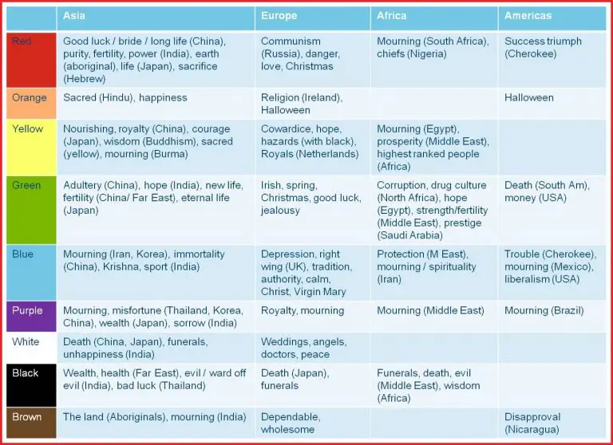
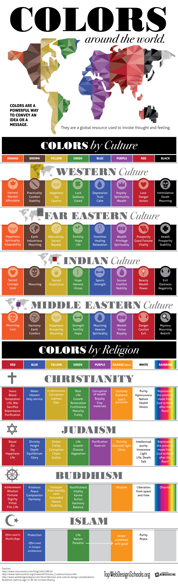

# Color Symbolism

Cultural background can influence our color preferences too. Aside from this, the color meanings can also vary from cultures. Like for example, in the West, white means innocence, aspiration, and hope. In Asia, however, white color is for death, mourning, and bad luck. You can look at the table below to check the color meanings of different cultures: [4]

## __References

[1]: <https://en.wikipedia.org/wiki/Color_symbolism>
[2]: <https://www.interaction-design.org/literature/article/ui-color-palette>
[3]: <https://www.interaction-design.org/literature/topics/color-symbolism>
[4]: <https://userpeek.com/blog/what-is-color-psychology-in-ux/>
