# Color Theory

Color is an integral part of a product’s branding: It can evoke emotion, establish information hierarchy, convey meaning, and do other important things in UX design. [C1]

**In user experience (UX) design, you need a firm grasp of color theory to craft harmonious, meaningful designs for your users.**

## Definition

**Color theory is the study of how colors work together and how they affect our emotions and perceptions**. [5]

- It's like a toolbox for artists, designers, and creators to help them choose the right colors for their projects.
- Color theory enables you to pick colors that go well together and convey the right mood or message in your work.

Structure by order:

- [Color Wheel](#color-wheel)
- [Color Model](#color-model)
- [Color Attributes](#color-attributes)
- [Color Communication](#color-communication)
- [Color Representations](#color-representations)
- [Color Harmony/Scheme](#color-harmonyscheme)

### History

**Sir Isaac Newton** established color theory when he invented the color wheel in 1666. Newton understood colors as human perceptions—not absolute qualities—of wavelengths of light. By systematically categorizing colors, he defined three groups:

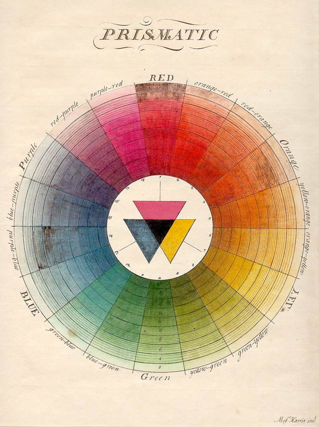

- Primary (red, blue, yellow).
- Secondary (mixes of primary colors).
- Tertiary (or intermediate—mixes of primary and secondary colors).

## Color Wheel

Sir Isaac Newton established color theory when he invented the color wheel in 1666. Newton understood colors as human perceptions—not absolute qualities—of wavelengths of light. By systematically categorizing colors, he defined three groups:

- Primary (red, blue, yellow).
- Secondary (mixes of primary colors).
- Tertiary (or intermediate—mixes of primary and secondary colors).

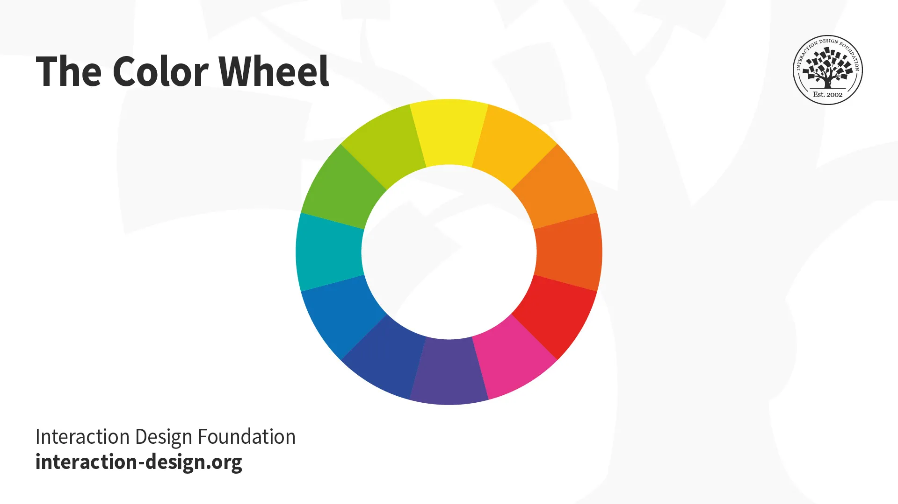

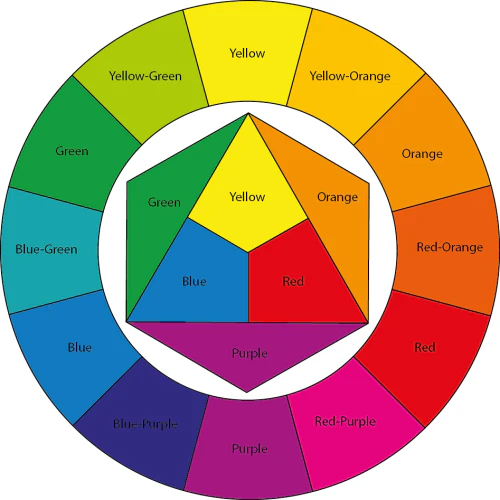

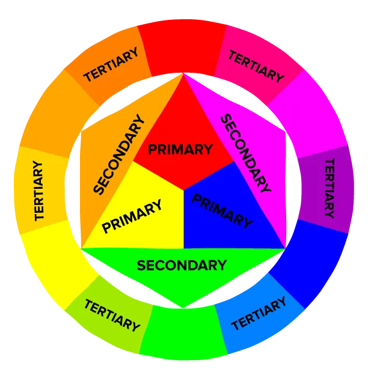

## Color Model

- [Color Model](./color_models/color_models)

## Color Attributes

[6],[7],[8],[9]

- [Hue](#hue)
- [Value](#value)
- [Saturation](#saturation)

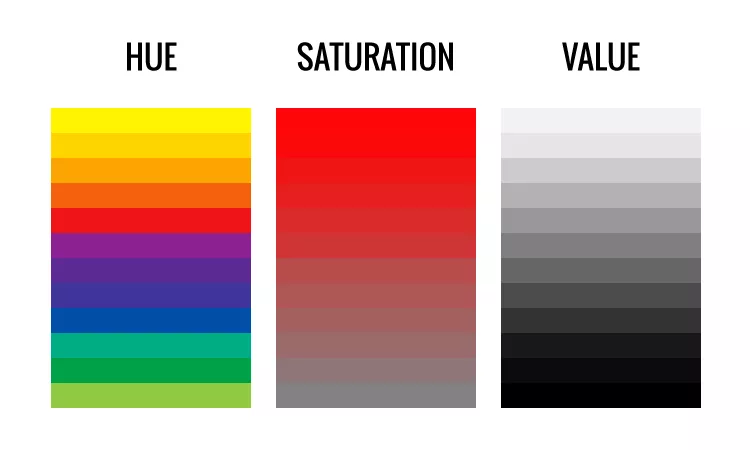

### Hue

Hue refers to color families (like red, green, or blue)

**Hue is the attribute of color that distinguishes it as red, blue, green or any other specific color on the color wheel**.

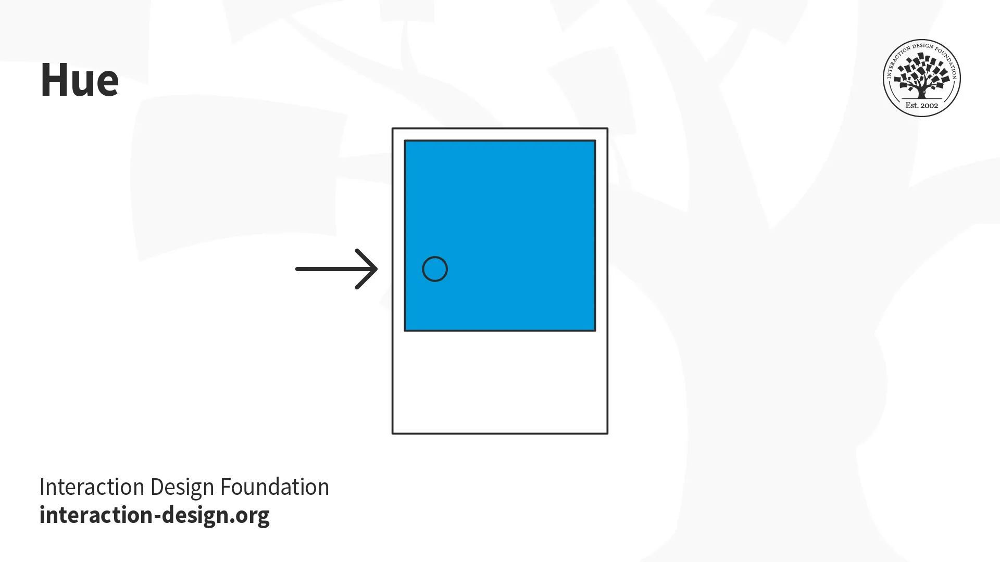

**Hues is a fancy term for the word ‘color.’ Hues are pure colors without any other color properties. There are a limited number of hues. Most of the colors we interact with have any or all of the other color properties**. [10]

### Value

**Value represents a color's relative lightness or darkness or grayscale and it’s crucial for creating contrast and depth in visual art.**

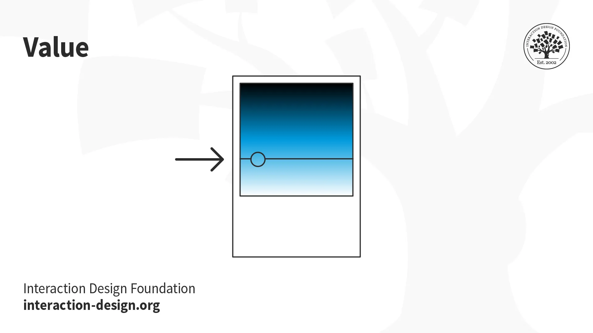

- The lightest value of any color is white
- The darkest is black (as in the graphic above).

Many programs have value settings, like a sliding scale that lets you add white or black to a selected color. Value is key to creating contrast in your designs.

> For example, a color with a lighter value stands out against a dark background, which can make a design easier to see.

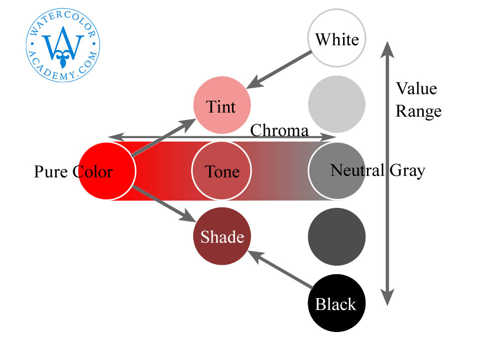 [12]

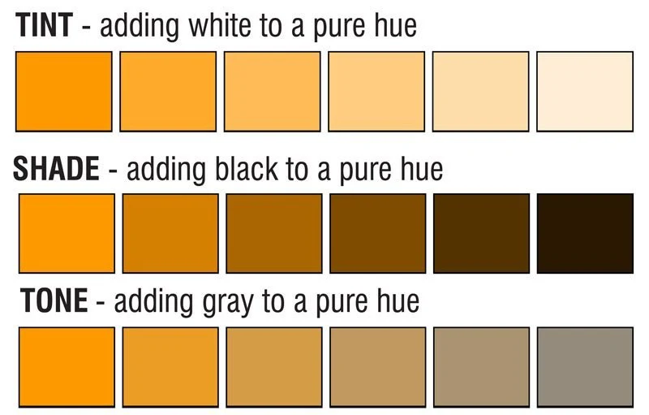 [13]

#### Tints

Tint is most often the forgotten term as it is grouped with shade. A tint of color is the hue mixed with white. Tint always lightens any color.

#### Tones

Tone is also a fancy term for the word ‘saturation.’ The tone of a hue is the hue mixed with black and white (a.k.a gray). A wide range of lighter and darker tones than the original hue can be created based on the amount of white and black added to the hue.

#### Shades

Shade is a term is often confused with the tone of a color. A shade of a color is the hue mixed with black; there is no white. Shades always darken the hue.

##### Shades of gray

[11]

### Saturation

*aka as chroma*.

**Saturation refers to the intensity and richness of color. Think of the highest saturation as the purest form of a color.**

- Lowering the saturation all the way would leave you with shades of grey, like a black and white film.
  > For example, red, at its most saturated, is bold and bright. You can soften pure red by lowering the saturation and making it appear more muted.

- The saturation you choose depends on how bold you want the colors in your design to be. Highly saturated colors are great for grabbing a user's attention.
  > Think of neon signs, highlighters, and sirens—all of which use intense saturation to emphasize their importance.

In the simple scale diagrams below, the first model indicates amount of black, white, or grey added to the hue. The second model illustrates the same scale but explains the phenomenon based on light [spectral] properties. [14]

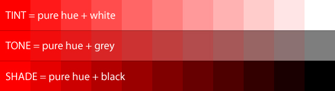

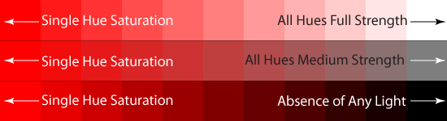

## Color Communication

[C2],[C3]

- Colors can affect your behavior, mood, and thoughts
- Colors can convey emotions, signal actions, and add variety

> Red, for example, attracts a lot of attention. That's why things like exit signs, emergency buttons, and stop signs are red. Objects with this color always get noticed.
>
> Blue on the other hand can communicate serenity and feelings of calmness or peace. That's one reason why blue is considered widely appealing.

*Keep in mind, certain colors might mean one thing in one region of the world and something totally different elsewhere. You'll learn over time the colors that are most commonly associated with different emotions and how those choices affect your design decisions.*

Color is a powerful tool for evoking emotions, expressing thoughts and communicating with—and persuading—your users, but its symbolism is subjective and depends on the context. How humans react to color is complex, stemming from our: [15],[16]

- [Color Psychology](./color_psychology/color_psychology) Biological response: For example, the color red can inspire fear and sexual desire, while blue light can help psychologically.

- [Color Symbolism](./color_symbolism/color_symbolism) Cultural response: Different cultures value certain colors differently. Western societies typically esteem blue well above yellow; Eastern ones tend to prize yellow and see red without alarming or erotic overtones.

- Personal associations with color: Our experiences can color our view of certain colors—e.g., someone’s childhood skiing accident might permanently scar their appreciation of white.

## Color representations

- HSL: [20]
- HSV: [20]

## Color Harmony/Scheme

- [Color Harmony](./color_harmony/color_harmony)

## Science of Color Theory

- **Colorization isn’t easy—it’s part art, part science, and part personal taste.** [17]

- **Crafting a color palette sounds like an art—but it’s really a science.** [18]

- **As tempting as it is, you can't rely purely on math to craft the perfect color palette.** [19]

## Examples

Color scheme for GeoShapes app including primary, secondary, and grayscale palettes.

The main, or primary, colors for the app are red, purple, and green. Colors often have implied meanings.

> For example, red represents passion, purple represents creativity and originality, and green represents growth and balance. 

All of these traits are important for cultivating a love of art. We chose a strong set of primary colors, secondary colors that are less vibrant than the primary colors, and a grayscale with a touch of these colors infused into them. As you build your sticker sheet, consider the theory behind the colors you choose and how those colors will represent the product you’re designing. [C1]

## References

[C1]: <https://www.coursera.org/learn/high-fidelity-designs-prototype/supplement/qqUtE/create-sticker-sheets-for-design-projects>
[C2]: <https://www.coursera.org/learn/high-fidelity-designs-prototype/lecture/t5ss3/color-in-ux-design>
[C3]: <https://www.coursera.org/learn/high-fidelity-designs-prototype/supplement/MDi11/work-with-color-in-mockups>

- [Color Theory](https://www.interaction-design.org/literature/topics/color-theory)

- To learn more about color theory and how the psychology of color can affect users, check out this article from UserPeek: [“What is Color Psychology in UX Design?”](https://userpeek.com/blog/what-is-color-psychology-in-ux/).

[1]: <https://en.wikipedia.org/wiki/Color_theory>
[2]: <https://colors.dopely.top/color-toner/001aff-shades-40>
[3]: <https://ux4sight.com/blog/ux-training-how-to-optimize-the-use-of-accent-colors>
[4]: <https://careerfoundry.com/en/blog/ui-design/introduction-to-color-theory-and-color-palettes/>
[5]: <https://www.interaction-design.org/literature/topics/color-theory>
[6]: <https://www.coursera.org/learn/high-fidelity-designs-prototype/supplement/xRrdC/consider-additional-visual-design-elements-and-principles>
[7]: <https://www.interaction-design.org/literature/topics/color-theory>
[8]: <https://learn.leighcotnoir.com/artspeak/elements-color/hue-value-saturation/>
[9]: <https://www.virtualartacademy.com/three-components-of-color/>
[10]: <https://medium.com/rutgers-creative-x/understanding-color-for-ui-design-ec53719e880e>
[11]: <https://en.wikipedia.org/wiki/Shades_of_gray>
[12]: <https://watercoloracademy.com/watercolor-lessons/color-theory-contrast-of-saturation>
[13]: <https://debbiechatfield.co.uk/blogs/debs-blog/tint-tone-and-shade>
[14]: <https://learn.leighcotnoir.com/artspeak/elements-color/hue-value-saturation/>
[15]: <https://www.interaction-design.org/literature/article/ui-color-palette>
[16]: <https://www.interaction-design.org/literature/topics/color-symbolism>
[17]: <https://www.linearity.io/blog/color-palette/>
[18]: <https://www.linkedin.com/pulse/guide-ui-color-palettes-uxtools-rcnne/>
[19]: <https://www.refactoringui.com/previews/building-your-color-palette>
[20]: <https://en.wikipedia.org/wiki/HSL_and_HSV>

- Curious about color theory and don’t know where to start? Here’s a brief yet thorough beginners’ guide to color theory from CareerFoundry: [The Color Guide: An Introduction To Color Theory And Color Palettes](https://careerfoundry.com/en/blog/ui-design/introduction-to-color-theory-and-color-palettes/).
