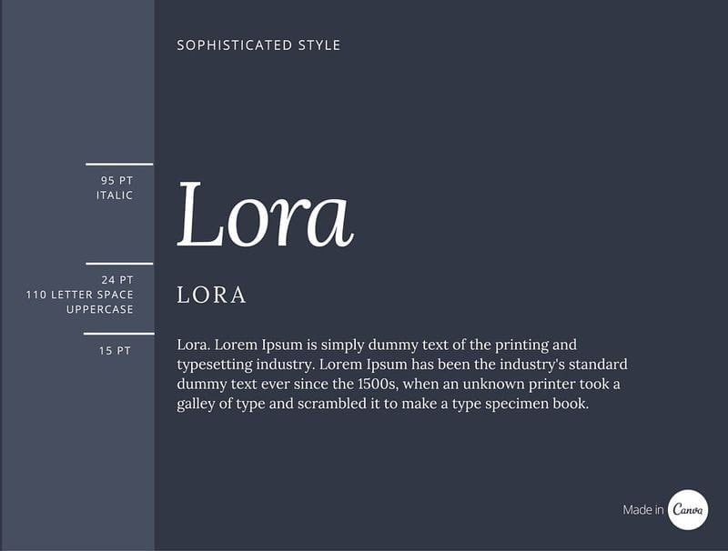

# Pairing/Combination Samples/cheat sheet

To make it easier for you to use this guide as a reference material, we’ve arranged our 30 unique font combinations according to the content or publication type they work best for. [1]

## Design publication font combination: League Spartan + Libre Baskerville [1]

- **League Spartan** is a modern typeface with strong structure and geometric form. This contrasts well against the elegant and more traditional style of **Libre Baskerville**. Using a serif for your body copy makes dense information easy to read.
- Columns are a great way to contain your text. Shorter lines of text are easier to read, so when you have limited copy, try to reduce the width of your text space.

Related article:Build your brand:How to choose the right fonts [2]

## Resumé font combination: Julius Sans One + Archivo Narrow [1]

- **Julius Sans One** offers a fine stroke, and its broader baseline makes it a great display font. Offsetting well against the more masculine and geometric style of **Archivo Narrow**, these typefaces offer a good font combination for easy readability.
- Resumes [3] and formal documents are often lacklustre when it comes to font and font combinations, but they don’t have to be. Combining clean, easy-to-read typefaces that create hierarchy and balance is imperative when you are trying to convey a message.

## Sports/active: Archivo Black font [1]

- A bold, rounded typeface combined with a lighter, condensed style will make for happy font combination. All three fonts in this example are strong and easy-to-read. The bold, wide Archivo Black creates impact, appropriate for an activity-oriented audience.

Here the text color has been broken up to complement the composition and colors in the background image. Communicating with visual techniques like this brings more symbolism to your designs. The text has been placed to outline the shape of the dancer in the image, guiding the eye to read the design much like a story.

*100 free fonts you should be using* [4]

## eBook: Libre Baskerville font [1]

- Don’t be afraid to use one typeface across your entire brand. Finding fonts like Libre Baskerville that have style variants is a clever way to create nuance without overcomplicating your designs. This typeface is a classic serif that is beautifully applied as a heading and easy-to-read body copy.

To elaborate on how easy it is to use different font variants, here is an example of Libre Baskerville in action. Using an italic pronounces a word or subheading without having to change font-families.

*9 terrific font pairs for you to try* [5]

## Fashion retail font combination: Bebas Neue + Montserrat [1]

- Bebas Neue is a favorite in the design-sphere. Its condensed and clean form makes it excellent to use for headings. Round and narrow typefaces offset nicely against each other. The contrast between Bebas and Montserrat makes for a tidy and contemporary font combination.

Because of the geometric form of this font combination, shapes are ideal to accompany your type. The lines applied either side of the Season Sale text act as great bookmarks and they align to the width of the heading for stylistic composition.

## Sophisticated style: Lora font [1]

- You don’t have to use completely different fonts to achieve a dramatic effect—you can use light and bold versions of the same family for versatility.
- **Lora** has brushed curves that make it a very elegant and sophisticated typeface.
- The effect of using the italic and regular together is charming and feminine.

Apply interesting compositions by finding areas to place text.

- The background image, here, was scaled to make for copy space to place on the bulb of the orchid.
- White was used for the body copy to contrast against the darker petals, while the same fuchsia color was used on the heading and subheadings.
- The keyline makes for a simple effect, and nicely anchors the copy to the right of the graphic.

*How to customize fonts to improve your designs* [6]

## Front page font combination: Open Sans Extra Bold + Cooper Hewitt+ PT Sans [1]

- This font combination has similarities to combinations you would find in newspapers or publishing. **Open Sans Extra Bold** grabs the attention of your audience, much like that of a headline. These typefaces are tough and straight to the point.
- The light **Cooper Hewitt** applied in uppercase is a great contrasting subhead or chapter marker, as is the easy-to-read **PT Sans** for body copy. These typefaces are well balanced and create a solid, well-anchored style.

## Technology: Roboto Condensed font [1]

- **Roboto Condensed** is a sans serif typeface with a sans serif reading rhythm, which makes it a great choice for body copy. When applied in bold, the font works very well for a heading. The extended x-height of the typeface enhances the already well-condensed effect of the font.

Headings and subtitles don’t have to sit in order, which is why we use scale and size to differentiate them. Create some nuance by using clever spacing between your ascenders and descenders to place some text.

## Art gallery: Cooper Hewitt font [1]

- With strong arches and curves, Cooper Hewitt is a classic typeface with excellent variations to use to separate your headings, subheadings and body copy respectively.

Finding geometric, contrasting spaces in your background image are an excellent way to place text. Darken your image a little to enhance readability.

## Invitation and events: Playfair Display font [1]

- **Playfair Display** is an excellent typeface to use for wedding or invitation design. The heavy style of **Playfair Display Black** offsets beautifully against **Playfair Display Italic**, creating a harmonious hierarchy.

Color can play a wonderful part in how your typefaces are portrayed
> for example, the light tones from the sky in the background image, here, have been used masterfully to soften the text.

## Industrial font combination: Norwester + Kollektif + Montserrat [1]

- **Norwester** is an attention-grabbing, geometric font best used for headings. The font combination of **Norwester**, **Kollektif** and **Montserrat** is structured and geometric.

It’s always good to consider the essence you are trying to visually communicate with your audience. Using this strong combination to symbolize the physical strength of the product is a nice way to create a visual metaphor.

## Lifestyle magazine font combination: Source Sans Pro + Source Serif Pro [1]

- **Source Sans Pro** and **Source Serif Pro** were created to be used as a combination in design and are another excellent example of typographic harmony.

Using a grid is one of the easiest ways to form a clean, structured composition, which creates balance and hierarchy, and color enhances these features by pulling tones in from the images to form consistency and visual harmony.

## Bike shop font combination: Yellowtail + Open Sans Bold + Open Sans light [1]

- A fun combination: **Yellowtail** is a fat brush script typeface with a mix of connecting letterforms. It contrasts nicely against the bold and more basic style of **Open Sans Bold** and **Open Sans Light**.

Script typefaces make for lovely and embellished short headings. Too many words are hard to read, so best to keep your application of script to a limited number of words. Take advantage of the slanted form of a script typeface by adjusting the angle a little.

Note: Find the natural composition of your background to place your text, letting descenders drop into spaces and curl around objects.

The Yellowtail font works great with any lifestyle design, just like the Blue and Pink Collage Clothes Retail Shop Facebook Post template.

*50 of the best bold fonts built for impact in any design* [7]

## Exhibition font combination: Raleway + Roboto Condensed [1]

- A great combination, the roundness of **Raleway** contrasts well with the condensed **Roboto Condensed**. A fine-weighted subheading offsets well against a heavier heading typeface.

Using mixed weights of one typeface is an excellent way to enhance hierarchy and form some nuance. Tying in a color from your background image will connect your audience with the subject matter.

## Mediterranean font combination:Cinzel + Quattrocento + Lora [1]

- **Cinzel** is considered contemporary, although it was inspired by the classical Roman style. With the delicate strokes of **Quattrocento** and **Lora**’s curves, this is a fine font combination to use for headings or for invitations.

This application is a more traditional and expected style. Finding words that are a similar length or width will create a nice form for the composition of your design.

## Form and function font combination: Oswald font + Montserrat Light + Cooper Hewitt [1]

- **Oswald** has been redesigned as a web font to work across all digital screens.
- Teamed with **Montserrat Light** and **Cooper Hewitt**, this is a highly functional and easy to read interface font combination.

To amplify a typeface like Oswald, use a contrasting color behind the sections of text. This not only makes it stand out but also enhances the hierarchy between your heading, subheading and body copy. Alignment is important, so ensure you place these blocks deliberately.To create a strong monochromatic style, use black and white elements grouped with a desaturated image.

## Annual Reports: Cooper Hewitt Thin

Reports require less complicated type combinations, which makes this trio a great choice. Don’t be afraid to use a thin typeface as a heading. This is one of the best ways to take advantage of a very fine type weight as it shows off the structure and letterform.

When you are applying fine typefaces, it’s imperative to ensure that it’s easy to read. Applying over a flat color can help with this, forming a contrast and letting the form stand out.

Note: Lighter typefaces risk looking weak; combining them with bold colors and additional elements will give your design some gusto.

*50 free modern fonts to download for a contemporary look* [8]

## Art and objects: Kollektif font

Kollektif was created in a fight against the fine, clean style of the geometric typefaces of the 21st Century. The disruptor is a round and strong typeface great for both web and print material. Gidole offers a heavy contrast with a fine and condensed form.

Choosing a typeface isn’t just about whether you like it or not, it’s about how the words in your copy look when the typeface is applied. It might be the descender on the g or the k that hugs the o (like in Kollektif). The tittle on the 'i' is quite round and creates an element of nuance in contrast to the structured and otherwise angular typeface.

## Fashion magazines font combination: Bodoni + Montserrat

**Bodoni** is known as a classic magazine heading typeface. [Massimo Vignelli](https://en.wikipedia.org/wiki/Massimo_Vignelli) stated that ‘**Bodoni** is one of the most elegant typefaces ever designed’. The application of **Bodoni** paired with the contrasting of Montserrat is sophisticated and contemporary.

Finding shapes within your background image is a clever technique to contain your text. Ensure your text color contrasts against the color behind as there may be detail in your image that would make your text hard to read.

## Adventure: Merriweather font

**Merriweather** was created specifically for web design and not favored as a print typeface. The combination of bold and regular style variants makes for easy reading and classic aesthetic.

Rules are also made to be broken, so don’t take these sizings and font combinations too seriously. Be creative with your placement and style variants, especially for the sake of conceptual design treatments like creating hierarchy and typographic styles.

## Zine font combination: League Gothic + Archivo Narrow + Kollektif

**League Gothic** has a distinctive condensed style that has similarities to **Archivo Narrow** yet offsets well against the round form of Kollektif, acting as a nice barrier between heading and body copy.

Make interesting compositions using shapes, photos and elements. [Color is a crucial element to tying in your design elements](https://www.canva.com/learn/color-meanings-symbolism/). Here it acts as a break from the desaturated photos and brings life to the title. Aligned placement of the chunky keyline below the heading forms an anchor and separates the copy from the heading. The intro heading is the same width as the first word of the main heading (Return) for visual harmony. Remember, design is deliberate, so ensuring elements line up is an imperative part of the creative process.

## Web design: Lato font

A relatively new typeface, **Lato** is an excellent choice for user interface website design. Lato’s semi-rounded characters create warmth, which isn’t always apparent in web fonts. Here, the strong form provides stability and slight masculinity.

Font Fact: Lato means “Summer” in Polish. “Male and female, serious but friendly. With the feeling of the Summer,” – Łukasz Dziedzic, Lato creator.

## Financial advertising: alfa slab one, coustard, nixie one

Remembering to ensure the typefaces you choose sings the song of the subject, apply an appropriate typeface according to the content. This combination is made up of slab serif typefaces that offer a more organic aesthetic. There are three very defined weights for a good contrast.

These fonts are bold and therefore great to apply to brands associated with strength and loyalty. Find colors that will enhance the meaning behind your brand or company, here the colors blue and red form that relationship with the product and the typefaces.

## Hotel font combination: Sifonn + Bebas Neue + Montserrat light

A contemporary and art-deco inspired combination, these geometric typefaces contrast and complement. **Sifonn** is a strong display font and ideal for headings and less copy heavy sections of text. Applying a high contrast font like **Bebas Neue** for the subheading forms visual harmony.

This application has been used with a more complex photo grid. Images are placed and cropped deliberately within grids to complement the form of the photograph. Here the text has been placed on the darkest section of the photo and follows the form of the feature within the image.

*60 free calligraphy fonts to bring charm to your designs* [9]

## Cocktail bar font combination: Montserrat + Montserrat Light

Contemporary and cool, this is an excellent example of using a fine weight typeface for a heading and heavier versions for subheading and body copy. **Montserrat** has a clean, structured and easy to read form. The application of **Montserrat Light** for a heading softens the overall effect.

In context, you can see how the fine lines complement the subject well. Because **Montserrat** is a very light typeface, it’s important to find copy space that doesn’t have too much detail to place it. In addition, make sure there is enough tonal contrast between background and text, to ensure your type is easily read.

## Review font combination: Source Sans Pro + Open Sans

**Source Sans Pro** is inspired by typefaces such as **Franklin Gothic**, but with a larger x-height. Although a sans serif typeface, it also has a subtle curve which has been influenced by humanist and serif typefaces.

Both **Source Sans Pro** and **Open Sans** are typefaces intended to work well in user interfaces. Online newsletters and reports need clean, easy-to-read combinations that clearly define heading, subheading and body copy so readers can scan and identify what they want to read.

## Cinema font combination: Six Caps + Archivo Narrow

Six Caps is a condensed and tight display font, ideal to use for a heading. Teamed with Archivo Narrow, this font combination makes for a 60s retrospective styling. The clear distinction between the three styles means the information will be communicated in order of importance.

Using a keyline or detail to create alignment between rows of text will form a stacking effect. This means your type will become well contained, a good technique to use for finer typefaces or small text.

## Manufacturing font combination: Anton + Open Sans Light

A sans serif font combination — **Anton** is a reworking of a traditional advertising typeface so designed to capture the attention of an audience with its strong, geometric form. To create more impact, it has been teamed with **Open Sans Light** for its contrasting visual qualities.

## Patisserie font combination: Sacramento + Montserrat Light

**Sacramento** is a *script font* best saved for headings. Because of its embellished and connecting strokes, too many words become hard to read. The delicate form of this typeface pairs well with Montserrat Light, for their contrasting style but similar weight.

This font combination is very modern and feminine therefore a lovely pairing for the representation of delicacies or sweet food.

*60 free fonts for minimalist designs* [10]

## Modern Classic: Aileron font

**Aileron** is an easy-to-read, functional typeface that when applied using different weights will create a consistent and clean aesthetic. This font combination is great to use for any formal marketing or documents with dense copy.

Font Fact: The typeface was created with Helvetica in mind but the creator made his own adjustments to give it more curves.

Whether you choose elegant serif typefaces or more modern contemporary ones, the typefaces you choose create a face for your brand. The successful combination of typefaces not only makes your content easy to read but helps you communicate your message to your audience better.

By putting together essential visual components, you form a personality for your brand. Therefore, the application of typefaces is a fundamental step in starting your brand journey. Use this blog post to help you create happy font pairings and to inspire you to go out and push your typographic abilities.

## CLASSIC FONT PAIRINGs

*My font library is overwhelmingly made up of classic fonts, but here are some of my all time favorites. Most of the type families in this collection come with lots of extras— variations, weights, styles, swashes, and extras so your possibilities are endless.* [[11]]

Pair-1:

- Clean – Cochin
- Elegant – Bickham Script Pro

Pair-2:

- Timeless – Beloved Script
- Classy – Didot Bold

Pair-3:

- Simple – Revista Black
- Polished – Aromatica Regular

Pair-4:

- Refined – ITC Century Std Light Condensed
- Chic – Bodoni Sans

Pair-5:

- Fashionable – La Parisienne Serif
- Stylish – Gorni Regular

Pair-6:

- Graceful – Edelweis
- Delicate – Wright Deco Light

Pair-7:

- Fine – Taberna Serif
- Exquisite – Yana Regular

Pair-8:

- Rich – Ragazza Script
- Grand – Encorpada Classic

Pair-9:

- Sharp – Adelicia Script
- Dependable – Core Deco Regular

## Canva fonts that go together

I’m bringing you 24 swoon-worthy combos that are sure to help you find inspiration or uplevel your brand in Canva. [[12]]

- Montserrat and Open Sans
- Poppins and Lora
- Playfair Display and Oswald
- Bodoni FLF and Raleway
- Alata and Cardo
- Black Mango and Garet Book
- Volkhorn Semibold and Poppins
- Josefin Sans and Source Sans Pro
- Oswald and EB Garamond
- Tan Mon Cherie and Open Sans
- Merriweather and Raleway
- Libre Baskerville and Montserrat Classic

- Cormorant Garamond and Muli Regular
- Athachantr Semibold and Noto Sans
- Helveticish and Courier Prime
- Kulachat HC and Ovo
- Safira March and Libre Baskerville
- Quicksand and Source Sans Pro
- Roboto Slab and Roboto
- Roca Two and Garet
- DM Serif Display and DM Sans
- The Seasons Light
- Garet Book and Hero
- Playfair Display Black and Lato (example shows Playfair Display italicized)

## 20 Free Font Pairings

- [Nevis Bold](https://www.dafontfree.net/freefonts-nevis-f87196.htm) + [Merriweather](https://fonts.google.com/specimen/Merriweather)
- [Otama](https://www.fontsquirrel.com/fonts/otama-ep) + [Clother](https://allbestfonts.com/clother-trial/)
- [Intervogue Soft](https://www.uxfree.com/intervogue-soft-font-sans-serif/) + [Playfair Display](https://fonts.google.com/specimen/Playfair+Display)
- [Big John](https://www.dafontfree.io/big-john-slim-joe-font-free/) + [Oxygen](https://www.fontsquirrel.com/fonts/oxygen)
- [Butler](https://www.fontsquirrel.com/fonts/butler) + [Source Sans Pro](https://www.uxfree.com/intervogue-soft-font-sans-serif/)
- [Audrey](https://www.dafontfree.io/download/audrey/) + [Intervogue Soft](https://www.uxfree.com/intervogue-soft-font-sans-serif/)
- [Intro Black](https://www.dafontfree.io/intro-font-free/) + [Imprima](https://fonts.google.com/specimen/Imprima)
- [Angelface](https://www.dafont.com/angelface.font) + [Montserrat](https://fonts.google.com/specimen/Montserrat)
- [Frontage](https://allbestfonts.com/shrift-frontage/) + [Libre Baskerville](https://fonts.google.com/specimen/Libre+Baskerville)
- [Abel](https://www.fontsquirrel.com/fonts/abel) + [Vesterbro](https://www.freefonts.io/vesterbro-font-free/)
- [London](https://www.dafont.com/london-between.font) + [Raleway](https://www.fontsquirrel.com/fonts/raleway)
- [Ubunto](https://www.fontsquirrel.com/fonts/ubuntu) + [Pontano Sans](https://fonts.google.com/specimen/Pontano+Sans)
- [Grand Hotel](https://www.fontsquirrel.com/fonts/grand-hotel) + [Quicksand](https://www.fontsquirrel.com/fonts/quicksand)
- [Elaris](https://befonts.com/elaris-serif-font.html) + [Oxygen](https://www.fontsquirrel.com/fonts/oxygen)
- [Abril Fatface](https://fonts.google.com/specimen/Abril+Fatface) + [Source Sans Variable](https://github.com/adobe-fonts/source-sans-pro/releases/tag/variable-fonts)
- [Quicksand](https://www.fontsquirrel.com/fonts/quicksand) + [Lora](https://www.fontsquirrel.com/fonts/lora)
- [Caviar Dreams](https://www.dafont.com/caviar-dreams.font) + [Fanwood](https://www.fontsquirrel.com/fonts/fanwood)
- [Cubano](https://www.losttype.com/font/?name=cubano) + [Bree Serif](https://www.fontsquirrel.com/fonts/bree-serif)
- [Bree Serif](https://www.fontsquirrel.com/fonts/bree-serif) + [Roboto Regular](https://www.fontsquirrel.com/fonts/roboto)
- [Oswald](https://fonts.google.com/specimen/Oswald) + [PT Serif](https://fonts.google.com/specimen/PT+Serif)

## Wedding Fonts

Choosing the right font pairing for wedding invitations is a pivotal element in setting the desired mood and theme for your special day. A successful font combination should strike a balance between elegance, readability, and personality. keeping the number of fonts limited to two or three maintains consistency and visual harmony across your wedding stationery. Ultimately, a good font pairing for weddings should reflect the couple's style, encapsulate the essence of the event, and create a lasting impression on guests. Some great examples are: [[14]]

- Anastasia Script + Balgin
- Breathing + Catchy Mager
- Le Jour Script + Montserrat
- Selima + Black Mango
- Malibu + Josefin Sans
- West Bynetta + Tan Agean
- Brightwall + Kabel
- Better Saturday + Raleway

## Vintage Fonts

Vintage-themed designs often evoke nostalgia and charm, and choosing the right font pairing can enhance this aesthetic. Opting for fonts that reflect the elegance and character of a bygone era is crucial. For a vintage-inspired, consider pairing a decorative script font with a classic serif font. Ultimately, a well-chosen vintage font pairing sets the stage for a design brimming with old-world charm and romantic allure. [[14]]

- Tan Twinkle + Quattrocento
- Lucien + Koulen
- Niconne + Lancelot
- Bugaki + Ovo
- Libre Baskerville + Josefin Sans
- Roman + Coustard
- Frunchy Sans + Cinzel
- Della Respira + Masha

## Hand Written Fonts

Crafting a design with handwritten fonts offers a personalized and intimate touch, infusing warmth and character into every detail. When considering handwritten font combinations, seek a blend of complementary styles that evoke a sense of individuality and charm. Pairing a casual and playful handwritten font with a more structured and readable sans-serif, or serif font can create a delightful contrast. [[14]]

- Amsterdam + Merriweather
- Best Light + Abhaya Libre
- Apricots + Raleway
- Brittany + Josefin Sans
- Angela White + Afrah
- Playlist + Montserrat
- Oswald + Aleo
- Daydream + Hagrid

## Minimalist Fonts

Creating minimalist font pairings involves a careful balance between simplicity and sophistication to create a clean, refined aesthetic. Start by selecting fonts that exude simplicity and clarity, favoring clean lines and minimal embellishments. Opt for a combination of sans-serif fonts with subtle differences in weights or styles. Stick to two fonts at most to maintain a minimalist look while ensuring readability. Establish a hierarchy by using one font for headers or titles and another for body text, ensuring contrast without overwhelming the design. Pay attention to spacing, alignment, and consistent sizing to create a harmonious visual flow. Minimalist font pairings thrive on simplicity, precision, and purposeful design, elevating the overall aesthetic while maintaining a sleek and modern appeal. [14]

- Julias Sans + Merriweather
- Balgin + The Seasons
- Quicksand + Lora
- League Spartan + Alike
- Amiko + Cormorant
- Montserrat + Copperplate
- Oswald + Roxborough
- Code + Garbata

## _References

[1]: <https://www.canva.com/learn/the-ultimate-guide-to-font-pairing/>

[2]: <https://www.canva.com/learn/canva-for-work-brand-fonts/>

[3]: <https://www.canva.com/create/resumes/>

[4]: <https://www.canva.com/learn/best-free-fonts/>

[5]: <https://www.canva.com/learn/the-ultimate-guide-to-font-pairing/>

- *How to customize fonts to improve your designs* [[6]]

[6]: <https://www.canva.com/learn/how-to-customize-fonts-to-improve-your-designs/>

- *50 of the best bold fonts built for impact in any design* [[7]]

[7]: <https://www.canva.com/learn/best-bold-fonts/>

- *50 free modern fonts to download for a contemporary look* [[8]]

[8]: <https://www.canva.com/learn/modern-fonts/>

- *60 free calligraphy fonts to bring charm to your designs* [[9]]

[9]: <https://www.canva.com/learn/calligraphy-fonts/>

- *60 free fonts for minimalist designs* [[10]]

[10]: <https://www.canva.com/learn/minimalist-font/>

- *Classic Font Pairings* [[11]]

[11]: <https://eleganceandenchantment.com/classic-font-pairings/>

- *24 of the Best Canva Font Pairings to Uplevel Your Brand* [[12]]

[12]: <https://www.firtherdesignco.com/blog/24-of-the-best-canva-font-pairings-to-uplevel-your-brand>

- *20 Free Font Pairings (and how they pertain to your brand)* [[13]]

[13]: <https://www.eyesavvydesign.com/blog/20-free-font-pairings-for-your-brand>

- *The best font pairings in Canva & how to design your own* [[14]]

[14]: <https://motionstamp.com/blogs/news/best-canva-font-pairings>

### Unmerged

- [50+ Best Canva Font Pairings for Pinterest Pins](https://madebymelody.co/canva-font-pairings-for-pinterest-pins/)
- [Build your brand: How to choose the right fonts](https://www.canva.com/learn/canva-for-work-brand-fonts/)
- [Fabulous Free Font Pairings for Special Occasions](https://www.designbeginswithl.com/2019/09/fabulous-free-font-pairings-for-special.html)
- [10 Font Pairings for Strong Branding](https://sugarstudiosdesign.com/2019/01/27/10-font-pairings-for-strong-branding/)
- [Font-in-use](https://fontsinuse.com/)
- [Try these free Google Font pairings](https://www.fontpair.co/all)
