# typography

**typography, refers to the use of text and fonts.** [C1],[C2],[C3]

## The Importance of typography

Typography can help [add hierarchy](#add-hierarchy) to your designs, [make text easy to read](#making-text-easy-to-read), and [add visual style](#matches-brand-guidelines) [C3]

### Add hierarchy

To help readers better navigate the page, we need to create a hierarchy.

**A typographic hierarchy is a method of ordering typefaces and fonts in a layout to create divisions that show users where to focus and how to find information.**

> If all the text on a page is the same size and visual style, it's hard for users to quickly understand the page's parts and find the specific information they're looking for.

Two common ways to create typographic hierarchy are by changing the typeface's **size** and **weight**.

- **Size**

> Think about when you open a newspaper. The text you notice first is big and bold. This is the newspaper's headline. The headline gives context for what's to come in the article.
>
> Similarly, when you open your favorite book, the chapter's title stands out because of the font. The font of the title is usually larger in size and bolder in weight than the other words on the page. Both the headline and the title in these examples are considered header styles. They both have larger and thicker letters than the words to follow.

The same thing goes for designing a digital product. Most product interfaces have at least two sizes for text: a smaller size that's used for longer text passages, and a larger size that's used for titles and headings.

- **Weight**

Digital products might also use weight, which is the thickness of the letters in the typeface to create typographic hierarchy.

> For example, a bold type face gives more emphasis or importance to the text.

[IMPLEMENT TYPE HIERARCHY IN TYPE SYSTEM - DESIGN SYSTEM](./typography_system#typographic-hierarchy)

### Making text easy to read

**As a UX designer, one of your jobs is to make the product easier to read and navigate.**

The product needs to be readable for all users, including people with low vision.

> Think about the nutrition facts label on food items that are sold at a grocery store. These food labels are usually printed in bold black text on a white background. Designers ensure that the label is easy to read, regardless of the surrounding design on the food package. This helps all grocery shoppers, including those with low vision, easily identify and read nutritional information about the food, like the calories, vitamins, and ingredients.

Similarly, UX designers use easy-to-read typography for digital platforms.

> For example, during the checkout section of an ecommerce website, designers choose typography that is bold and easy to read so that the user is sure that they're paying correctly.

### matches brand guidelines

**Be sure that the typography used in your design matches brand guidelines.**

- *Brand guidelines are visual style choices used to communicate a brand's identity, values, and mission.*
- Brand guidelines have rules on typography and other visual design elements that have already been researched, tested, and approved by the company's design team.

Typography adds to this visual style and displays a company's identity.

> For example, Google uses a sans serif typeface called Google Sans. The typeface was created by our design team and is seen in all of our marketing material. It is even used in the Google logo. This typeface reinforces the Google brand.

*If you're designing for a specific company, make sure you ask for their brand guidelines before getting started.*

## Type properties

### Typeface anatomy

A typeface is a collection of letters. While each letter is unique, certain shapes are shared across letters. A typeface represents shared patterns across a collection of letters. [R2],[7]

Typefaces that are selected for their style, legibility, and readability are most effective when following the fundamental principles of typographic design. [R2]

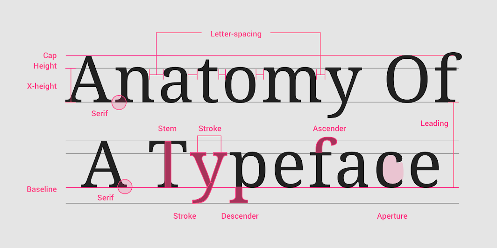

- [Baseline](#baseline)
- [Cap height](#cap-height)
- [X-height](#x-height)
- [Ascenders](#ascenders-and-descenders)
- [Descenders](#ascenders-and-descenders)
- [Aperture](#aperture)
- [Stem]
- [Stroke]

#### Baseline

The baseline is the invisible line upon which a line of text rests. In Material Design, the baseline is an important specification in measuring the vertical distance between text and an element.

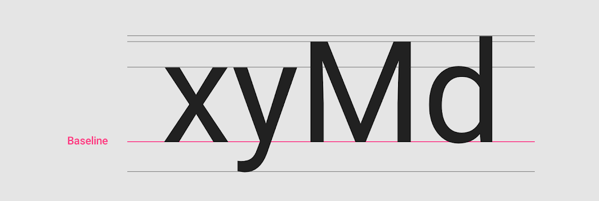

#### Cap height

Cap height refers to the height of a typeface’s flat capital letters (such as M or I) measured from the baseline. Round and pointed capital letters, such as S and A, are optically adjusted by being drawn with a slight overshoot above the cap height to achieve the effect of being the same size. Every typeface has a unique cap height.

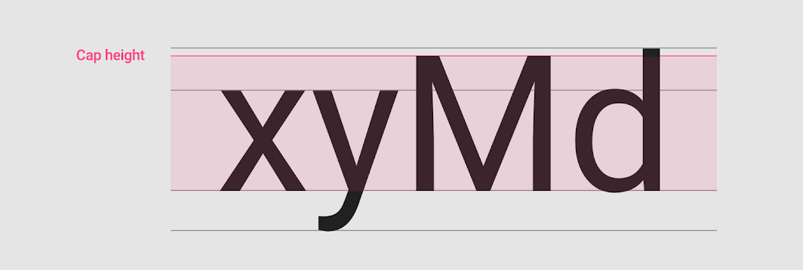

#### X-height

X-height refers to the height of the lowercase x for a typeface, and it indicates how tall or short each glyph in a typeface will be.

Typefaces with tall x-heights have better legibility at small font sizes, as the white space within each letter is more legible.

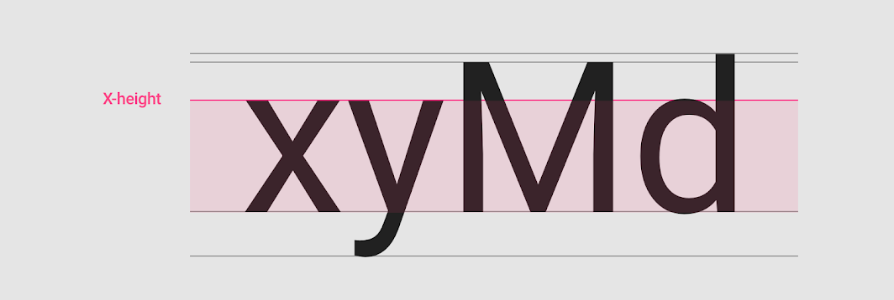

#### Ascenders and descenders

Ascenders are an upward vertical stroke found in certain lowercase letters that extend beyond either the cap height or baseline. Descenders are the downward vertical stroke in these letters. In some cases, a collision between these strokes can occur when the line height (the vertical distance between baselines) is too tight.

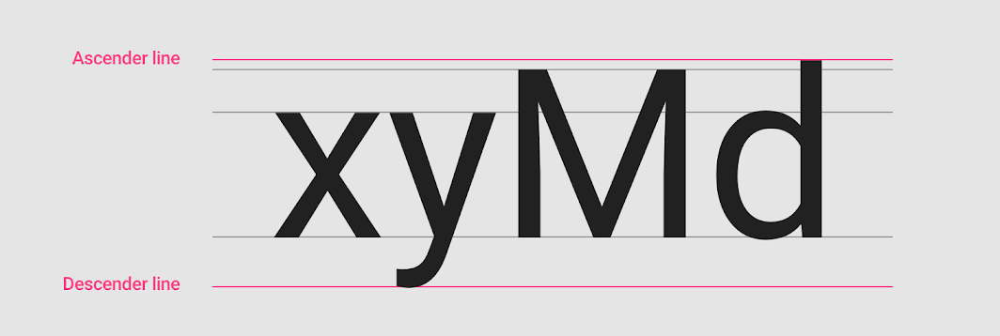

#### Weight

Weight refers to the relative thickness of a font’s stroke. A typeface can come in many weights; and four to six weights is a typical number available for a typeface.

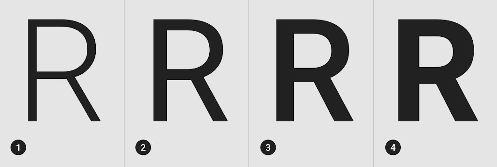

Common weights with code

- Thin: 100
- Extra-light: 200
- Light: 300
- Regular: 400
- Medium: 500
- Semi-Bold: 600
- Bold: 700
- Extra bold: 800
- Black: 900

#### Aperture

[TBD]

#### Curvature

Rounded [7]
Semi-Rounded [7]

### Type classification

or called compositional techniques [7]

- [Serif](#serif)
- [Sans](#sans)
- [Slab Serif](#slab-serif)
- [Script](#script)

#### Serif

#### Sans

#### Slab Serif

#### Script

### Emphasis

- Bold
- Italic
- Underline

[6]

### Readability properties

- [Letter-spacing](#letter-spacing)
- [Line length](#line-length)
- [Leading/Line height](#line-height)
- [Paragraph spacing](#paragraph-spacing)
- [Type alignment](#type-alignment)

#### Letter-spacing

Letter-spacing, also called tracking, refers to the uniform adjustment of the space between letters in a piece of text.

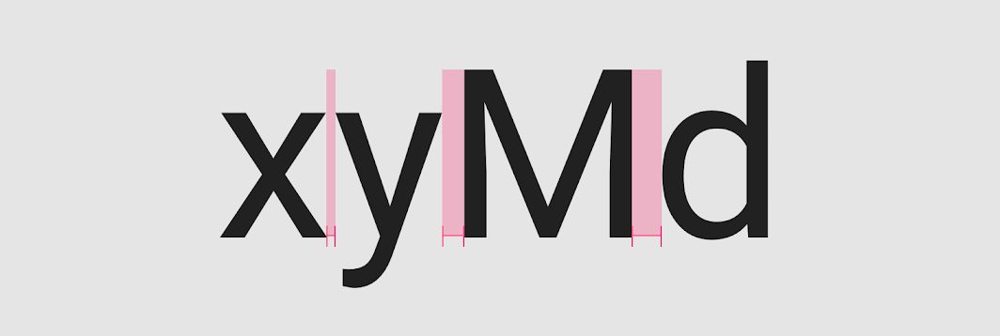

- Larger type sizes, such as headlines, use tighter letter-spacing to improve readability and reduce space between letters.

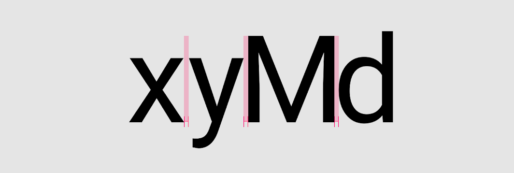

- For smaller type sizes, looser letter spacing can improve readability as more space between letters increases contrast between each letter shape. Text in all caps, even at small type sizes, has improved readability because of its added letter spacing.

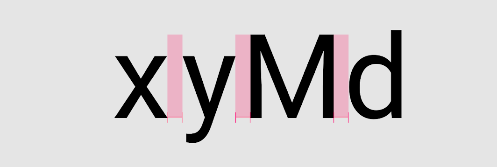

#### Line length

Line lengths for body text are usually between 40 to 60 characters. In areas with wider line lengths, such as desktop, longer lines that contain up to 120 characters will need an increased line height from 20sp to 24sp.

> The ideal line length is 40-60 characters per line for English body text.

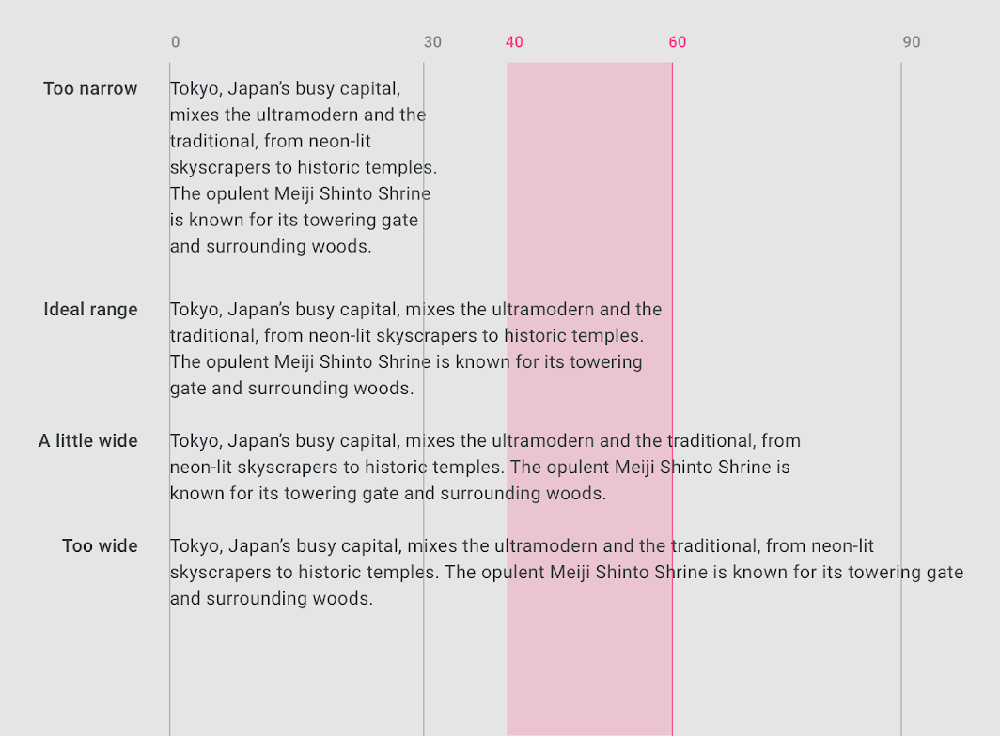

> The ideal line length for short lines of English text is 20-40 characters per line.

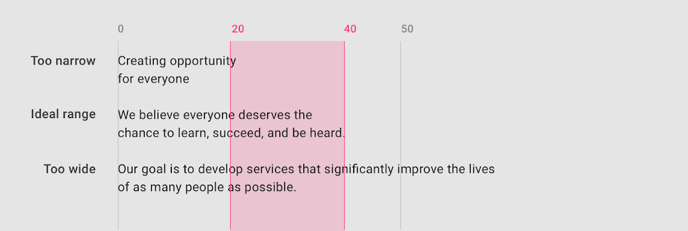

#### Line height

Line height, also known as leading, controls the amount of space between baselines in a block of text. A text’s line height is proportional to its type size.

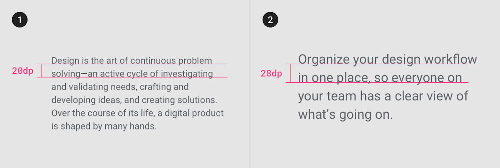

#### Paragraph spacing

Keep paragraph spacing in the range between .75x and 1.25x of the type size.

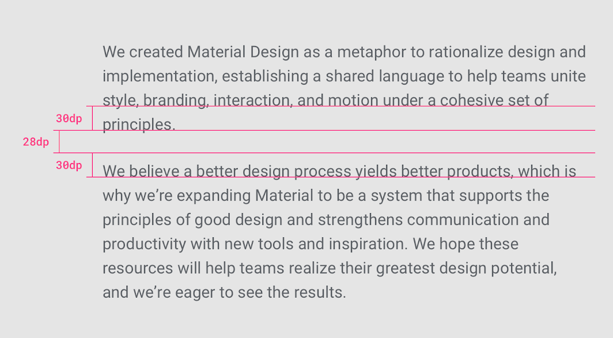

#### Type alignment

Type alignment controls how text aligns in the space it appears. There are three type alignments:

- Left-aligned: when text is aligned to the left margin
  - Left-aligned text is the most common setting for left-to-right languages such as English.

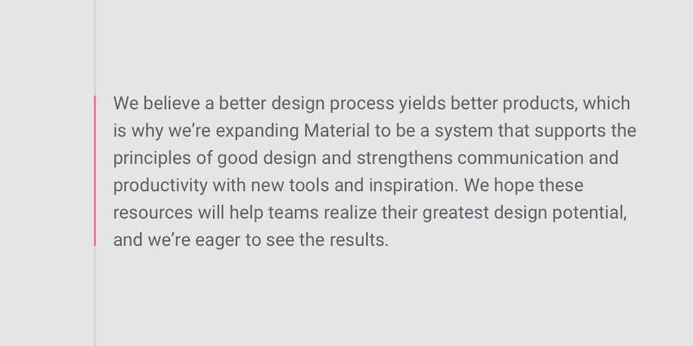

- Right-aligned: when text is aligned to the right margin
  - Right-aligned text is the most common setting for right-to-left languages, such as Arabic and Hebrew.

Left-to-right languages can use right-aligned text, though it is best for distinguishing short typographic elements within a layout (such as side notes), and is not recommended for long copy.

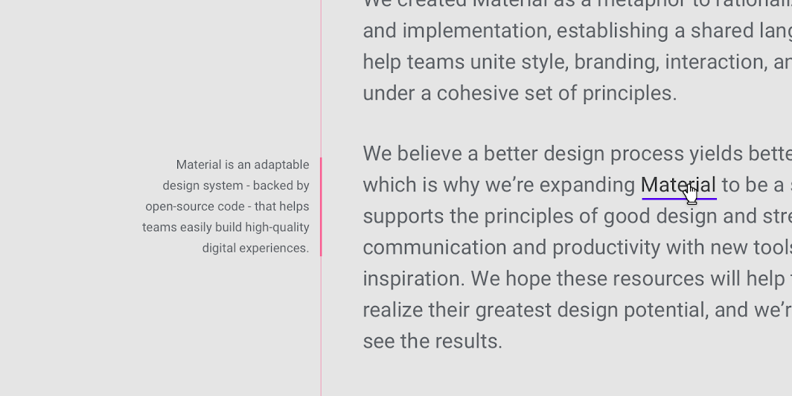

- Centered: when text is aligned to the center of the area it is set in
  - Centered text is best used to distinguish short typographic elements within a layout (such as pull quotes), and is not recommended for long copy.

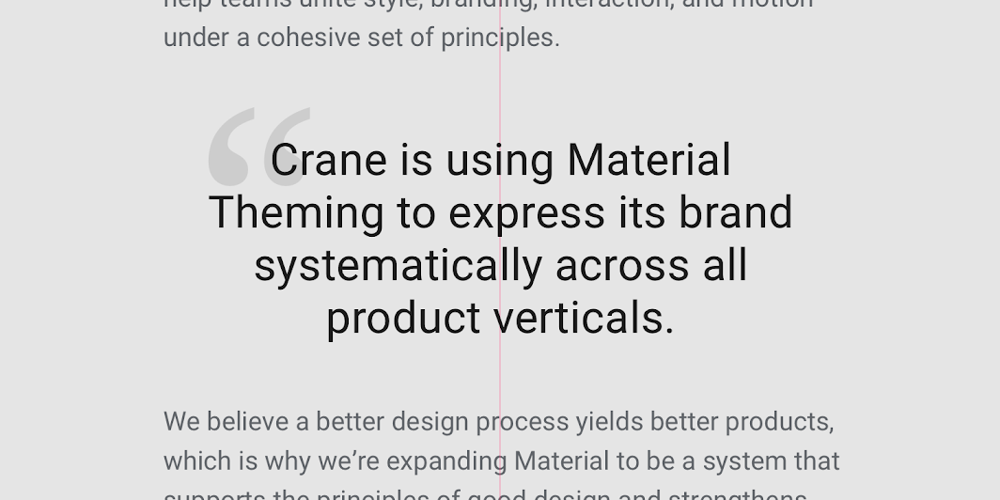

## Steps to find typography

There are three steps to find the perfect typography for your design:

1. [Selecting a type classification](#selecting-a-type-classification)
2. [Picking a typeface](#picking-a-typeface)
3. [Choosing a font](#choosing-a-font)

### Selecting a type classification

**Type classification is a general system to describe styles of type.**

Two of the most popular type classifications are **Serif** and **Sans Serif**.

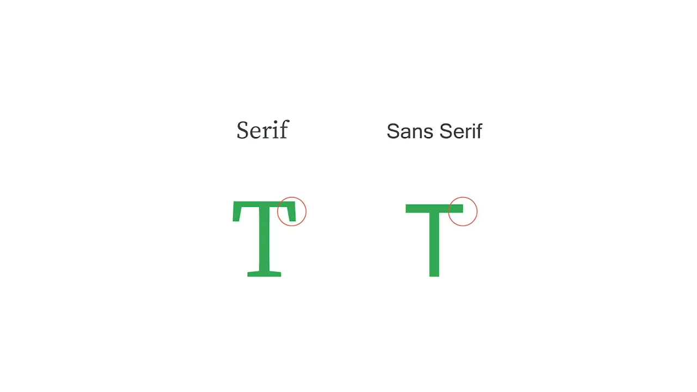

- **Serif styles** of type can be recognized by the tiny lines called serifs that trail from the letters as strokes and stems as edges.
  > Look closely at the letter T on the left side of the screen. The small lines hanging off of both ends of the horizontal line at the top of the T help identify the text type classification as *serif*.
- **Sans Serif styles** of type don't have these tiny lines.
  > Notice that on the right side of the screen, there are no small lines hanging off of the T. This T is just a simple horizontal and vertical line. That's a clear indicator that this T falls into the *sans serif* type classification.

### Picking a typeface

**A typeface is the overall style of a letter.**

Typefaces are distinguished by their

- stroke weight
- shape
- type of serif
- and line lengths.

Each typeface is known by a family name:

- **Serif typefaces** are Times New Roman, Georgia, and Cambria.
- **Sans serif typefaces** include Arial, Helvetica, and Verdana.

> Historically, UX designers preferred sans serif typefaces for apps and websites, because it was more legible on the screen. But, as technology has gotten better, so has screen resolution, which means it's no longer difficult to read serif typefaces digitally. In the past few years, serif typefaces have made a comeback with UX designers, and they have even been digitized for modern screen use.

### Choosing a font

**Font is the size, thickness, and emphasis of letters.**

The difference between typeface and font can be a little confusing.

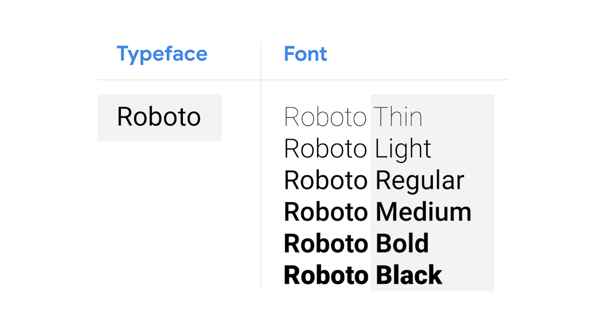

- The font can be more light or bold, italicized or regular, and even more variations.
- The font on the right side of the screen is a collection of all of the characters of a typeface in one size and one style.

> So let's take a look at this example. In this case, the typeface is Roboto. Roboto Bold in 12-point size is a font, and Roboto Light in 18-point size is also a font.

*Nói ngắn gọn: "Font" là sự cụ thể hóa của Typeface theo từng mức [weight](#weight)*

## Glyph

**Glyph**: In typography, a glyph is "the specific shape, design, or representation of a character". It is a particular graphical representation, in a particular typeface, of an element of written language. [R1]

[TBD]

## Tools

<!-- - [Work with type in mockups](../../../tools/figma.md/#work-with-type-in-mockups) -->

## Type system

[Type system](./typography_system#typography-system)

## _References

[C1]: <https://www.coursera.org/learn/high-fidelity-designs-prototype/lecture/5PiMP/introduction-to-foundational-elements-of-visual-design>
[C2]: <https://www.coursera.org/learn/high-fidelity-designs-prototype/lecture/KuESU/typography-in-ux-design>
[C3]: <https://www.coursera.org/learn/high-fidelity-designs-prototype/lecture/Gc8PR/the-importance-of-typography>

[R1]: <https://en.wikipedia.org/wiki/Glyph>
[R2]: <https://m2.material.io/design/typography/understanding-typography.html>
[R3]: <https://en.wikipedia.org/wiki/Typeface_anatomy>

[1]: <https://selahcreativeco.com/blog/your-guide-to-typefaces-brand-font-hierarchy>
[2]: <https://mangoads.vn/learn/ky-thuat-phan-cap-thong-tin-cho-phan-chu-trong-bai-viet-phan-1>
[3]: <https://mangoads.vn/learn/ky-thuat-phan-cap-thong-tin-cho-phan-chu-trong-bai-viet-phan-2>
[4]: <https://help.vyond.com/hc/en-us/articles/17221820958740-What-is-the-title-subtitle-and-body>
[5]: <https://app.uxcel.com/courses/typography-basics/headings-761>
[6]: <https://en.wikipedia.org/wiki/Emphasis_(typography)>
[7]: <https://www.canva.com/learn/the-ultimate-guide-to-font-pairing/>

## _Control

[TBD]: (To be Defined)
