# Typography system principles

design system setup guidelines for typography (việc setup design system bao gồm visual design)

*Xây dựng nên Typo System tức là lựa chọn bộ typefaces và nhiều việc khác nữa để kết hợp chúng lại với nhau. Trong đó, font combinations là một việc trong các việc để xây dựng nên Typo System.*

## Steps to Create a Typography System

A well-designed typography system is essential for creating visually appealing and consistent digital products. Here are the key steps involved:

### 1. Define Your Goals and Brand Personality

- **Purpose:** What do you want your typography to achieve? (e.g., elegance, readability, boldness)
- **Brand Voice:** How does your typography reflect your brand's personality? (e.g., friendly, professional, playful)
- **Target Audience:** Consider their preferences and reading habits.

### 2. Choose Your Font Pair

In the simplest form, a Font Pairing is when you pair fonts that look great together! Typically the pair includes a Headline Font and a Body Copy Font [[5]]

- **Headlines:** Select a strong, distinctive font for headlines.
- **Body Text:** Choose a highly readable font for paragraphs and smaller text.
- **Consider:** Contrast, legibility, and overall aesthetic.

### 3. Establish a Type Scale

- **Base Size:** Determine the foundational font size for your system.
- **Modular Scale:** Create a consistent ratio (e.g., golden ratio, Fibonacci sequence) to define font sizes for different elements (headings, subheadings, body text, etc.).

[Hierarchy and Contrast](#hierarchy-and-contrast)

### 4. Set Line Height and Leading

- **Line Height:** The vertical space between lines of text.
- **Leading:** The space between the baseline of one line of text and the baseline of the next.
- **Consider:** Readability and visual hierarchy.

### 5. Determine Letter Spacing (Tracking)

- **Adjust:** Letter spacing to improve readability and visual balance.
- **Avoid:** Excessive tracking, which can strain the eyes.

### 6. Define Text Styles

- **Create:** Predefined styles for different elements (e.g., headings, body text, call-to-action buttons).
- **Consistency:** Ensure consistency across your entire product.

### 7. Test and Iterate

- **Prototype:** Create mockups to test your typography system in context.
- **Gather Feedback:** Get input from designers, developers, and users.
- **Refine:** Make adjustments based on feedback and testing.

### Additional Tips

- **Accessibility:** Consider font size adjustments, color contrast, and readability for users with visual impairments.
- **Responsiveness:** Ensure your typography scales appropriately across different devices and screen sizes.
- **Documentation:** Create clear guidelines for your typography system to ensure consistency.

By following these steps, you can create a robust typography system that enhances the user experience and strengthens your brand identity.

## Principles

*Great font combinations are essential to great design. But picking great fonts can seem like an impossible dark art for most people.* [2]

These font combinations are perfect if you are trying to design your next [logo](https://www.canva.com/logos/), [presentation](https://www.canva.com/presentations/), [infographic](https://www.canva.com/infographics/), [invitation](https://www.canva.com/invitations/), [postcard](https://www.canva.com/postcards/), or anything else you’d like to design. There’s a science to applying a heading, subheading and body copy to suit the type of content you’re producing and the message or tone of your brand. [2]

We explain the key 8 design points to consider with font pairing, so you have the tools to make your own combinations. [[6]]

- [Hierarchy and Contrast](#hierarchy-and-contrast)
- [Consistency and Cohesion](#consistency-and-cohesion)
- [Readability and Legibility](#readability-and-legibility)
- [Whitespace and Alignment](#whitespace-and-alignment)
- [Balance and Proportion](#balance-and-proportion)
- [Contrast in Font Pairing](#contrast-styles-in-font-pairing)
- [Color and Texture in Typography](#color-and-texture-in-typography)
- [Validation of Font pairings](#validation-of-font-pairings)

### Hierarchy and Contrast

Every design! **Websites**, **books**, **posters**, **brochures**, **signs**, etc. has a form of word [hierarchy](./typography_system/typography_hierarchy_levels/typography_hierarchy_levels). What do I mean by [hierarchy](./typography_system/typography_hierarchy_levels/typography_hierarchy_levels)? [[5]]

- The most important information should stand out to the viewer first.
  > On a poster, the most important information is the headline of an event. On a website, it’s the title of a blog post. On a business card, it’s the name of the person or the company.
- The first thing you read is (usually) what I call a “Headline Font” This font can be many different types of fonts, the only factor that it MUST HAVE is that it should overpower the “Body Copy” font.

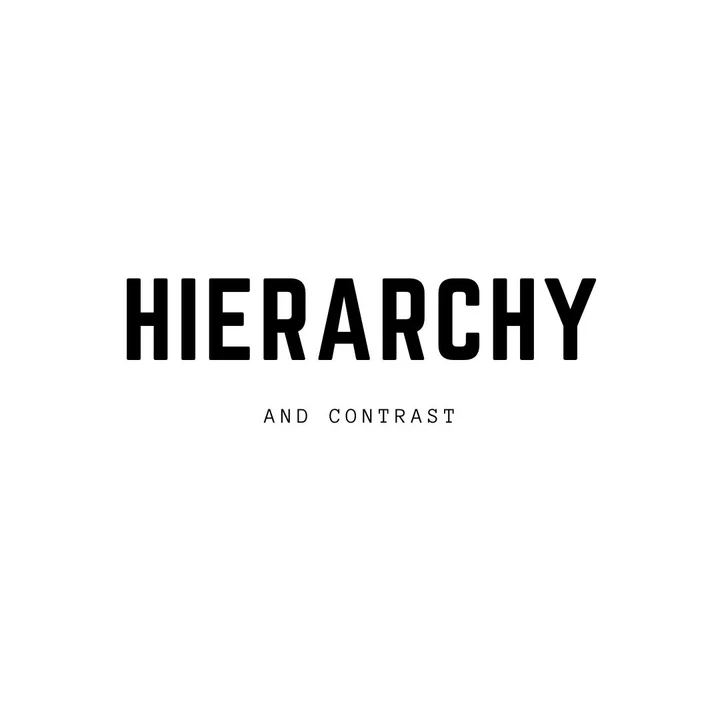

Create a clear visual hierarchy by varying font sizes, weights, and styles to distinguish between headers, subheaders, and body text. Utilize Canva's font options to achieve this hierarchy effectively. [[6]]

Imagine you're telling a story with different chapters and sections. In typography, hierarchy helps you tell that story by guiding your reader. You might want the title to stand out, so it’s big and bold, ensuring the reader sees this first. While subtitles are a bit smaller, looked at next in a supporting role. Contrast helps you create these differences, making your design more interesting and easier to follow. Imagine a painting where the main subject is bright and bold while the background is softer – that’s contrast! It’s really important because it helps organize your design, making it clear and enjoyable to read. [[6]]

**1. Establish a Clear Hierarchy**:

- **Purpose**: Use different typefaces to indicate varying levels of importance.
- Example: Use a bold serif font for headings and a clean sans-serif font for body text.
- Ensure contrast in **weight**, **size**, or **style** between headings, subheadings, and body text.

[Levels of typographic hierarchy](./typography_system/typography_hierarchy_levels/typography_hierarchy_levels)
[Modular scale](./typography_system/modular_scale/modular_scale)

### Consistency and Cohesion

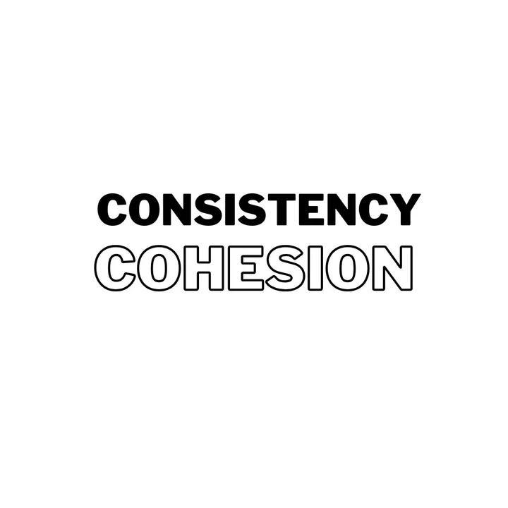

Maintain consistency in typography throughout your design. Stick to a limited number of fonts and styles to ensure visual coherence and a unified look in Canva. 2 or 3 different fonts is a great number. [[6]]

Think of this as having a set of matching Lego blocks to build something. In typography, it means using the same font styles, like choosing one font for titles and another for the body text, and using them consistently throughout your project. This helps your design look neat and tidy, just like when you paint a picture and use the same colors to create harmony. [[6]]

**Stick to 2-3 fonts per design**:

- **Guideline**: Stick to **two or three typefaces** in a design.
  - One for headings, another for body text, and an optional third for accents.
- Too many fonts can make the design cluttered and inconsistent.

When you use too many fonts in a single design, it can be overwhelming for the viewer. The eye doesn’t know where to focus, and important information can easily get lost in the mix. This can result in a confusing and unprofessional-looking design that fails to effectively convey your message. [[10]]

To avoid these issues, it’s best to stick to a maximum of 2-3 fonts when pairing fonts in graphic design. This helps create a cohesive and consistent design, while also making sure that your message is clear and easy to read. [[10]]

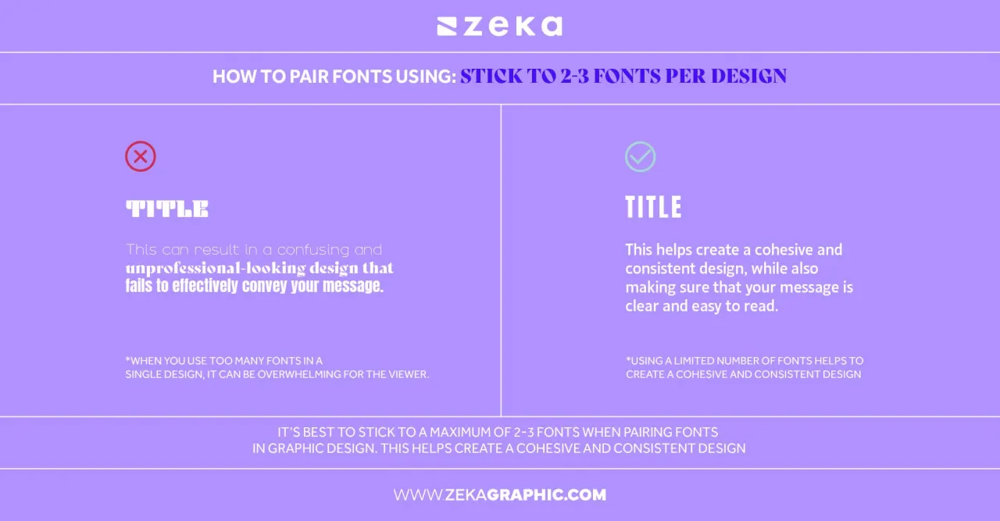

### Readability and Legibility

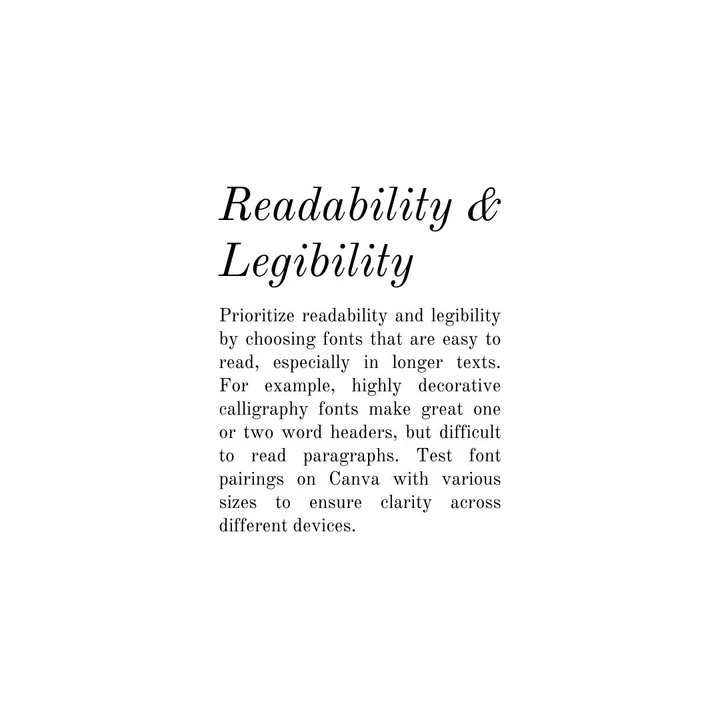

Prioritize readability and legibility by choosing fonts that are easy to read, especially in longer texts.
> For example, highly decorative calligraphy fonts make great one or two word headers, but difficult to read paragraphs. Test font pairings on Canva with various sizes to ensure clarity across different devices. [[6]]

Think of reading a book – you want the letters to be clear and easy to understand. Readability is how comfortable your text is to read, especially when it’s long. Legibility is about how clear the letters are – you don’t want them to be fuzzy or hard to see. These are super important because you want people to easily understand what you're saying. [[6]]

**9. Test Readability**:

- Ensure fonts are legible across various sizes and weights, especially for body text.
- Avoid using decorative fonts for long blocks of text.

### Whitespace and Alignment

Use whitespace (empty space around your text) effectively to enhance readability and allow the text to breathe. Think of Whitespace as the silence between musical notes – it helps create harmony. [[6]]

Ensure proper and neat alignment of text elements within Canva's design grid for a clean and organized layout. This means lining text up on borders and having them evenly spaced apart where appropriate. [[6]]

Alignment is how your text lines up - left, right, or center. Good alignment keeps your design looking organized and makes it easier for your readers to follow along. It's like organizing your desk - when things are arranged neatly, it’s more pleasing to the eye and easier to use. [[6]]

### Balance and Proportion

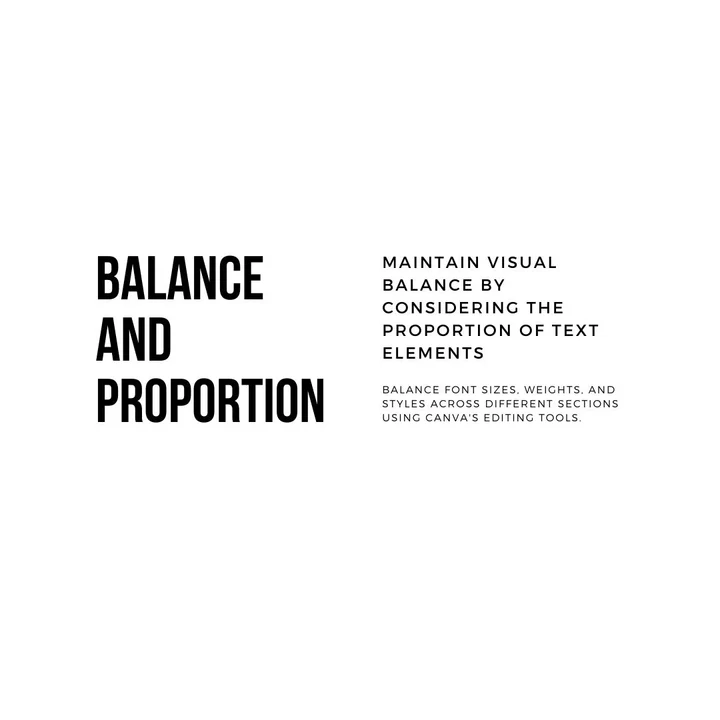

Maintain visual balance by considering the proportion of text elements in your design. Balance font sizes, weights, and styles across different sections using Canva's editing tools. [[6]]

Balance is about distributing the elements in your design so that it feels stable. It's like balancing a see-saw - you want both sides to be equally weighted. For example, one large design element on the left of screen, while many smaller elements to the right. [[6]]

Proportion is about the relationship between different elements - like the size of the title compared to the size of the body text. If one part is too big or too small, it might look odd. It's important because a well-balanced design feels comfortable and natural to look at. [[6]]

**7. Consider Typeface Proportions**:

- Pay attention to **x-height**, letter spacing, and stroke thickness.
- Fonts with similar proportions often pair well together (e.g., Lora and Open Sans).

### Contrast Styles in Font Pairing

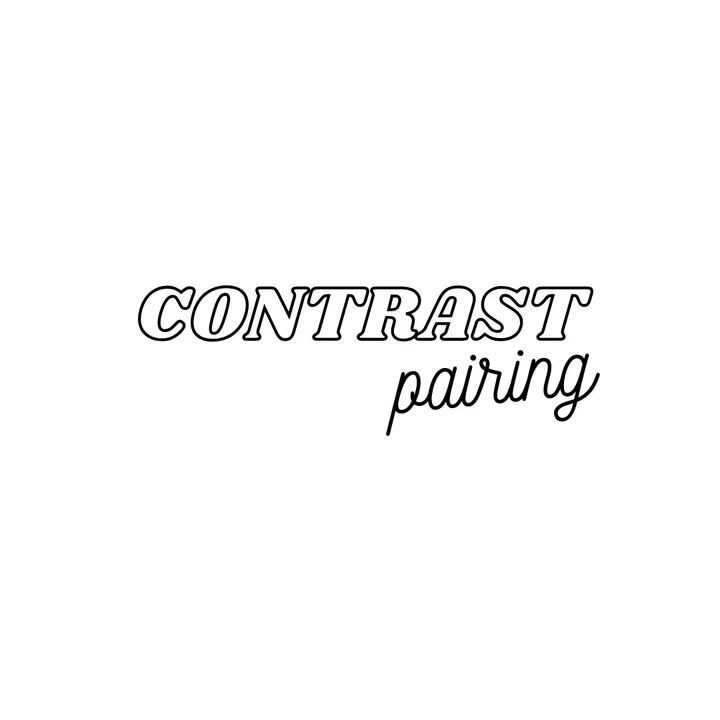

Pair fonts with contrasting styles to create visual interest and hierarchy. Experiment with different font combinations available in Canva to achieve a harmonious yet distinct look. [[6]]
> For example, a large bold font header, balances with thinner smaller paragraphs. [[6]]

Contrast is pairing fonts that are different but work well together. It's like having a harmony between different notes in a song – they're different but create a beautiful melody. Pairing fonts with different styles or weights can make your design more interesting and help guide your reader through the text. It’s important because it adds personality and uniqueness to your design. [[6]]

- **How**: Contrast fonts in style, weight, or case for visual interest.
- Example: Pair a thin, elegant serif (e.g., Bodoni) with a bold sans-serif (e.g., Futura).

### Choose Complementary Typefaces

Choosing complementary fonts is crucial to create a harmonious look and feel. Fonts that share similar characteristics, such as shape, proportions, and style, can complement each other. For instance, a serif font can be paired with a sans-serif font to create a beautiful contrast. Similarly, two sans-serif fonts with different weights and styles can also create a visually pleasing effect. [[10]]

It’s essential to consider the proportions of the fonts while pairing them. Fonts with different shapes may not pair well together. Therefore, it’s recommended to opt for fonts with similar proportions for a balanced look. By keeping these factors in mind, you can create an aesthetically pleasing typography design. [[10]]

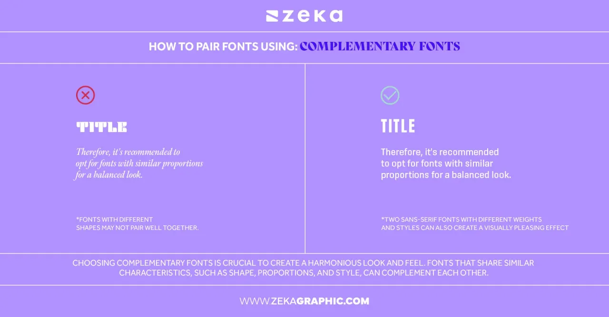

- **Tip**: Pair fonts with distinct yet complementary characteristics.
- Example Combinations:
  - A classic serif font (e.g., Garamond) with a clean sans-serif (e.g., Helvetica).
  - A decorative script font (e.g., Pacifico) with a neutral sans-serif (e.g., Roboto).

### Match type characteristics faceted taxonomy

To make sure your fonts are working together harmoniously, start by identifying the overall mood you want to convey with your design. Is it playful and fun, or serious and professional? Once you have a clear idea of the mood you’re going for, you can choose fonts that fit that mood and pair them in a way that creates a cohesive look. [[10]]

When pairing fonts, it’s important to consider the mood of each font and how it works together with the other fonts in your design. Mixing and matching fonts that have different moods can create a disjointed and confusing design. [[10]]

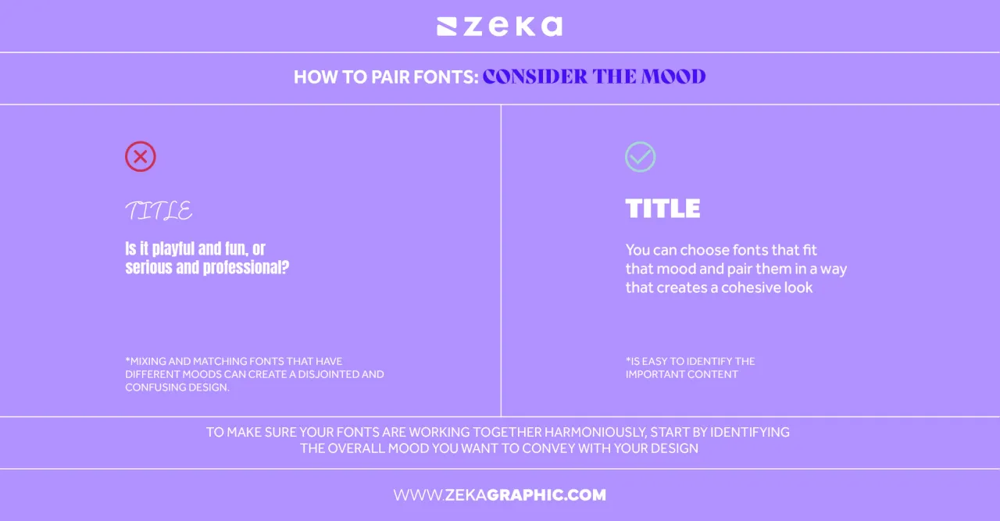

Typeface được phân loại dựa trên các thông tin research từ business và user, theo các tiêu chí như sau:

- **By moods, tones, vibes, emotions, effects, message**: warmth, cozy, calming, softens, strong, stability, masculinity, charming, feminine, playful, nostalgic, romantic
  > Playful fonts for casual or fun content.
  > **Why**: Fonts should align with the content’s tone or message.
- **By styles**: modern, classic, contemporary, art-deco, clean, elegant, timeless, classy, simple, polished, refined, chic, fashionable, stylish, graceful, delicate, fine, exquisite, rich, grand, sharp, dependable, minimalist, sleek, rustic
  > Sleek, modern fonts for professional or business-focused designs.
- **By industries, fields, professions**: fashion, industrial, technology, weather report, web design, financial, hotel, cocktail bar, review, cinema, manufacturing, sport, art galery/exhibition
- **By topics**: life style, event, invitation
- **By products**: bakery or patisserie, liquor
- **By geographic locations**: Mediterranean
- **By eras**: gothic, Roman

### Pair Fonts by Classification

Different font categories refer to grouping fonts based on their style and characteristics. The most common font categories include serif, sans-serif, script, display, and monospace. Each category has its own unique characteristics and is best suited for specific design purposes. [[10]]

When pairing fonts from different categories, it’s important to consider the overall mood and tone of your design. For example, pairing a bold sans-serif font with a delicate script font can create a playful and energetic look, while pairing a classic serif font with a modern sans-serif font can create a more sophisticated and refined look. [[10]]

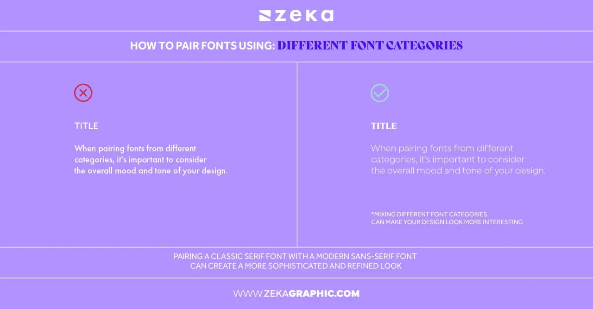 [[10]]

- Consider the Different types of fonts: [[8]] Serif, San-serif, Script, Display
- It is so important when it comes to branding that you choose the right pair of fonts that express the personality of your brand and also compliment your logo. [[8]]
  > For example, if you want your brand to be represented as serious and traditional, I would recommend using a Serif font as your headline font and if you want to be thought of as more fun and care-free, I suggest using a display font or a script font
- Don’t use something intricate or too crazy of a font for your Body Copy Font because it would be very hard to read lengthy paragraphs using a crazy font for your body copy. [[8]]
  - If your business is mostly online, you may want to consider making sure your picking “Web-Safe” fonts. Believe it or not, there are fonts out there that don’t work well online, and don’t offer the “Web-Safe” file version which is WOFF.

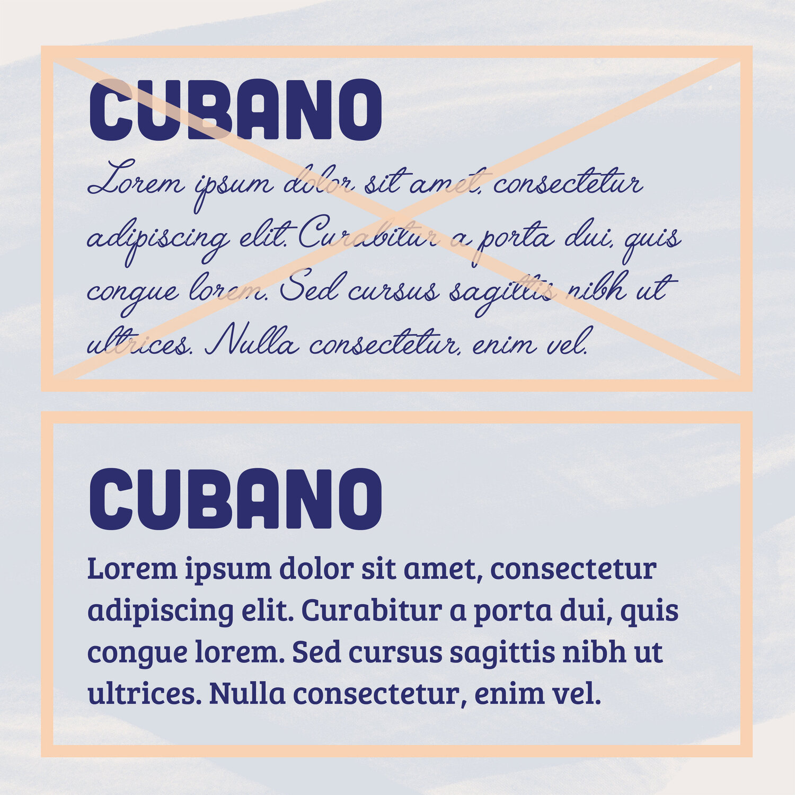

Common pairings include:

- Principle-1: single-typeface using one typeface across entire brand [[2]]
- Principle-2: dual-typeface Serif for title/heading, and San-serif for body copy [[2]] Balance traditional with modern.
- Principle-3: dual-typeface San-serif for title/heading, and Serif for body copy  [[2]] Balance traditional with modern.
- Principle-4: dual-typeface Serif for both title/heading and body copy [[2]] Combine two serif fonts with different weights or styles for elegance.
- Principle-5: dual-typeface San-Serif for both title/heading and body copy [[2]]
- Principle-6: dual-typeface Script for title/heading, and San-Serif for body copy [[2]] A clean base with a decorative flair.
- Principle-7: triple-typefaces [[2]]

### Use font families

**8. Leverage Font Families**:

- Many font families (e.g., Roboto, Montserrat) include multiple weights and styles, allowing for variation without introducing another typeface.

Using font families can be particularly helpful when you need to pair fonts for different purposes within the same design. For example, you might use a bold font for headlines and a lighter font for body text, but you want them to have a similar style and feel. [[10]]

By choosing fonts from the same family, you can ensure that they have a similar visual style and share design elements like letter shapes and spacing. This can help create a sense of unity and consistency throughout your design. [[10]]

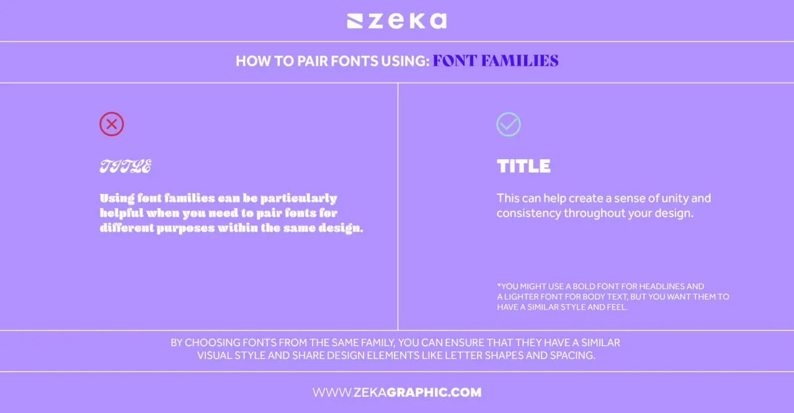

### Keep it simple

When it comes to font pairing in graphic design, [simplicity](https://www.zekagraphic.com/minimalist-graphic-design-rules/) is a fundamental principle to keep in mind. Simple font combinations can often have a big impact, while using too many fonts or styles can overcomplicate things and make your design look cluttered and unprofessional. [[10]]

To keep things simple, start by choosing two or three fonts that complement each other well. Stick to classic and timeless fonts that are easy to read and don’t distract from your message. For example, a classic serif font paired with a clean sans-serif font can create a simple yet effective design. Consider using variations of the same font family as well, as they often have a cohesive look that works well together. [[10]]

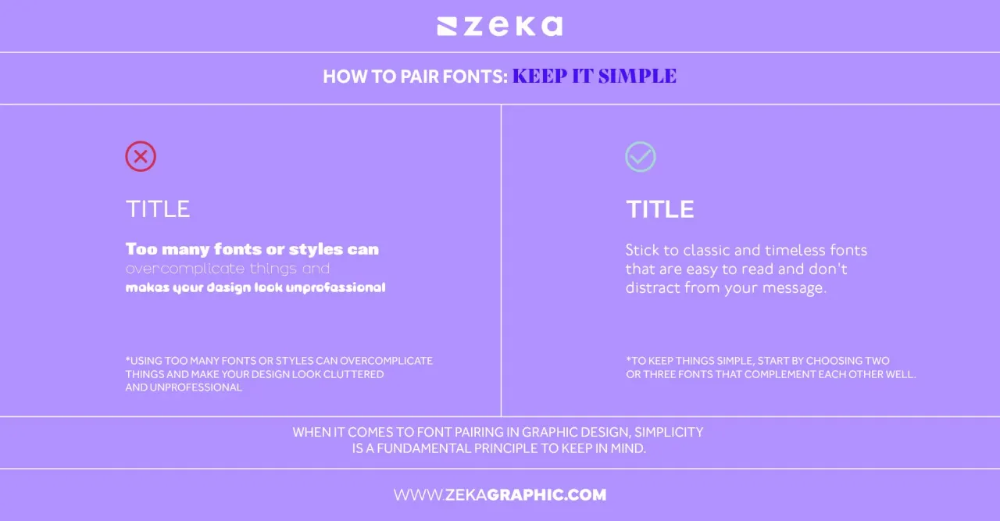

### Color and Texture in Typography

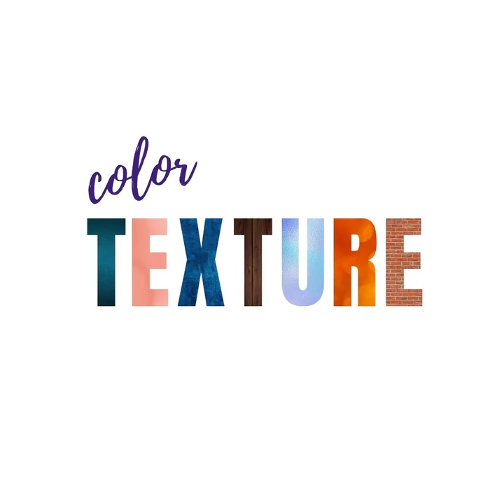

Experiment with color and texture variations within typography to add depth and visual interest to your design. Canva allows you to apply color and texture effects to text elements seamlessly. Such as brush strokes effects, or fonts with transparency. [[6]]

Color and texture in typography are like adding flavors and spices to a dish. They can bring depth and interest to your design. Using color and texture effects on text can make it more visually appealing and add character to your overall design. Colors can create moods too - like warm colors make you feel cozy, while cool colors can feel calming. [[6]]

### Experimentation and Iteration

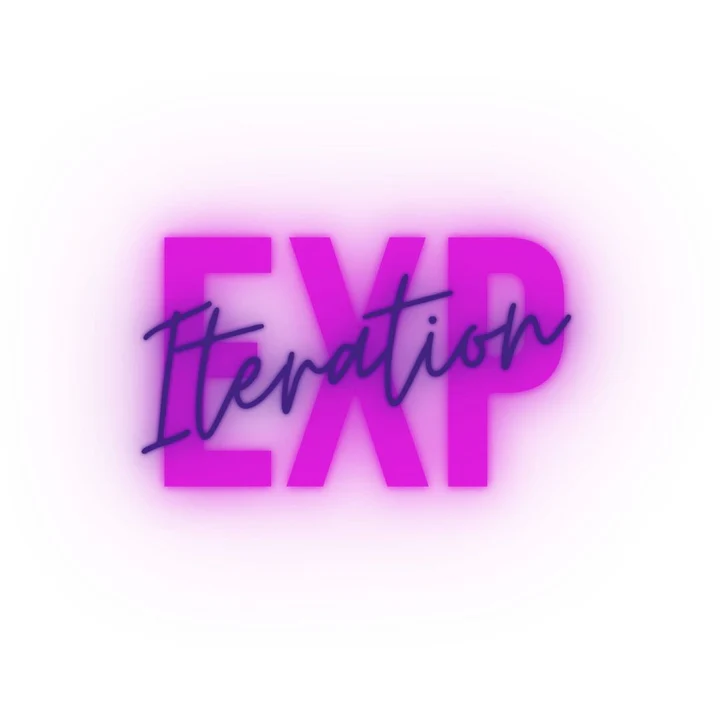

Continuously experiment with various typography options available in Canva. Iterate on font pairings, sizes, and styles to find the best combination that suits your design's objectives and aesthetics. [[6]]

Think of typography as an art. Just like painters try different strokes, you can try various font combinations to see what looks best. Experimenting with fonts and styles in Canva lets you explore and find what suits your design. Iterating means trying again and again, refining your design until it's just right. It’s important because it encourages creativity and helps you discover new ideas. [[6]]

Keep in mind that font pairing is not an exact science, and what works for one project may not work for another. Don’t be afraid to step out of your comfort zone and try something new. Experimenting with different font pairings can lead to unique and memorable designs that set your work apart from others. So, embrace the creative process and experiment with different font pairings until you find the perfect combination for your project. [[10]]

It’s important to keep in mind that font pairing is not an exact science and what works for one project may not work for another. Don’t be afraid to think outside of the box and try something new. [[10]]

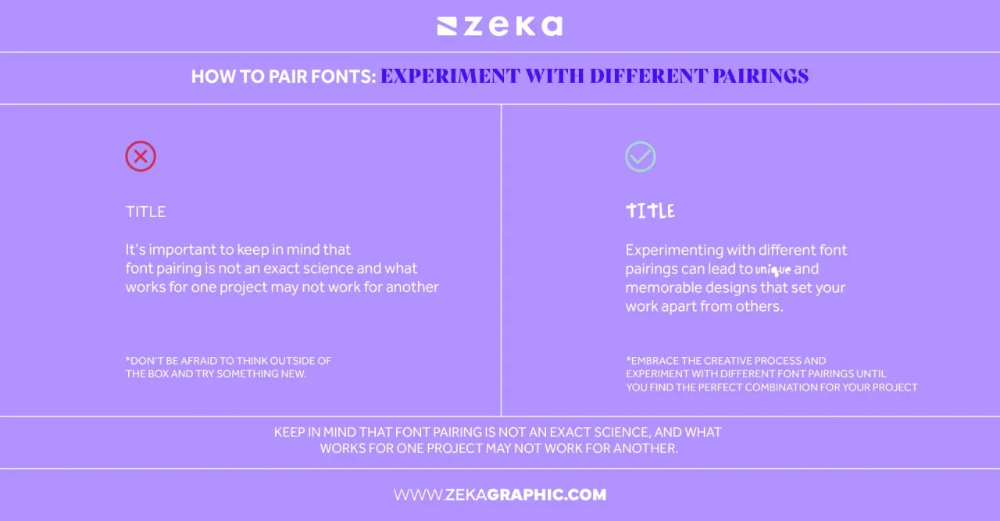

## Validation of Font pairings

What makes a good font pairing? [[4]]

- From a visual point of view, a good type pairing will add visual contrast to the design.
- From a utilitarian point of view, a good font pairing should be legible and flexible.

> That’s why the general rule of thumb it’s okay for type pairings to be a bit, well, boring.

- The best sans serif and serif font pairings tend to be a combination of a display font and a supporting font for body text. The body text’s main goal is to be readable, which is why you typically see sans serif and serif, not script or ornamental fonts. [[4]]

- Bold and light - Contrast of font

## Tools

**10. Use Online Tools**:

- **Font Pairing Tools**: Services like [Google Fonts](https://fonts.google.com), [FontPair](https://fontpair.co/), or [Typ.io](https://typ.io) suggest tried-and-tested font combinations.
- These tools provide inspiration and ensure compatibility between typefaces.

## Samples

[Pairing Samples](./pairing_samples/pairing_samples) [[2]]

## _References

- *Learn more about typographic scales.* [[1]]

[1]: <https://designcode.io/typographic-scales>

- *Canva's ultimate guide to font combinations* [[2]]

[2]: <https://www.canva.com/learn/the-ultimate-guide-to-font-pairing/>

- *Build your brand: How to choose the right fonts* [[3]]

[3]: <https://www.canva.com/learn/canva-for-work-brand-fonts/>

- *24 of the Best Canva Font Pairings to Uplevel Your Brand* [[4]]

[4]: <https://www.firtherdesignco.com/blog/24-of-the-best-canva-font-pairings-to-uplevel-your-brand>

- *20 Free Font Pairings (and how they pertain to your brand)* [[5]]

[5]: <https://www.eyesavvydesign.com/blog/20-free-font-pairings-for-your-brand>

- *The best font pairings in Canva & how to design your own* [[6]]

[6]: <https://motionstamp.com/blogs/news/best-canva-font-pairings>

- *Typographic Hierarchy in Graphic Design* [[7]]

[7]: <https://www.zekagraphic.com/typographic-hierarchy-in-graphic-design/>

- *How to Structure an Effective Typographic Hierarchy* [[8]]

[8]: <https://www.toptal.com/designers/typography/typographic-hierarchy>

- *Your Guide to Brand Typography and Hierarchy* [[9]]

[9]: <https://selahcreativeco.com/blog/your-guide-to-typefaces-brand-font-hierarchy>

- *The Art of Pairing Fonts: A Beginner’s Guide* [[10]]

[10]: <https://www.zekagraphic.com/how-to-pair-fonts-in-graphic-design/>
