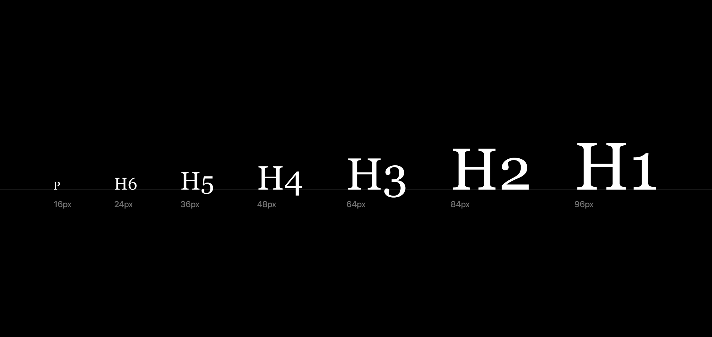
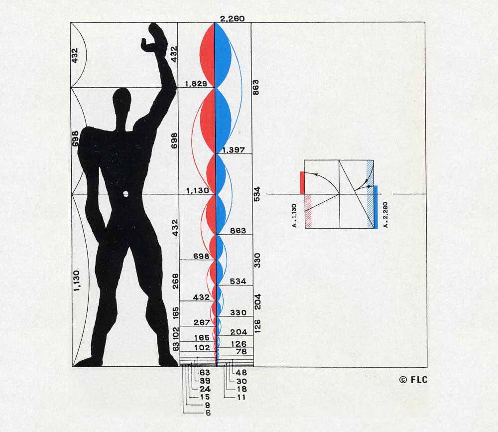
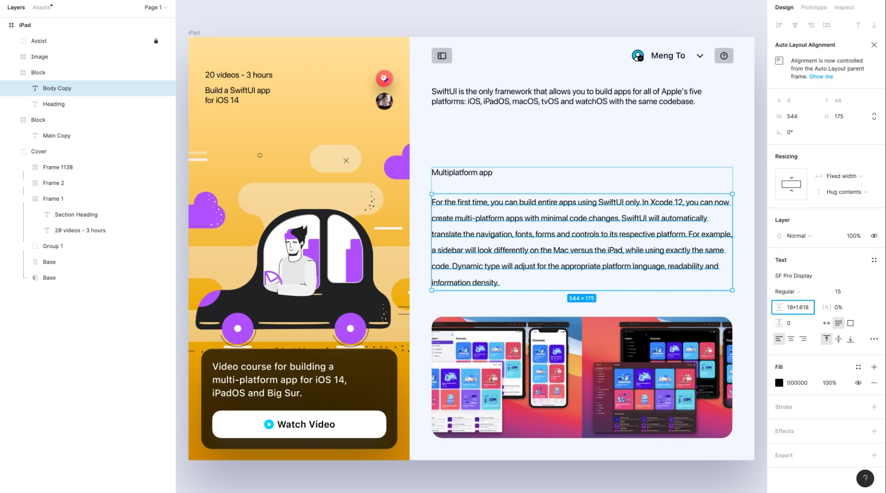
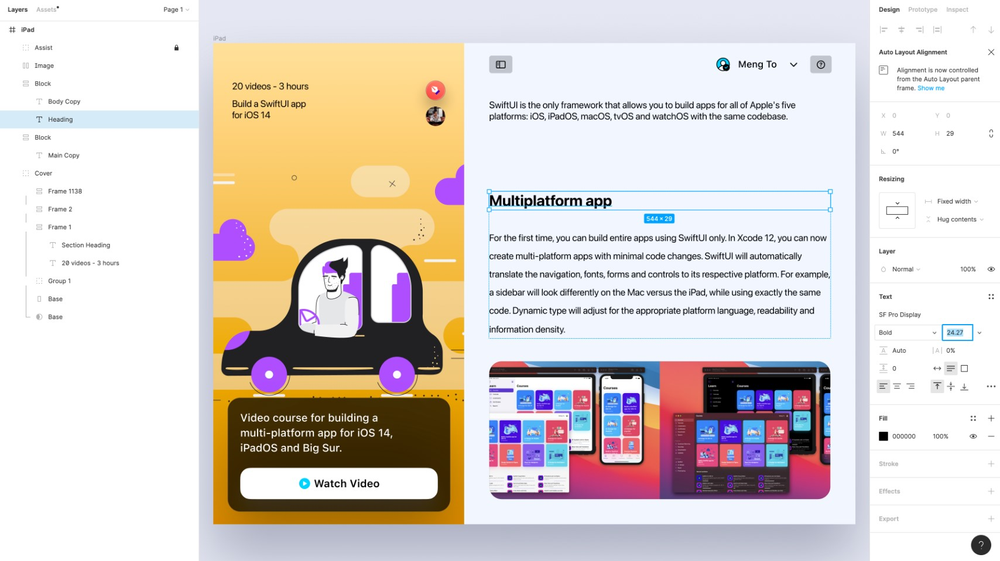
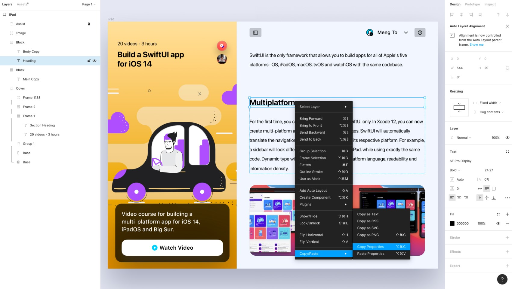

# Modular/Typographic scale

**A modular scale** is a system for creating consistent and visually pleasing typography. It's inspired by musical scales, where each note is a proportional step up or down from the previous one.

- In typography, this means that each font size in your system is a multiple of a base size, creating a harmonious relationship between the different text elements.

The typographic scale is used to create a balanced and friendly font sizing, which uses a range of type sizes related to each other since they grow by the same ratio. Using this method will help us develop a type system that is scalable and adaptive. [[1]]

 [[1]]

## Key Concepts

- **Base Size:** This is the foundation of your scale, often set as the size of your **body text**.
- **Ratio:** This determines the proportional step between each size in the scale. Common ratios include the **golden ratio** (1.618), **perfect fourths** (1.22), and **major thirds** (1.25).
- **Scale Steps:** By multiplying or dividing the base size by the chosen ratio, you generate a series of font sizes for different elements like **headings**, **subheadings**, and **body text**.

## Type of Scales

Selecting a scale depends on specific needs, and sometimes this can be tricky. Always choose a scale based on the type ratio that we need for our designs. However, we can always develop our system once we fully understand how type scale works. [[1]]

### Low Contrast Scales

Designs that should be versatile, such as dashboards and mobile apps, often use low-contrast scales as they allow the content to be flexible. Low contrast scales include Minor Second and Major Second.

- Minor Second [[1]]: 1.067
- Major Second [[1]]: 1.125

### Medium Contrast Scales

Medium contrast can use The Major Third, Major Second, or Perfect Fourth scales as the contrast between types is not drastic and can fit more content.

- Minor Third [[1]]: 1.200
- Major Third [[1]]: 1.250
- Perfect Forth: [[1]]: 1.333

### High Contrast Scales

Designs that demand a fair amount of contrast between types can use high contrast and hugely benefit from Augmented Fourth, Perfect Fifth, and Golden Ratio. These can be a perfect fit for large screen devices.

- Argumented Forth [[1]]: 1.414
- Perfect Fifth [[1]]: 1.500
- Golden Ratio [[1]]: 1.618

*In modern design, Le Corbusier’s Modulor, based on the golden ratio and the proportions of the human body, is the most famous of such modular scales, used extensively in his architecture and adopted by many other designers.* [[3]]

 [[3]]

## Responsive Type Scales

Type scale that is responsive and feels more comfortable to read across multiple screen sizes is essential. Developing a responsive type scale can be tricky. We can either bring in a second ratio or have multiple type scales for different screen sizes. [[1]]

- **Adding a Second Type Scale**: This can be any ratio we want. Adding a second type scale allows us to have more flexibility, making our type scale a little looser to allow well-defined type sizes for much higher contrast across different screen sizes.

- **Multiple Type Scales**: We will use a small ratio as there is less distraction in smaller screen sizes, and as the size increases, we can increase the ratio to bring more contrast to the type to avoid distractions to the user.

<!-- Related to [Web Design - Responsive](/UX_design/level-4/targets/web/web_design.md/#responsive) -->

## Average scale ratio

Có thể sử dụng linh hoạt với average scale ratio (**unconfirm ????**)

> ví dụ như Starbuck sử dụng average ratio "minor-third average": 1.3, 1.077, 1.14, 1.19, 1.052, 1.1, 1.27, 1.28, 1.39. Với average ratio là 1.2

## Type Scale Calculator

This is a visual type calculator that helps you pick the right type scale ratio for your design.

[Typescale](https://typescale.com/)
[Spencermortensen Typescale](https://type-scale.spencermortensen.com/)

## Steps to create scale

- Step-1: determine base size for Body Copy text

> Designers have a tendency to default to a 12-point body text size, but increasing that to 14 or 16 (or even as high as 24) can lead to increased readability depending on the typeface being used. Jeffrey Zeldman’s personal website, for example, uses a 24px font size for the body copy, while Vogue.com uses a 19px body text size. [[4]]

*Before finalizing the actual scale, though, designers should make sure the typefaces being used in the design have been finalized. Different typefaces can appear significantly larger or smaller even when they’re technically the “same” size.*

### Example-1

Let's say your base size is 16px and your ratio is the golden ratio (1.618). Your scale might look like this:

- **Base:** 16px
- **Step 1:** 16px * 1.618 = 25.888px (rounded to 26px)
- **Step 2:** 26px * 1.618 = 42.068px (rounded to 42px)
- **Step 3:** 16px / 1.618 = 9.886px (rounded to 10px)

### Example-2

Using the Golden Ratio Number to improve contrast and readability of our typography [[1]]

- **Step-1**: Select the Body Copy text layer and navigate to its text options. Multiply the Line Height with the Golden Ratio number 1.618

- **Step-2**: Now, select the Heading text layer and multiple the Font Size with the Golden ratio number and change the font weight to Bold from Regular

- **Step-3**: Copy the Text Property of the Body Copy and paste it to the Main Copy Layer. Also copy the Heading Text Property and paste it to the Section Heading Layer.

## Benefits of Using a Modular Scale

- **Consistency:** Ensures a unified and harmonious look across your design.
- **Readability:** Creates clear visual hierarchy, making it easier for users to scan and understand the content.
- **Responsiveness:** Adapts well to different screen sizes, maintaining the proportional relationships between text elements.
- **Efficiency:** Streamlines the design process by providing a pre-defined system for font sizes.

## _Best Practices

###

No, Heading 1 (H1) and Heading 2 (H2) do not necessarily need to be continuous steps in a typographic scale. However, their relationship should still adhere to a clear visual hierarchy and design logic. Here's a detailed breakdown:

**When H1 and H2 Can Be Continuous Steps:**

1. **Uniform Visual Flow:**
   - If your design relies on consistent increments for all typographic elements, keeping H1 and H2 as consecutive steps ensures uniformity.

2. **Minimalist or Linear Designs:**
   - In minimalist designs, where simplicity is key, a linear typographic scale helps maintain balance and visual harmony.

3. **Accessible or Utility-focused Websites:**
   - For highly functional sites (e.g., government or educational sites), a straightforward, logical typographic scale aids usability and clarity.

**When H1 and H2 Can Skip Steps:**

1. **Distinct Visual Emphasis for H1:**
   - H1 often serves as the most critical element on a page and needs to stand out more than H2. You might increase the size difference or use other techniques like color, weight, or case to make H1 more prominent.

2. **Flexible or Non-linear Scales:**
   - Many designs prioritize visual hierarchy over rigid scale adherence. In these cases, you can skip a step (or even two) between H1 and H2 to emphasize H1 more dramatically.

3. **Designing for Specific Use Cases:**
   - For editorial websites, blogs, or storytelling platforms, a larger gap between H1 and H2 helps differentiate main titles (H1) from subheadings (H2).

**Best Practices for Typographic Scale in Headings:**

1. **Maintain Visual Hierarchy:**
   - Even if H1 and H2 aren’t consecutive, ensure H1 is clearly larger or more prominent than H2, which should be larger than H3, and so on.

2. **Consider Context and Frequency:**
   - H1 is usually used once per page (e.g., the page title), while H2 may appear multiple times. Design H2 to balance prominence and readability in repeated use.

3. **Use Proportions Thoughtfully:**
   - Common typographic ratios (e.g., the **modular scale**) like 1.125, 1.25, 1.414, or 1.618 can guide your choices. You might apply a larger ratio between H1 and H2 for stronger contrast.

4. **Complement with Other Styles:**
   - Use weight, color, or letter-spacing alongside size to reinforce hierarchy. For example, a slightly smaller but bolder H2 can feel equally prominent.

**Key Questions to Ask Yourself:**

- **What is the importance of H1 and H2 on my website?**
- **Do I want a dramatic or subtle transition between these levels?**
- **Does the visual hierarchy align with user expectations and content structure?**

Would you like assistance in defining a typographic scale for your project?

## _References

- *Learn more about typographic scales.* [[1]]

[1]: <https://designcode.io/typographic-scales>

- *The typographic scale* [[2]]

[2]: <https://spencermortensen.com/articles/typographic-scale/>

- *Responsive typography with Modular Scale: Create meaningful proportions in your design using SASS* [[3]]

[3]: <https://www.bugsnag.com/blog/responsive-typography-with-modular-scale/>

[4]: <https://www.toptal.com/designers/typography/typographic-hierarchy>
