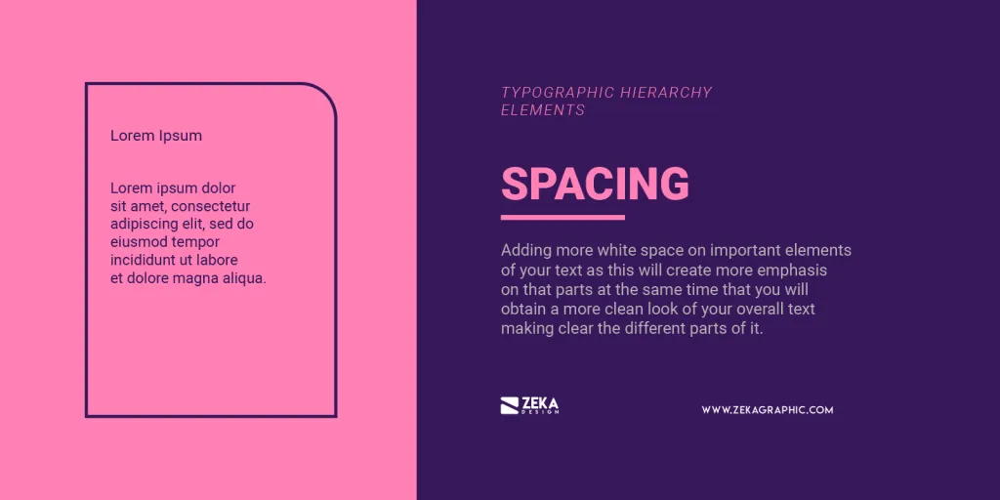

# Levels of typographic hierarchy

In typographic and text hierarchy there are three different sections with a clear differentiation between them and this is used to create a visual hierarchy in the text. The three sections of text hierarchy are **Heading**, **Subheading** and **body**, graphic designers use these sections to make the design more eye-pleasing and easy to find the information you are looking for. [[2]],[[7]],[[8]],[[9]],[[13]]


However, as you grow in your ability to create font hierarchy in your designs, you will begin to use more than these three primary levels. [9]

**6 levels of heading tags** [9]

There are actually six levels of typographic hierarchy, and I’ll explain why. [9]

- When you develop a website, there are codes called “HTML headings” or “header tags” that are designed to create typographic hierarchy on a web page. These headings are numbered one through six (```<H1>``` - ```<H6>```), plus body copy, which doesn’t count as a heading. Header one is the most important while body copy is the “least.”
- Each header is meant to provide value and clarify your content further, so readers and search engines like Google can understand what each of your web pages is about. Proper web typography hierarchy also boosts your search engine optimization (SEO).

*Now, I would say out of those seven levels of typographic hierarchy, four of them are crucial*.

=> *cách sử dụng các heading trong accessibilities có theo thứ tự từ lớn đến nhỏ liền mạch không?*
=> *bắt nguồn từ hierarchy của IA*.

Here is an exhaustive list of typographic hierarchy levels commonly used in design, ranging from the most prominent to the least prominent. These levels can vary depending on the type of project (web, print, branding, etc.), but they represent the general structure of organizing content visually:

- [Display font](#display)
- [Headlines](#headlines)
- [Title](#title)
- [Body Text]
- [Caption]

 [[10]]

*By carefully using these levels, you can create a visually appealing and intuitive typographic hierarchy that improves readability and user experience.*

## Display

As the largest text on the screen, display styles are reserved for short, important text or numerals. They work best on large screens. [[10]]

- Display fonts are usually more decorative, bold, or artistic fonts designed to grab attention in large sizes. They are often used for titles, banners, or other prominent areas where visual impact is important. These fonts are meant to be eye-catching and are used sparingly due to their high visual weight.
- Designed for large-scale applications like billboards, posters, and logos.
- Prioritize impact and visual appeal over readability in small sizes.
- Often have decorative or unique styles.
- Examples: Impact, Blackletter, Brush Script

| Token              | Font Size | Weight   |
|--------------------|-----------|----------|
| Display Large      | 57px      | Regular  |
| Display Medium     | 45px      | Regular  |
| Display Small      | 36px      | Regular  |

## Headlines

The first section the viewer should see is the heading, that is why the most important information of your message should be placed here and used to attract the viewer attention. Usually, the heading is used for the title and as it contains the most important part of your text it should be the most visually stimulating element of your design using large and bold typefaces to make the viewer stop and read the information in your design. [[13]]

Headlines are best-suited for short, high-emphasis text on smaller screens. These styles can be good for marking primary passages of text or important regions of content. [[10]]

- Headline fonts, sometimes known as display fonts, are not just any typeface. These are the main attractions, meant to pique the interest of your audience like a shark sighting. Despite their quieter parallels, and body fonts, which are designed for ease of reading and comfort, display typefaces exist to make a statement. They’re bold, stunning, and as visible as a kangaroo in your garden. [[11]],[[12]]
- Used for titles and headings in various media.
- Balance readability and visual interest.
- Can be serif, sans-serif, or display-style fonts.
- Examples: Arial Black, Times New Roman Bold, Impact

- with 6 levels [[1]]

| Token              | Font Size | Weight   |
|--------------------|-----------|----------|
| Headline Large     | 32px      | Regular  |
| Headline Medium    | 28px      | Regular  |
| Headline Small     | 24px      | Regular  |

### Primary Level (Highest Importance)

#### Main Heading (H1)

The first, largest words you read are known as the primary heading, headline, or title (```<H1>```). This heading is the most important whether you’re designing for digital or print. [[9]]

- The largest and most prominent text, often used for page titles or major sections.
- Purpose: Capture attention and convey the primary message.

### Secondary Level

#### Subheading (H2)

Subheading in graphic design is used to divide your design layout into different sections to give the reader more information about what is about the body text and expand the header information. The subheading should be visible and stand out from the body text but still making the visual differentiation with the main header, as example you can use this post, and as the main header is the title of the post, the article is divided into different sections with subheadings indicating what you will read in the body text. [[13]]

Next, you read the secondary heading (```<H2>```) or subtitle, which is the next largest font style. As you might have guessed, this is the second most important level of your text hierarchy. (Are you starting to get the picture here?) [[9]]

- Slightly smaller and less bold than the main heading.
- Purpose: Define sections within a page or document and support the main heading.

#### Tertiary Heading (H3)

Then, you may find subheadings (```<H3>```) or accent headings, which further break down content under a secondary heading. These tertiary headings clarify what’s being communicated in smaller chunks of information to make the content scannable. [[9]]
  
> Pro SEO Note: Whether a subheading displays before or after the two larger headings is preferential. However, following SEO best practices, subheadings should be coded as paragraph text and not an ```<H3>``` tag if it comes before primary (```<H1>```) or secondary (```<H2>```) headings. You always want your headings to show up sequentially (H1 is your top-level heading, followed by an H2, then H3…etc.). [[9]]

- Smaller than subheadings, used for subsections.
- Purpose: Break down content within a section.

### Supporting Level

**Quaternary Heading (H4)**:

- A minor heading for deeper subcategories.
- Purpose: Organize detailed content without overwhelming the reader.

**Quinary Heading (H5)**:

- A very small heading used sparingly for fine-grained structure.
- Purpose: Categorize highly specific content.

**Senary Heading (H6)**:

- The smallest heading style.
- Purpose: Offer additional hierarchy for technical or complex documents.

### __versus Display**

Display fonts and headline fonts are typically not the same, though they can overlap in some cases.

Here’s the distinction: [Headline fonts](#headlines) are fonts specifically chosen for use in headlines. They can be simpler and more readable than [display fonts](#display) but still need to stand out in a larger size compared to body text. Headline fonts are often clean and legible but are still designed to catch the reader's attention.*

**Key Differences**:

- **Purpose:** Display fonts are primarily for large-scale, attention-grabbing visuals, while headline fonts are for titles and headings in various media.
- **Readability:** Display fonts may sacrifice readability at smaller sizes for visual impact, whereas headline fonts prioritize both readability and visual appeal.
- **Style:** Display fonts are often more decorative and unique, while headline fonts can encompass a wider range of styles.

**In summary:**

- **Display fonts** are like bold, attention-grabbing posters.
- **Headline fonts** are like clear, informative titles.

*So, while both can appear in large sizes and serve attention-grabbing roles, display fonts are usually more stylized, whereas headline fonts are designed to be more legible and readable at a distance.*

## Title

Titles are smaller than headline styles and should be used for medium-emphasis text that remains relatively short. For example, consider using title styles to divide secondary passages of text or secondary regions of content. [[10]]

| Token              | Font Size | Weight   |
|--------------------|-----------|----------|
| Title Large        | 22px      | Regular  |
| Title Medium       | 16px      | Medium   |
| Title Small        | 14px      | Medium   |

## Body Text Levels

Lastly but not least is the body copy, this section will include the content and that will make it text heavy, as we saw the main function of heading and subheading is to grab the viewer attention and the main function of the body text is to communicate the information you want, that is why is important that you use a font with good readability for the text and the size of your body copy needs to be smaller in comparison with heading and subheading. [[13]]

### Body Text (Paragraph)

*Body styles are used for longer passages of text in your app.* [[10]]

Finally, we land on the paragraph text, which is the smallest font under all of the headings (also known as body copy). [[9]]

- Standard-sized text used for the main content.
- Purpose: Deliver detailed information and narrative.

| Token              | Font Size | Weight   |
|--------------------|-----------|----------|
| Body Large         | 16px      | Regular  |
| Body Medium        | 14px      | Regular  |
| Body Small         | 12px      | Regular  |

### Introductory Text (Lead Paragraph)

- Larger or more stylized than normal body text.
- Purpose: Act as a summary or preview of the content.

### Secondary Body Text

- Slightly smaller or less prominent than standard body text.
- Purpose: Present supporting information, annotations, or less critical content.

### Block Quotes

- Stylized text, often indented, sometimes italicized.
- Purpose: Highlight quotes or excerpts from other sources.

## Specialized Text

### Captions

Label styles are smaller, utilitarian styles, used for things like the text inside components or for very small text in the content body, such as captions. [[10]]

- Smaller text accompanying images, graphs, or other visuals.
- Purpose: Provide context or descriptions for visual elements.

| Token              | Font Size | Weight   |
|--------------------|-----------|----------|
| Label Large        | 14px      | Medium   |
| Label Medium       | 12px      | Medium   |
| Label Small        | 11px      | Medium   |

### Footnotes

- Very small text placed at the bottom of a page or section.
- Purpose: Include citations, references, or supplementary details.

### Callouts

- Text that draws attention (e.g., bold, highlighted, or colored).
- Purpose: Emphasize critical information or insights.

### Labels

- Brief, often bold or uppercase text.
- Purpose: Identify form fields, buttons, or categories.

## Navigation and Utility Text

### Navigation Links

- Styled text for menus or links.
- Purpose: Aid in navigating a website or document.

### Breadcrumbs

- Small text showing the user’s position in a hierarchy.
- Purpose: Help with navigation and context.

### Button Text

- Short, actionable text in buttons.
- Purpose: Encourage user actions (e.g., “Submit,” “Learn More”).

### Form Field Labels

- Text identifying form input fields.
- Purpose: Guide user input.

## Metadata/Utility Text

- Very small text displaying less critical info (e.g., dates, tags).
- Purpose: Convey additional context or technical details.

## Supplementary and Decorative Text

### Pull Quotes

- Enlarged or stylized excerpts from the body text.
- Purpose: Draw attention to key ideas or highlight quotes.

### Sidebar Text

- Secondary content placed on the side of the main content.
- Purpose: Provide additional context or related information.

### Overlines

- Small text above a heading.
- Purpose: Provide context or category for the headline.

### Underlines

- Stylized small text beneath a heading or image.
- Purpose: Add a descriptive subtitle or emphasize key points.

### Taglines

- Brief, memorable text.
- Purpose: Convey branding or overarching themes.

## _Creating of typographic hierarchy

Now that we know the three levels of text hierarchy in graphic design, the next step is how we create this hierarchy in a visual way and easy to differentiate each part of the text, there are plenty of graphic design techniques to do it and let’s see the most efficient ways to create visual hierarchy in text. [[13]]

- One of the first things to consider is how many levels of hierarchy a design should have. [[14]]
  - As a general rule, every design should include three levels of hierarchy: heading, subheading, and body text. [[14]]
  - From there, it’s up to the designer to consider additional levels that might be necessary. These could include captions, additional subheadings, pull quotes, and meta information (for things like authors or dates on an article). [[14]]

From there, it’s key to figure out how to distinguish between the different parts of the hierarchy.
> It should go without saying, but headings should be more prominent than subheadings, which should be more prominent than body copy.
>
> Captions should generally be less prominent than body copy, and pull quotes should be somewhere between body copy and subheadings. [[14]]

### Type Size

The first element to create text hierarchy that cames to our minds is type size, and it consists of making the most important parts of our text larger (Heading and subheading) in comparison to the less important (body text) making the bigger elements as a tool to grab the attention of the reader. If you want to use type size to create visual hierarchy in your design layout you can use the traditional typographic scales present in most word processing programs and it the scale is 6, 7, 8, 9, 10, 11, 12, 14, 16, 18, 21, 24, 30, 36, 48, 60, and 72. [[13]],[[14]]


Refer to [Modular Scale](./modular_scale.md)

### Case

Usually, capital letters are most suitable to use as a heading or subheading as they will make the sentence more visually important and easy to see but by another hand, they are not a good idea to use in the body text as it will negatively affect to the readability of your design [[13]],[[14]]


### Weight

Typeface weights are a great idea to create visual hierarchy in your text as making the typeface bolder or thinner will make it easier for the viewer to organise the information in your design. It’s better to use bold typeface weight for heading and subheading as they are more suitable to grab viewer attention and use regular or thin weights for body text to increase the readability of your text. [[13]],[[14]]


### Color

Color is also a great graphic design technique to create a visual hierarchy on the text as you can use the color contrast principles and giving the high contrast color to the focal part of the text and you can use different shades of a specific color to create this hierarchy, [you can check this post where I show you how to use contrast in graphic design.](https://www.zekagraphic.com/how-to-use-contrast-in-graphic-design/) [[13]],[[14]]


### Position

The position is also a graphic design principle that you can apply to text hierarchy to organise the information across your design layout depending on the importance of them, you can place the most important information in a prominent place of your design to create a visual separation from the body text making for the viewer easy to identify the key elements of your text. [[13]],[[14]]


### Alignment

Alignment is related to position to create visual hierarchy in your text, you can play with the different alignment options to create a clear difference between the heading, subheading and body text. [[13]],[[14]]


### Typeface

Font pairing is also a popular technique among graphic designers to create visual hierarchy in typography and it consists on choosing different fonts for the most prominent elements of your text (heading and subheading) which will be more focused on grabbing viewer attention as you can use bold and decorative fonts and more readability focused font for the body text as it will include bigger pieces of text. Make sure that the fonts that you will use for your design layout have a reason and are aligned with the context of your design.


Refer to [Font Pairing](../typography_system.md#font-pairingcombination)

### Spacing

Lastly but not least you also can use spacing as a graphic design technique to create a visual hierarchy by adding more [white space](https://www.zekagraphic.com/white-space-in-graphic-design/) on important elements of your text as this will create more emphasis on that parts at the same time that you will obtain a more clean look of your overall text making clear the different parts of it.



### _Combine Different Styling techniques

Now that you have learned the different styling techniques graphic designers have to create typographic hierarchy it’s time to play with them, that is why you can combine different elements of text hierarchy to create the combination that will be right for your content and design layout. [[13]]

> For example, you can combine type size, typeface weight and color as you see on the example below to create a visual hierarchy in your text organising the information according to their importance and make it look better in your overall design. [[13]]


## _Best Practices

## Examples

### Ex-1

 [[9]]

- Roboto Mono for all headings, Roboto Condensed for subheadings, and Roboto Regular for body copy. [[9]]

 [[9]]

- The one below it showcases a subheading before the main/primary heading paired with an elegant script font for secondary headings. [[9]]

 [[9]]

## _References

- *Canva's ultimate guide to font combinations* [[2]]

[2]: <https://www.canva.com/learn/the-ultimate-guide-to-font-pairing/>

- *Typographic Hierarchy in Graphic Design* [[7]]

[7]: <https://www.zekagraphic.com/typographic-hierarchy-in-graphic-design/>

- *How to Structure an Effective Typographic Hierarchy* [[8]]

[8]: <https://www.toptal.com/designers/typography/typographic-hierarchy>

- *Your Guide to Brand Typography and Hierarchy* [[9]]

[9]: <https://selahcreativeco.com/blog/your-guide-to-typefaces-brand-font-hierarchy>

[10]: <https://medium.com/@vosarat1995/material-3-you-typography-cheatsheet-ffc58c540181>
[11]: <https://www.reddit.com/r/typography/comments/xqe7r5/display_vs_headline_font/>

[12]: <https://medium.com/design-bootcamp/headline-fonts-101-choosing-the-right-typeface-for-impact-8a76fd078392>

[13]: <https://www.zekagraphic.com/typographic-hierarchy-in-graphic-design/>

[14]: <https://www.toptal.com/designers/typography/typographic-hierarchy>

**Unmerged**:

[15]: <https://typetype.org/blog/20-best-headline-fonts-fresh-ideas-for-title-and-header-design/>
[16]: <https://www.threerooms.com/blog/what-is-a-display-font>
[17]: <https://www.myfonts.com/pages/display-fonts>
[18]: <https://m3.material.io/styles/typography/applying-type>
[19]: <https://medium.com/design-bootcamp/headline-fonts-101-choosing-the-right-typeface-for-impact-8a76fd078392>